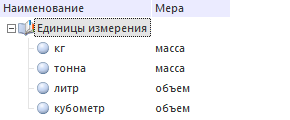
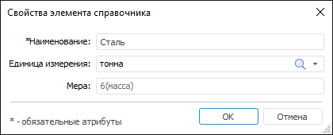
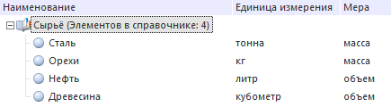
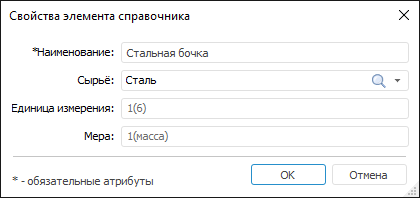
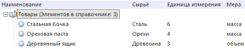

# Как создать заимствованный атрибут?

Как создать заимствованный атрибут?
-

# Как создать заимствованный атрибут?

Заимствованные атрибуты позволяют использовать в качестве атрибутов
 текущего справочника НСИ значения необходимых атрибутов из связанных справочников
 НСИ.

Рассмотрим пример справочника НСИ «Товары»
 в настольном приложении, в качестве одного из атрибутов которого используется
 атрибут из связанного справочника НСИ «Сырьё».
 При этом атрибут из справочника НСИ «Сырьё»
 является заимствованным атрибутом из связанного справочника НСИ «Единицы измерения».

## Шаг 1. Создание справочника «Единицы измерения»

Создайте справочник НСИ «Единицы измерения».
 Добавьте для него [обычный
 атрибут](../Master_RDS_reference_book/Attributes/Attribute.htm) «Мера» строкового
 типа данных.

Заполните справочник элементами:

## Шаг 2. Создание справочника «Сырьё»

Создайте справочник НСИ «Сырьё».
 Добавьте в него:

	- [обычный
	 атрибут](../Master_RDS_reference_book/Attributes/Attribute.htm) «Единицы измерения».
	 После добавления атрибута задайте для него [связь](../Master_RDS_reference_book/Link.htm)
	 со справочником «Единицы измерения».
	 В окне «[Свойства
	 связи](../Master_RDS_reference_book/Link_Property.htm)» задайте настройки связи:

		- в раскрывающемся списке «Отображать
		 поле в качестве значения» выберите элемент «Наименование»;

		- в раскрывающемся списке «Формат
		 отображения» выберите вариант «Значение»;

	- [заимствованный
	 атрибут](../Master_RDS_reference_book/Attributes/Imported_Attribute.htm) «Мера». В окне
	 «[Свойства
	 заимствованного атрибута](../Master_RDS_reference_book/Attributes/Imported_Attribute.htm)» задайте следующие настройки:

		- в раскрывающемся списке «Связь»
		 выберите связь по атрибуту «Единицы
		 измерения»;

		- выберите атрибут источника «MEASURE».

Заполните справочник элементами. Для этого в окне «[Свойства элемента
 справочника](../Master_RDS_reference_book/Element_Card.htm)»:

	- Введите наименование сырья.

	- В раскрывающемся списке «Единица
	 измерения» выберите единицу измерения, используемую для данного
	 вида сырья.

После установки значения в ссылочный атрибут «Единицы
 измерения» для заимствованного атрибута «Мера»
 будет автоматически установлено значение, соответствующее значению в связанном
 справочнике по атрибуту, который был определён при создании заимствованного
 атрибута как «Атрибут источника».

В окне «Свойства элемента справочника»
 значение заимствованного атрибута «Мера»
 будет выделено серым шрифтом:

При открытии справочника НСИ «Сырьё»
 в дереве элементов для заимствованного атрибута отображаются значения,
 соответствующие значениям в связанном справочнике:

## Шаг 3. Создание справочника «Товары»

Создайте справочник «Товары».
 Добавьте в него:

	- [обычный
	 атрибут](../Master_RDS_reference_book/Attributes/Attribute.htm) «Сырьё». После
	 добавления атрибута задайте для него [связь](../Master_RDS_reference_book/Link.htm)
	 со справочником «Сырьё».
	 В окне «[Свойства
	 связи](../Master_RDS_reference_book/Link_Property.htm)» задайте настройки связи:

		- в раскрывающемся списке «Отображать
		 поле в качестве значения» выберите элемент «Наименование»;

		- в раскрывающемся списке «Формат
		 отображения» выберите вариант «Значение»;

	- [заимствованный
	 атрибут](../Master_RDS_reference_book/Attributes/Imported_Attribute.htm) «Единица измерения».
	 В окне «[Свойства
	 заимствованного атрибута](../Master_RDS_reference_book/Attributes/Imported_Attribute.htm)» задайте следующие настройки:

		- в раскрывающемся списке «Связь» выберите
		 связь по атрибуту «Сырьё»;

		- выберите атрибут источника «UNIT»;

	- [заимствованный
	 атрибут](../Master_RDS_reference_book/Attributes/Imported_Attribute.htm) «Мера». В окне
	 «[Свойства
	 заимствованного атрибута](../Master_RDS_reference_book/Attributes/Imported_Attribute.htm)» задайте следующие настройки:

		- в раскрывающемся списке «Связь» выберите
		 связь по атрибуту «Сырьё»;

		- выберите атрибут источника «MEASURE».

Атрибуты «Единица измерения»
 и «Мера» являются заимствованными
 атрибутами связанного справочника НСИ «Единицы
 измерения».

Заполните справочник элементами. Для этого в окне «[Свойства элемента
 справочника](../Master_RDS_reference_book/Element_Card.htm)»:

	- Введите наименование товара.

	- В раскрывающемся списке «Сырьё»
	 выберите наименование сырья, используемого для данного вида товара.

После установки значения в ссылочный атрибут «Сырьё»
 для заимствованных атрибутов «Единица
 измерения» и «Мера» будут
 автоматически установлены значения, соответствующие значениям в связанном
 справочнике по атрибуту, который был определён при создании заимствованного
 атрибута как «Атрибут источника».
 При этом для атрибута «Единица измерения»
 в [карточке элементов](../Master_RDS_reference_book/Element_Card.htm)
 и в итоговом справочнике будет отображаться только ключ, соответствующий
 данному атрибуту в справочнике «Единицы
 измерения».

В окне «Свойства элемента справочника»
 значения заимствованных атрибутов «Единица
 измерения» и «Мера» будут
 выделены серым шрифтом:

При открытии справочника НСИ «Товары»
 в дереве элементов для заимствованных атрибутов отображаются значения,
 соответствующие значениям в связанном справочнике:

## Вывод

В результате выполнения последовательности шагов было создано и настроено
 три справочника НСИ таким образом, что:

	- элементы справочника «Сырьё»
	 содержат:

		- ссылочный атрибут «Единица
		 измерения»;

		- атрибут «Мера»,
		 заимствованный из справочника «Единицы
		 измерения»;

	- элементы справочника «Товары»
	 содержат:

		- ссылочный атрибут «Сырьё»;

		- атрибут «Единица измерения»,
		 заимствованный от ссылочного атрибута из связанного справочника
		 «Сырьё»;

		- атрибут «Мера»,
		 заимствованный от заимствованного атрибута из связанного справочника
		 «Сырьё».

См. также:

[Вопросы и ответы](FAQ.htm)

		Справочная
		 система на версию 10.9
		 от 18/08/2025,
		 © ООО «ФОРСАЙТ»,
