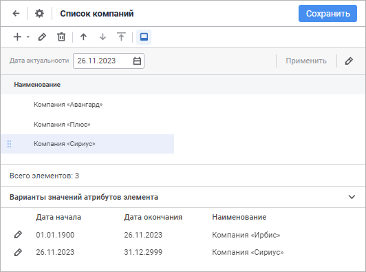
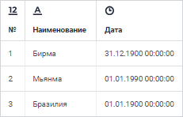
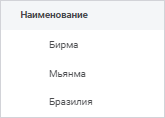
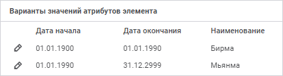
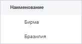
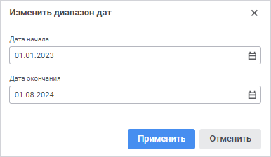

# Как управлять версиями элементов?

Как управлять версиями элементов?
-

# Как управлять версиями элементов?

Справочник НСИ считается версионным, если для значений элементов ведется
 история изменений. Для каждого элемента справочника указывается диапазон
 действия значения - даты начала и окончания действия.

Версия элемента может измениться при вводе новых значений [атрибутов
 элемента](../Master_RDS_reference_book/Attributes.htm#add) и при [перемещении
 элемента](../Work/Operations_Elements.htm#replace) по иерархии справочника, в том числе при перемещении элемента
 под новый элемент-родитель.

Версионность справочника позволяет:

	- не удалять данные справочников, чтобы не нарушать целостность
	 данных;

	- вводить данные заранее;

	- исключить устаревшие данные.

## Настройка версионности справочника НСИ

Для настройки версионности справочника НСИ установите флажок «[Элементы
 могут изменяться во времени](../Master_RDS_reference_book/base_settings.htm#change_in_time)». После чего появится возможность
 задавать диапазон действия значения элемента справочника.

При работе с элементами справочника используйте параметр «Дата
 актуальности»:

При смене даты актуальности дерево элементов перестраивается в соответствии
 с выбранным значением.

Особенности настройки версионности справочника НСИ:

	- если требуется учитывать время в дате актуальности, то после
	 установки флажка «[Элементы
	 могут изменяться во времени](../Master_RDS_reference_book/base_settings.htm#change_in_time)» установите флажок «Учитывать
	 время в периодах действия элементов»;

	- если требуется ручное задание диапазона дат, то после установки
	 флажка «[Элементы
	 могут изменяться во времени](../Master_RDS_reference_book/base_settings.htm#change_in_time)» установите флажок «Ручное
	 формирование периода действия элементов». Если флажок не установлен,
	 то диапазон формируется автоматически по правилу: дата начала равняется
	 дате актуальности, дата окончания - «31.12.2999».

Примечание.
 [Дискреционные](../Master_RDS_reference_book/base_settings.htm#discretion_access_permissions)
 и [мандатные](../Master_RDS_reference_book/base_settings.htm#mandatory_access_permissions)
 права доступа на элементы справочников НСИ не поддерживают механизм версионности.
 При изменении прав на элементы справочников НСИ не создается новая версия
 элементов. Независимо от версии элементов берутся только актуальные права,
 то есть последние из установленных прав.

## Создание новой версии элемента

Для создания новой версии элемента справочника выполните следующие действия:

	- Укажите в параметре «Дата актуальности»
	 дату, с которой создается новая версия элемента.

Примечание.
 При работе со справочником НСИ в веб-приложении для применения параметров
 к элементам справочника нажмите кнопку «Применить»
 на [панели параметров](../Work/Work_Dictionary.htm#rds).

	- Выполните редактирование атрибута выбранного элемента, который
	 будет изменяться со временем.

Например, у компании «Ирбис» после 26.11.2023 сменилось наименование
 на «Сириус». Выполнив все вышеперечисленные действия, для элемента справочника
 компании «Ирбис» была создана новая версия:

## Задание периода действия элемента

Задание периода действия элемента рассмотрим на примере справочника
 НСИ, в который были [импортированы](../Work/Work_Elements.htm#import)
 данные таблицы (наименования стран и даты, когда произошла смена их наименований):

Например:

	- с 1900 года Бразилия не изменяла своё название;

	- до 1989 года Мьянма официально наименовалась Бирмой. Таким образом,
	 до и после этой даты страна имеет разные наименования. Это изменение
	 можно отобразить в версионном справочнике.

До включения версионности элементов в справочнике НСИ отображаются наименования
 стран до и после переименования:

Для справочника настройте версионность: установите флажки «[Элементы
 могут изменяться во времени](../Master_RDS_reference_book/base_settings.htm#change_in_time)» и «Ручное
 формирование периода действия элементов».

Далее для изменения существующих версий элементов справочника выберите
 элемент с наименьшим периодом действия («Бирма»)
 и выполните последовательность действий:

	- В параметре «Дата актуальности»
	 установите дату, после которой элемент справочника будет меняться:
	 «01.01.1990».

	- Откройте элемент «Бирма»
	 на [редактирование](../Work/Work_Elements.htm#edit).

	- В открывшемся окне «[Свойства
	 элемента справочника](../Work/Work_Elements.htm)» измените необходимый атрибут элемента
	 справочника. В данном случае измените наименование «Бирма»
	 на «Мьянма».

	- [Обновите](../Work/Operations_Elements.htm#refresh)
	 дерево элементов.

В дереве элементов будут отображаться два элемента справочника с одинаковыми
 названиями, для одного из которых в области «Варианты
 значений атрибутов элемента» будет отображена расширенная история
 версий элемента:

Теперь в зависимости от установленного значения в параметре «Дата
 актуальности» наименование элемента справочника будет меняться.

Если установить дату «01.01.1986», то в справочнике будет отображены
 элементы:

Где:

	- «Бирма» - наименование
	 страны Мьянма до переименования;

	- «Бразилия» - страна,
	 наименование которой не изменялось.

## Работа с версионными элементами

В версионном справочнике НСИ для выбранного элемента доступны следующие
 операции:

[Ручное
 изменение периода действия элемента](javascript:TextPopup(this))

	Для изменения даты актуальности выбранного элемента справочника
	 НСИ выполните следующие шаги:

		- Установите флажок «[Ручное
		 формирование периода действия элементов](../Master_RDS_reference_book/base_settings.htm#change_in_time)» и сохраните
		 заданные настройки.

		- В области «Варианты значений
		 атрибутов элемента» выберите ту версию элемента, которую
		 требуется отредактировать и выполните одно из действий:

			- в веб-приложении нажмите кнопку 
			 «Изменить диапазон дат»;

			- в настольном приложении:

				- дважды щёлкните по дате в столбце «Дата
				 начала»;

				- выполните команду «Изменить
				 периоды действия версии» в контекстном меню даты.

	После выполнения одного из действий будет
	 открыто окно «Изменить диапазон дат»:

	

		- В открывшемся окне измените период действия значения элемента.

	Если введен период, пересекающийся с
	 периодами других версий данного элемента, то версии элемента с интервалами,
	 которые попадут внутрь отредактированного периода, будут удалены,
	 а элементы других справочников, которые будут ссылаться на удаленные
	 версии, будут ссылаться на редактируемую версию. У интервалов версий,
	 которые не помещаются целиком, границы будут скорректированы.

	Если для версионного справочника установлен
	 флаг «[Элементы имеют признак скрытости](../Master_RDS_reference_book/base_settings.htm#hidden_attribute)»,
	 то в данном окне будет отражен флажок «Скрытый»,
	 при установке которого редактируемая версия элемента не будет отображаться
	 в дереве элементов справочника.

	После выполнения всех шагов будет изменен период действия элемента.

[Сортировка атрибутов
 элемента по периодам действия](javascript:TextPopup(this))

	Атрибуты элемента справочника НСИ можно сортировать по значению
	 периода действия.

	Примечание.
	 Сортировка атрибутов элемента по периодам действия доступна только
	 в настольном приложении.

	Для сортировки элементов по значению конкретного атрибута щёлкните
	 по заголовку соответствующей колонки в области «Варианты
	 значений атрибутов элемента». При этом в заголовке колонки
	 отобразится значок, показывающий вид сортировки:

		-  «По
		 возрастанию»;

		-  «По
		 убыванию».

См. также:

[Вопросы
 и ответы](../../../FAQ/FAQ.htm)

		Справочная
		 система на версию 10.9
		 от 18/08/2025,
		 © ООО «ФОРСАЙТ»,
