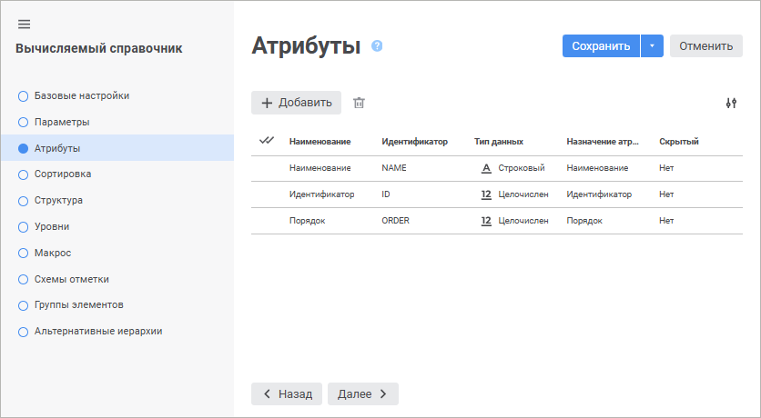
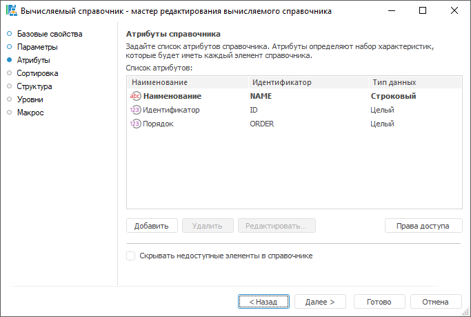

# Страница «Атрибуты»: Вычисляемый справочник

Страница «Атрибуты»: Вычисляемый справочник
-

# Атрибуты

На странице «Атрибуты» задаётся
 список атрибутов справочника и их назначение. Список атрибутов определяет
 набор характеристик, которые будет иметь каждый элемент справочника.

	Веб-приложение Настольное приложение

		

		

[Создание атрибута](javascript:TextPopup(this))

	Для создания нового атрибута:

		- в веб-приложении  «Добавить». В конец списка атрибутов
		 будет добавлена новая строка, и откроется панель «[Свойства
		 атрибута](../Master_Table_reference_book/UiMd_reference_book_Master_Table_page1_AttProps.htm)» для настройки добавленного атрибута;

		- в настольном приложении нажмите кнопку «Добавить».
		 Откроется окно «[Свойства атрибута](../Master_Table_reference_book/UiMd_reference_book_Master_Table_page1_AttProps.htm)»
		 для настройки добавленного атрибута.

[Редактирование
 атрибута](javascript:TextPopup(this))

	Для редактирования атрибута:

		- в веб-приложении щёлкните по атрибуту, после чего измените
		 значения требуемых свойств на боковой панели «[Свойства
		 атрибута](../Master_Table_reference_book/UiMd_reference_book_Master_Table_page1_AttProps.htm)»;

		- в настольном приложении выделите атрибут в списке и выполните
		 одно из действий:

			- нажмите кнопку «Редактировать»;

			- выполните команду контекстного меню «Редактировать».

	Измените значения свойств в окне «[Свойства атрибута](../Master_Table_reference_book/UiMd_reference_book_Master_Table_page1_AttProps.htm)».

[Удаление атрибута](javascript:TextPopup(this))

	Для удаления одного или нескольких выделенных атрибутов:

		- в веб-приложении нажмите кнопку  «Удалить»;

		- в настольном приложении выполните одно из действий:

			- нажмите кнопку «Удалить»;

			- выполните команду «Удалить»
			 контекстного меню;

			- нажмите сочетание клавиш CTRL+DELETE.

	Будет запрошено подтверждение выполняемого действия.

[Отображение/скрытие
 свойств атрибута](javascript:TextPopup(this))

	Для отображения/скрытия свойств атрибута в списке нажмите кнопку
	  «Настройка»
	 и установите/снимите флажок напротив наименования свойства.

	Примечание.
	 Отображение/скрытие свойств атрибута доступно только в веб-приложении.

[Настройка атрибутов
 прав доступа по элементам](javascript:TextPopup(this))

	Указание атрибутов прав доступа позволяет в дальнейшем, при использовании
	 справочника в кубах, ограничить доступ определенных пользователей
	 к данным по определенным элементам.

	Примечание.
	 Настройка атрибутов прав доступа по элементам доступна только в настольном
	 приложении.

	Для указания атрибутов выполните следующие действия:

		- Создайте два целочисленных атрибута.

		- Нажмите кнопку «Права доступа»,
		 при этом будет открыт диалог:

	

		- В раскрывающихся списках диалога выберите созданные атрибуты
		 и нажмите кнопку «ОК».

	В качестве значений по выбранным атрибутам должны передаваться десятичные
	 значения, соответствующее битовой маске безопасности. В соответствии
	 с данной маской для определенных пользователей будет разрешено/запрещено
	 чтение или редактирование данных по определенным элементам справочника.
	 Каждому биту маски ставится в соответствие субъект безопасности, добавленный
	 на вкладке «[Метки безопасности](admin.chm::/03_admin/admin_adminobjects_marks.htm)».
	 Номер бита соответствует номеру субъекта в списке. Значение бита определяет
	 разрешение/запрет на выполнение действий данному субъекту.

	Значение бита маски:

		- 0. Действие запрещено;

		- 1. Действие разрешено.

	Пример составления маски:

			 Значение маски
			 ... 1 1 1 0 1 1 0

			 Порядок следования субъектов в списке на
			 вкладке "Метки безопасности"

			 ... 6 5 4 3 2 1 0

			 Значение атрибута доступа

			     118

	Следовательно, субъекту, находящемуся в списке первым (0), действие
	 запрещено; субъекту, находящемуся в списке вторым (1), действие разрешено
	 и т.д.

[Скрытие недоступных
 элементов в справочнике](javascript:TextPopup(this))

	Если для справочника были определены атрибуты прав доступа, то для
	 скрытия элементов справочника от пользователей, которые не имеют доступа
	 на чтение, установите флажок «Скрывать
	 недоступные элементы в справочнике».

	Примечание.
	 Скрытие недоступных элементов в справочнике доступно только в настольном
	 приложении.

См. также:

[Вычисляемый
 справочник](Master_Calculation.htm)

		Справочная
		 система на версию 10.9
		 от 18/08/2025,
		 © ООО «ФОРСАЙТ»,
