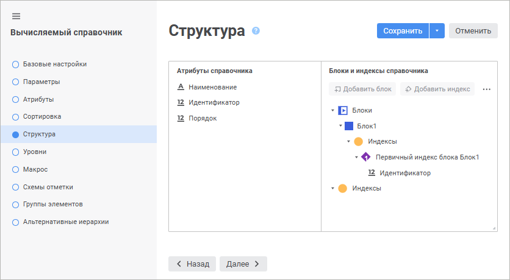
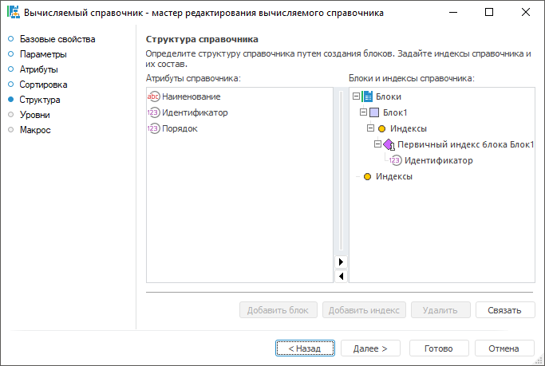
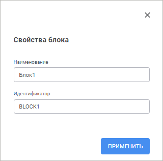
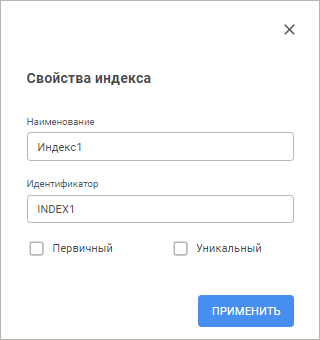

# Страница «Структура»: Вычисляемый справочник

Страница «Структура»: Вычисляемый справочник
-

# Структура справочника

На странице «Структура»
 создаётся логическая структура будущего дерева элементов.

	Веб-приложение Настольное приложение

		

		

## Блоки

Основой всей структуры справочника является блок. Блок -
 это условный элемент, который при построении справочника предоставит все
 элементы из одного источника данных. Количество
 блоков не ограничено. Все блоки располагаются на одном уровне. В вычисляемом
 справочнике создаются только простые блоки. Наполнение блоков
 элементами и организация рекурсивных
 блоков производится на программном уровне в [прикладном
 макросе](UiMd_reference_book_Master_Calculation_page2.htm).

[Создание
 блока](javascript:TextPopup(this))

	Для создания блока выделите элемент «Блоки»
	 или заголовок уже созданного блока, после чего выполните одно из действий:

		- в веб-приложении нажмите кнопку  «Добавить блок». Откроется панель
		 «Свойства блока»;

		- в настольном приложении нажмите кнопку «Добавить
		 блок». Откроется окно «Свойства
		 блока».

		Веб-приложение Настольное приложение

			

			

	Задайте свойства блока:

		- Наименование. Введите
		 наименование блока. По умолчанию: «Блок<порядковый
		 номер>»;

		- Идентификатор. Введите
		 уникальный идентификатор блока. По умолчанию: BLOCK<порядковый
		 номер>.

	Для каждого блока автоматически создаётся первичный индекс. Данный
	 индекс будет использоваться при построении справочника для проверки
	 на уникальность и идентификации элементов только этого блока.

[Удаление блока](javascript:TextPopup(this))

	Для удаления блока выделите его заголовок в списке, после чего выполните
	 одно из действий:

		- в веб-приложении нажмите кнопку  «Удалить»;

		- в настольном приложении нажмите кнопку «Удалить».

	После подтверждения блок будет удалён.

## Индексы

В структуре справочника можно выделить два вида индексов:

	- Индексы блока.
	 Создаются внутри блока, используются для проверки уникальности и идентификации
	 элементов только этого блока. Индекс блока также может использоваться
	 для связи различных блоков;

	- Индексы справочника.
	 Создаются как дочерний элемент у элемента «Индексы»
	 в области «Блоки и индексы
	 справочника». Используются для проверки уникальности и идентификации
	 элементов всего справочника. Индексы справочника будут использоваться
	 при включении справочника в состав структуры какого-либо куба для
	 привязки данных к элементам справочника.

Совет. В индексах
 справочника рекомендуется создавать первичный индекс и включать в него
 атрибут с [назначением](../Master_Table_reference_book/UiMd_reference_book_Master_Table_page1_AttProps.htm)
 «Идентификатор» или любой другой
 атрибут, по которому предполагается наличие уникальных значений. Для корректной
 работы справочника в дальнейшем не рекомендуются в индексы включать атрибуты,
 по которым могут присутствовать пустые значения.

[Создание
 индекса](javascript:TextPopup(this))

	Для создания индекса выделите элемент «Индексы»
	 в области «Блоки и индексы справочника»
	 или внутри какого-либо блока, после чего выполните одно из действий:

		- в веб-приложении нажмите кнопку  «Добавить индекс». Откроется
		 панель «Свойства индекса»;

		- в настольном приложении нажмите кнопку «Добавить
		 индекс». Откроется окно «Свойства
		 индекса».

		Веб-приложение Настольное приложение

			

			

	Задайте свойства индекса:

		- Наименование. Введите
		 наименование индекса. По умолчанию: «Индекс<порядковый
		 номер>»;

		- Идентификатор. Введите
		 уникальный идентификатор индекса. Идентификатор может состоять
		 только из букв латинского алфавита, цифр и символа подчеркивания.
		 По умолчанию: INDEX<порядковый
		 номер>;

		- Специфика работы индекса.
		 Определите специфику работы индекса. Для этого установите соответствующий
		 флажок:

			- Уникальный.
			 Уникальный индекс осуществляет проверку на уникальность данных
			 по атрибутам, которые будут в него включены;

			- Первичный. Уникальный
			 индекс, используемый для идентификации элементов. Первичный
			 индекс гарантирует, что в справочнике только один элемент
			 будет иметь определенное значение атрибута (комбинацию значений
			 атрибутов).

[Связь индекса
 и атрибутов](javascript:TextPopup(this))

	Для задания атрибутов, значения которых будет проверять индекс при
	 построении справочника, выполните одно из следующих действий:

		- в области «Атрибуты справочника»
		 выделите атрибут, а в области «Блоки
		 и индексы справочника» выберите индекс, после чего нажмите
		 кнопку  «Связать» в веб-приложении или
		 кнопку «Связать» в настольном
		 приложении;

		- в области «Атрибуты справочника»
		 выберите атрибут и перетащите в индекс, расположенный в области
		 «Блоки и индексы справочника»,
		 с помощью механизма Drag&Drop.

	После выполнения действий атрибут справочника будет связан с индексом.

[Удаление индекса](javascript:TextPopup(this))

	Для удаления индекса выделите его заголовок в списке, после чего
	 выполните одно из действий:

		- в веб-приложении нажмите кнопку  «Удалить»;

		- в настольном приложении нажмите кнопку «Удалить».

	После подтверждения индекс будет удалён.

См. также:

[Вычисляемый
 справочник](Master_Calculation.htm)

		Справочная
		 система на версию 10.9
		 от 18/08/2025,
		 © ООО «ФОРСАЙТ»,
