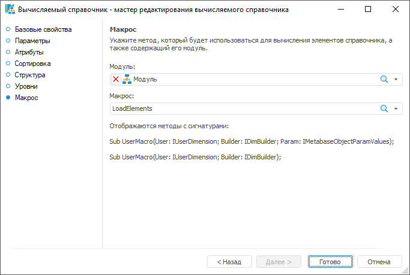

# Страница «Макрос»: Вычисляемый справочник

Страница «Макрос»: Вычисляемый справочник
-

# Макрос

На странице «Макрос» задаётся
 макрос, который будет использоваться для построения справочника, а также
 модуль, содержащий этот макрос.

	Веб-приложение Настольное приложение

		

		

Для задания макроса:

	- Выберите модуль в раскрывающемся списке объектов репозитория
	 «Модуль».

Для быстрого выбора объекта в поле для поиска введите его название/идентификатор/ключ,
 в зависимости от настроек отображения. Поиск будет выполняться автоматически
 по мере ввода текста. Список будет содержать объекты, наименования/идентификаторы/ключи
 которых содержат вводимый текст.

Для настройки отображения объектов репозитория в списке нажмите кнопку
  «Отображение
 объекта» и выберите в раскрывающемся меню вариант отображения:

	- Наименование. Объекты
	 отображаются под своими наименованиями. Вариант по умолчанию;

	- Идентификатор. Объекты
	 отображаются под своими идентификаторами;

	- Ключ. Объекты отображаются
	 под своими ключами.

Выбрать можно несколько вариантов. Идентификатор и ключ будут указаны
 в скобках.

Для сброса отметки выбранных объектов нажмите кнопку 
 «Очистить».

	- Выберите макрос, содержащийся в выбранном модуле, в раскрывающемся
	 списке «Макрос».

После выполнения действий для построения справочника будет использоваться
 заданный макрос.

[Структура макроса](javascript:TextPopup(this))

	Пользовательский макрос должен содержать процедуру, имеющую одну
	 из следующих сигнатур:

	Sub <Name>(UserDim: IUserDimension; Builder: IDimBuilder);

	Sub <Name>(UserDim: IUserDimension; Builder: IDimBuilder; Param: IMetabaseObjectParamValues);

	В первом параметре процедуры UserDim
	 передается структура вычисляемого справочника, для которого будет
	 осуществляться построение дерева элементов. Используя данную структуру
	 можно получить список атрибутов, по которым необходимо определить
	 значения для элементов.

	Второй параметр процедуры Builder
	 передает объект, используемый для подготовки справочника к загрузке
	 данных.

	Третий параметр процедуры Params
	 будет содержать коллекцию значений входных параметров если справочник
	 является параметрическим. Значения параметров могут быть использованы
	 для настройки ограничений в прикладном алгоритме наполнения справочника
	 данными или переданы в источники, из которых загружаются данные.

	Общий алгоритм процедуры для наполнения данными должен быть следующим:

		- с помощью метода [IDimBuilder.CreateRootBlockLoader](kedims.chm::/interface/idimbuilder/idimbuilder.createrootblockloader.htm),
		 который доступен у параметра Builder,
		 для всех блоков справочника создаются загрузчики элементов самого
		 верхнего корневого уровня;

		- если в каком-либо блоке необходимо организовать иерархию
		 элементов, то с помощью метода [IDimBuilder.CreateBlockLoader](kedims.chm::/interface/idimbuilder/idimbuilder.createblockloader.htm)
		 для него также создается загрузчик элементов нижних уровней;

		- созданный загрузчик представляет собой таблицу. По строкам
		 таблицы расположены элементы, по столбцам - атрибуты элементов.
		 С помощью метода [IDimBlockLoader.AddRow](kedims.chm::/interface/idimblockloader/idimblockloader.addrow.htm)
		 создаётся необходимое количество строк-элементов. С помощью свойства
		 [IDimBlockLoader.Value](kedims.chm::/interface/idimblockloader/idimblockloader.value.htm)
		 задаются значения атрибутов элементов. В таблице загрузчика столбцы
		 идут в том же порядке, в каком созданы [атрибуты](UiMd_reference_book_Master_Calculation_Atribute.htm)
		 в справочнике.

[Организация
 иерархии в вычисляемом справочнике](javascript:TextPopup(this))

	Для организации иерархии в пользовательском макросе с помощью метода
	 [IDimBuilder.CreateBlockLoader](kedims.chm::/interface/idimbuilder/idimbuilder.createblockloader.htm)
	 для необходимого блока должен быть создан загрузчик элементов нижних
	 уровней. В данном загрузчике количество доступных столбцов всегда
	 на один больше чем [количество
	 атрибутов](UiMd_reference_book_Master_Calculation_Atribute.htm), созданных в вычисляемом справочнике. Если задать значение
	 по последнему дополнительному столбцу, то при построении данное значение
	 отображаться не будет. Оно будет рассматриваться как идентификатор
	 родительского элемента.

[Пример](javascript:TextPopup(this))

	Процедура LoadElements может
	 использоваться для создания многоуровневого вычисляемого справочника:

		Sub LoadElements(UserDim: IUserDimension; Builder: IDimBuilder);

		Var

		    DimBlock: IUserDimBlock;

		    BlockRoot, Block: IDimBlockLoader;

		    m, n, i, Element: integer;

		Begin

		    {

		        Здесь может располагаться код подключения

		        к необходимым источникам данных или любой другой код,

		        используемый для получения значений атрибутов для элементов

		    }

		    // Получаем параметры первого блока справочника

		    DimBlock := UserDim.Blocks.Item(0);

		    // Создаем загрузчик корневых элементов

		    BlockRoot := Builder.CreateRootBlockLoader(DimBlock.Key);

		    // Создаем загрузчик элементов нижних уровней

		    Block := Builder.CreateBlockLoader(DimBlock.Key, DimBlock.Key);

		    // Создаем корневые элементы

		    // m - количество атрибутов справочника

		    // n - количество создаваемых элементов

		    m := 3;

		    n := 5;

		    For i := 1 To n Do

		        Element := BlockRoot.AddRow;

		        BlockRoot.Value(Element, 0) := //
		 Значение

		        BlockRoot.Value(Element, 1) := //
		 Значение

		        //...

		        BlockRoot.Value(Element, m - 1) := //
		 Значение

		    End For;

		    // Создаем иерархию дочерних элементов

		    // m - количество атрибутов справочника

		    // n - количество создаваемых элементов

		    // В столбце с индексом m будут указаны идентификаторы родительских элементов

		    For i := 1 To n Do

		        Element := Block.AddRow;

		        Block.Value(Element, 0) := //
		 Значение

		        Block.Value(Element, 1) := //
		 Значение

		        //...

		        Block.Value(Element, m - 1) := //
		 Значение последнего атрибута, созданного в справочнике

		        Block.Value(Element, m) := // Значение, которое будет рассматриваться как

		        //
		 идентификатор родительского элемента

		    End For;

		End Sub LoadElements;

	Процедура LoadElementsWithParams
	 может использоваться для создания вычисляемого справочника, количество
	 элементов в котором будет зависеть от значений входных параметров
	 (предполагается наличие в структуре справочника двух целочисленных
	 параметров):

		Sub LoadElementsWithParams(UserDim: IUserDimension; Builder: IDimBuilder; Params: IMetabaseObjectParamValues);

		Var

		    DimBlock: IUserDimBlock;

		    BlockRoot, Block: IDimBlockLoader;

		    m, i, Element, Start, End_: integer;

		Begin

		    {

		        Здесь может располагаться код подключения

		        к необходимым источникам данных или любой другой код,

		        используемый для получения значений атрибутов для элементов

		    }

		    // Получаем значения параметров

		    Start := Params.Item(0).Value As Integer;

		    End_ := Params.Item(1).Value As Integer;

		    // Получаем параметры первого блока справочника

		    DimBlock := UserDim.Blocks.Item(0);

		    // Создаем загрузчик корневых элементов

		    BlockRoot := Builder.CreateRootBlockLoader(DimBlock.Key);

		    // Создаем загрузчик элементов нижних уровней

		    Block := Builder.CreateBlockLoader(DimBlock.Key, DimBlock.Key);

		    // Создаем корневые элементы

		    // m - количество атрибутов справочника

		    m := 3;

		    For i := Start To End_ Do

		        Element := BlockRoot.AddRow;

		        BlockRoot.Value(Element, 0) := i.ToString; // Значение

		        BlockRoot.Value(Element, 1) := i; //
		 Значение

		        //...

		        BlockRoot.Value(Element, m - 1) := i; //
		 Значение

		    End For;

		End Sub LoadElementsWithParams;

См. также:

[Вычисляемый
 справочник](Master_Calculation.htm)

		Справочная
		 система на версию 10.9
		 от 18/08/2025,
		 © ООО «ФОРСАЙТ»,
