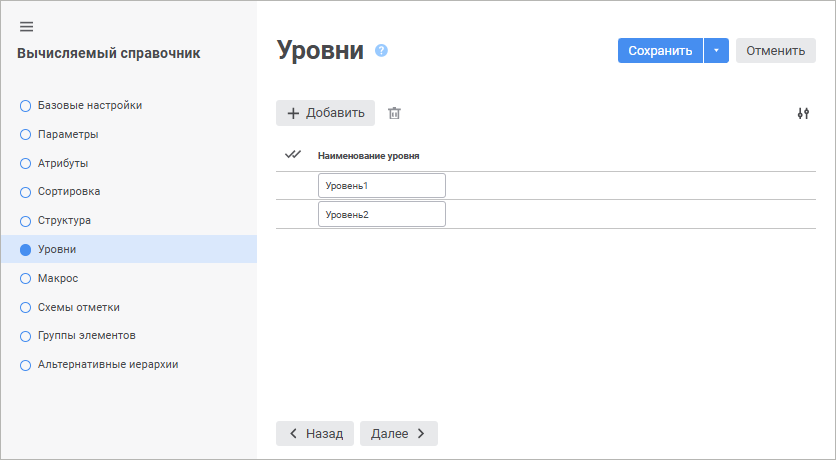
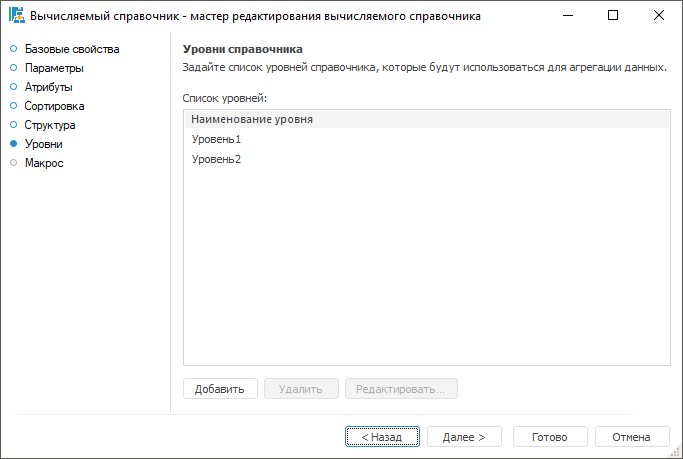

# Страница «Уровни»: Вычисляемый справочник

Страница «Уровни»: Вычисляемый справочник
-

# Уровни справочника

На странице «Уровни» формируется
 список уровней, которые будут храниться вместе со структурой справочника.
 Данные уровни не влияют на фактическое количество уровней элементов, которые
 получатся при построении справочника. Фактическое количество уровней зависит
 только от исходных данных и реализованного в [прикладном
 макросе](UiMd_reference_book_Master_Calculation_page2.htm) алгоритма.

Созданные на данной странице уровни в дальнейшем будут использоваться
 для [настройки
 агрегации](../../Cube/CreateCube/Master_Standart/UiMd_Cube_CreateCube_Master_Standart_7.htm) в кубах.

	Веб-приложение Настольное приложение

		

		

[Создание
 уровня](javascript:TextPopup(this))

	Для создания уровня:

		- в веб-приложении нажмите кнопку  «Добавить». Будет добавлена строка
		 нового уровня, в которой необходимо задать наименование созданного
		 уровня;

		- в настольном приложении нажмите кнопку «Добавить».
		 Откроется диалог, в котором необходимо задать наименование создаваемого
		 уровня:

	

	По умолчанию уровень добавляется с наименованием «Уровень<порядковый
	 номер>».

	Примечание.
	 Идентификаторы уровней генерируются автоматически.

[Редактирование
 уровня](javascript:TextPopup(this))

	Для редактирования выбранного уровня:

		- в веб-приложении щёлкните по наименованию уровня и введите
		 новое наименование;

		- в настольном приложении выделите уровень в списке и нажмите
		 кнопку «Редактировать».
		 В открывшемся диалоге измените наименование уровня.

[Удаление уровня](javascript:TextPopup(this))

	Для удаления одного или нескольких уровней выделите требуемые уровни
	 в списке, после чего выполните одно из действий:

		- в веб-приложении нажмите кнопку  «Удалить»;

		- в настольном приложении нажмите кнопку «Удалить».

	После подтверждения выделенные уровни будут удалены.

См. также:

[Вычисляемый
 справочник](Master_Calculation.htm)

		Справочная
		 система на версию 10.9
		 от 18/08/2025,
		 © ООО «ФОРСАЙТ»,
