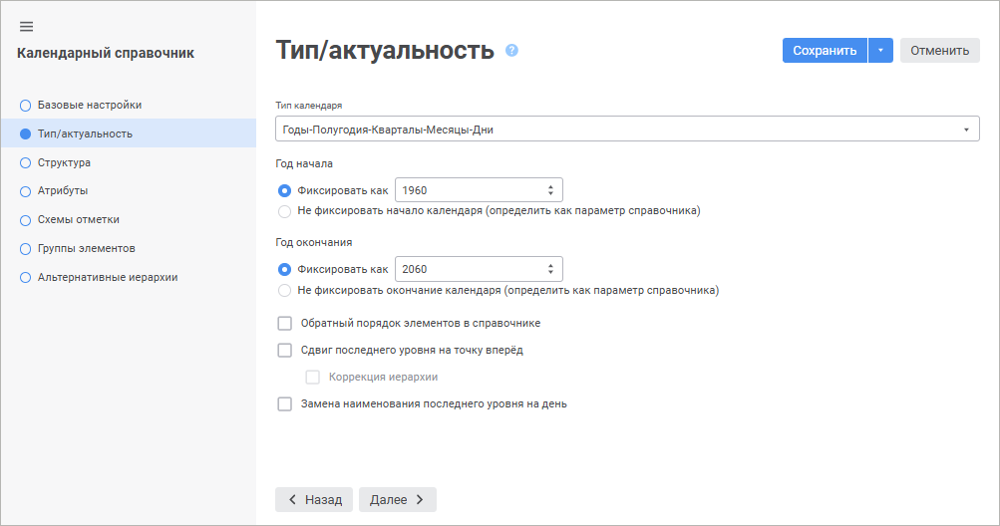
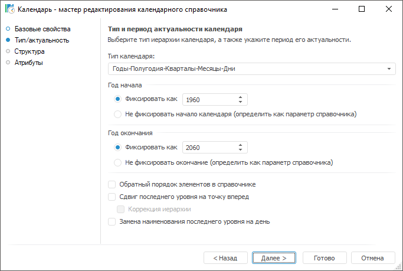

# Календарный справочник

Календарный справочник
-

# Календарный справочник

Календарный справочник содержит иерархическое представление временной
 шкалы с заданной детализацией. Доступна детализация по следующим уровням:
 годы, 9 месяцев, полугодия, кварталы, месяцы, недели и дни. Содержимое
 справочника генерируется автоматически в зависимости от указанных параметров.

Календарный справочник поддерживает динамическое определение начала
 и окончания временной шкалы, то есть является динамическим.

Для построения данного справочника не нужно создавать таблицы и устанавливать
 взаимосвязь между элементами таблиц. Необходимо лишь выбрать уровни календаря,
 а их соподчиненность, элементы и взаимосвязь между ними генерируются системой.

[Создание календарного
 справочника](javascript:TextPopup(this))

	Для создания календарного справочника в [навигаторе
	 объектов](GetStarted.chm::/Interface/Interface_Navigator.htm):

	- в веб-приложении нажмите кнопку  «Создать» в главном меню и выберите
	 тип объекта на боковой панели «[Новый объект](UiNav.chm::/02_Navigator/General_Principles_of_Work.htm#add_object)»;

	- в настольном приложении выполните одно из действий:

		- нажмите кнопку «Новый объект
		 > Справочник» в группе «Создать»
		 на вкладке «Главная» ленты
		 инструментов;

		- выполните команду «Создать
		 > Справочник» в контекстном меню навигатора объектов.

Выберите тип создаваемого справочника на
 странице «Тип справочника» в мастере
 справочника.

	 Веб-приложение Настольное приложение

		

		

В мастере доступны страницы:

	- [Базовые
	 настройки/Базовые свойства](base_settings.htm). Задаются наименование
	 объекта, идентификатор и примечание;

	- [Тип/актуальность](UiMd_reference_book_Master_Calendar_page1.htm).
	 Задаются основные параметры, определяющие используемую в календаре
	 иерархию и годы начала и окончания календарного периода.

	- [Структура](UiMd_reference_book_Master_Calendar_page2.htm).
	 Указываются уровни, которые будут присутствовать в иерархии календаря.

	- [Атрибуты](UiMd_reference_book_Master_Calendar_page3.htm).
	 Можно сформировать набор дополнительных пользовательских атрибутов,
	 которые будут характеризовать каждый элемент справочника;

	- [Схемы отметки](../look-and-feel_Reference_book/UiMd_reference_book_look-and-feel_Scheme.htm). Задаются
	 схемы отметки для автоматизации выделения элементов справочника по
	 заданным правилам. Переход на страницу доступен после сохранения настроек
	 справочника;

	- [Группы элементов](../look-and-feel_Reference_book/UiMd_reference_book_look-and-feel_Group.htm). Определяются
	 группы элементов для ограничения списка доступных элементов справочника.
	 Переход на страницу доступен после сохранения настроек справочника;

Примечание.
 Страницы «Схемы отметки», «Группы элементов», «Альтернативные
 иерархии» доступны только в веб-приложении.

Для сохранения настроек в мастере справочника:

	- в веб-приложении:

		- нажмите кнопку «Сохранить»;

		- выполните команду «Сохранить
		 и закрыть» в раскрывающемся меню кнопки «Сохранить».
		 После этого будут сохранены заданные настройки, закрыт мастер
		 и выполнен переход в [навигатор
		 объектов](getstarted.chm::/Interface/Interface_Navigator.htm).

Примечание.
 Команда «Сохранить и закрыть»
 доступна только при [редактировании
 настроек](../Work/Work_Dictionary.htm#edit).

	- в настольном приложении нажмите кнопку «Готово».

## Индексы календарного справочника

Календарный справочник имеет в своей структуре фиксированный набор блоков
 и индексов, которые в дальнейшем используются для привязки данных источников
 к элементам календаря. Каждый индекс построен на [системных
 атрибутах](UiMd_reference_book_Master_Calendar_page3.htm) справочника. Набор блоков и индексов меняется в зависимости
 от того, какой выбран [тип
 календаря](UiMd_reference_book_Master_Calendar_page1.htm) и какие [уровни](UiMd_reference_book_Master_Calendar_page2.htm)
 включены в структуру календаря.

Блоки предназначены для выделения элементов только определённых уровней.
 Каждый блок имеет первичный, уникальный индекс, построенный на атрибуте
 «Дата начала периода (START_DATE)». В зависимости от выбранного блока,
 даты, хранящиеся в источнике, будет рассматриваться как начало годов,
 месяцев или других периодов. Также в справочнике имеются индексы, учитывающие
 все элементы календаря. Ниже приведён список и состав этих индексов:

		 Наименование (идентификатор)
		 Атрибуты, входящие в индекс
		 Дополнительно

		 Первичный ключ (INDEX_MAIN)
		 Тип блока календаря (BLOCK_TYPE)

		Дата начала периода (START_DATE)

		 Первичный, уникальный. Всегда присутствует в структуре справочника.

		 Имя элемента календаря (INDEX_NAME)
		 Имя элемента календаря (NAME)
		 Всегда присутствует в структуре справочника.

		 Порядок элементов (INDEX_ORDER)
		 Порядок (ORDER)
		 Уникальный. Всегда присутствует в структуре справочника.

		 Индекс Номер года (INDEX_ATTR_YEAR)
		 Номер года (YEAR)
		 -

		 Индекс Номер полугодия (INDEX_ATTR_HALF_OF_YEAR)
		 Номер полугодия (HALF_OF_YEAR)
		 -

		 Индекс Номер квартала (INDEX_ATTR_QUARTER)
		 Номер квартала (QUARTER)
		 -

		 Индекс Номер месяца (INDEX_ATTR_MONTH)
		 Номер месяца (MONTH)
		 -

		 Индекс Номер недели в году (INDEX_ATTR_WEEK_OF_YEAR)
		 Номер недели в году (WEEK_OF_YEAR)
		 -

		 Индекс Номер дня в неделе (INDEX_ATTR_DAY_OF_WEEK)
		 Номер дня в неделе (DAY_OF_WEEK)
		 -

		 Индекс Номер дня в месяце (INDEX_ATTR_DAY_OF_MONTH)
		 Номер дня в месяце (DAY_OF_MONTH)
		 -

		 Индекс Номер дня в году (INDEX_ATTR_DAY_OF_YEAR)
		 Номер дня в году (DAY_OF_YEAR)
		 -

При настройке привязок измерений используйте тот индекс, который соответствует
 хранящимся в источнике календарным данным.

См. также:

[Создание справочников](../Create.htm) | [Табличный справочник](../Master_Table_reference_book/Master_Table.htm)
 | [Вычисляемый
 справочник](../Master_Calculation_reference_book/Master_Calculation.htm)

		Справочная
		 система на версию 10.9
		 от 18/08/2025,
		 © ООО «ФОРСАЙТ»,
