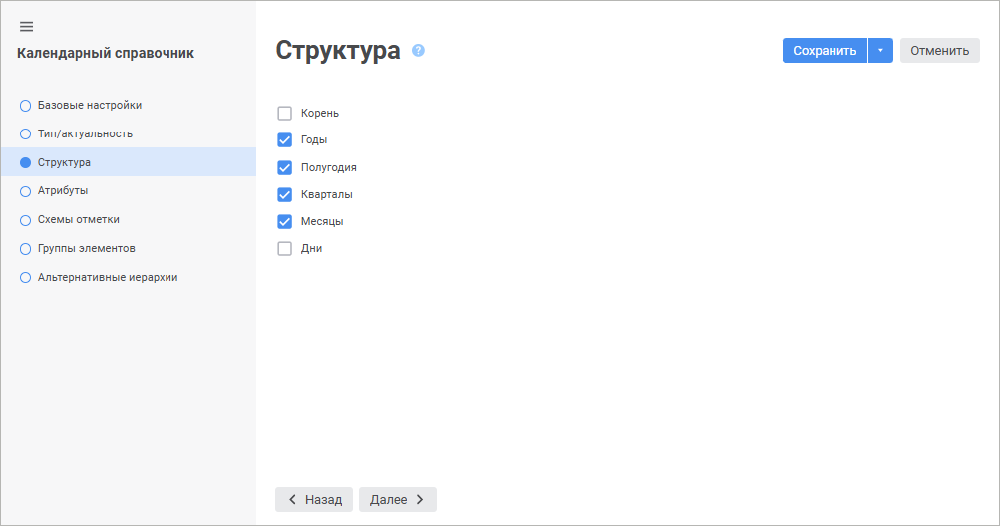
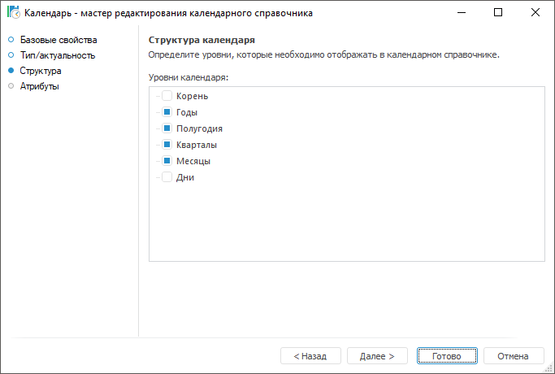
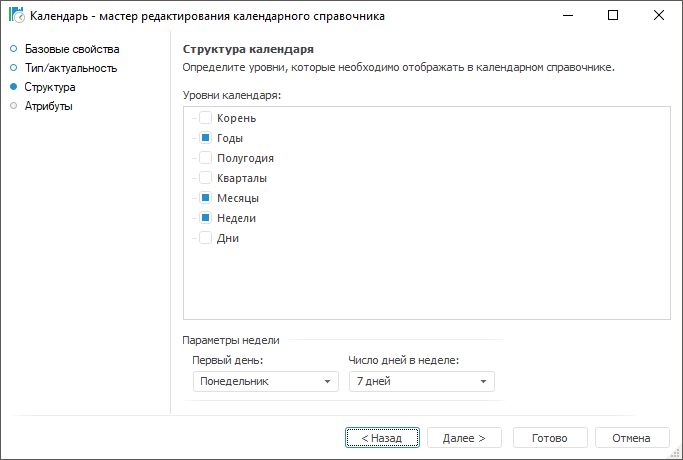

# Страница «Структура»: Календарный справочник

Страница «Структура»: Календарный справочник
-

# Структура

На странице «Структура» с помощью
 установки флажков определяются уровни, которые будут отображаться в календарном
 справочнике.

	 Веб-приложение Настольное приложение

		

		

Если календарь включает уровень «Недели»
 и для данного уровня установлен флажок, то в настольном приложении становятся
 доступными для настройки «Параметры недели»:

	- Первый день. Укажите
	 первый день недели, по умолчанию - «Понедельник».
	 Если первый день недели принадлежит месяцу, то считается, что вся
	 неделя принадлежит данному месяцу;

	- Число дней в неделе.
	 Укажите число дней в неделе (5 или 7 дней):

См. также:

[Календарный справочник](Master_Calendar.htm)

		Справочная
		 система на версию 10.9
		 от 18/08/2025,
		 © ООО «ФОРСАЙТ»,
