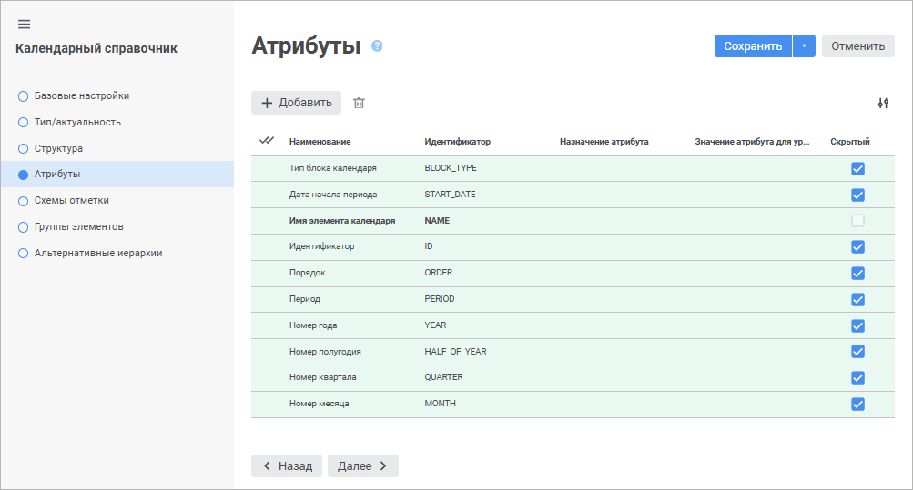
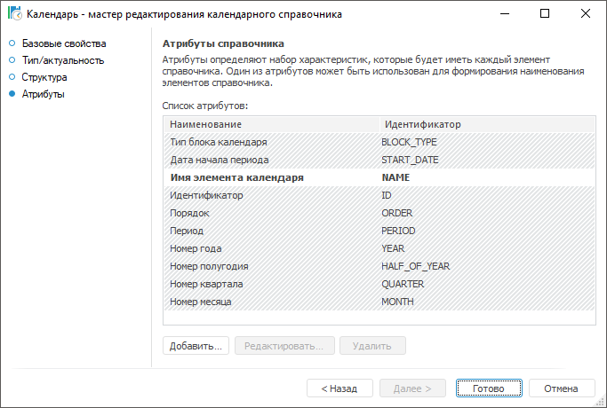

# Страница «Атрибуты»: Календарный справочник

Страница «Атрибуты»: Календарный справочник
-

# Атрибуты

Атрибуты определяют набор характеристик, который будет иметь каждый
 элемент справочника.

На странице «Атрибуты справочника»
 всегда содержатся системные атрибуты календарного справочника, недоступные
 для удаления и переименования. Скрытые атрибуты выделены серым цветом
 в настольном приложении и флажком «Скрытый»
 в веб-приложении.

	 Веб-приложение Настольное приложение

		

		

Если по каким-либо причинам значения стандартных атрибутов справочника
 не подходят для использования, то можно определить набор пользовательских
 атрибутов. Возможности данного вида атрибутов:

	- использования формул;

	- использование пользовательских форматов даты и времени;

	- использование функций, написанных на языке Fore;

	- использование правил формирования значений элементов как для
	 всех, так и для определенных уровней справочника.

Редактирование параметров атрибутов справочника выполняется в окне «[Свойства
 атрибута](UiMd_reference_book_Master_Calendar_page3Attr.htm)».

[Для добавления
 пользовательского атрибута](javascript:TextPopup(this))

		- в веб-приложении нажмите кнопку  «Добавить» в веб-приложении.
		 В конце списка атрибутов появится строка нового атрибута;

		- в настольном приложении:

			- нажмите кнопку «Добавить»;

			- выполните команду «Добавить»
			 контекстного меню;

			- нажмите клавишу INSERT.

	Для созданного атрибута откроется окно
	 «[Свойства
	 атрибута](UiMd_reference_book_Master_Calendar_page3Attr.htm)».

[Для редактирования
 параметров выбранного атрибута](javascript:TextPopup(this))

		- в веб-приложение измените значения требуемых полей нужного
		 атрибута;

		- в настольном приложении выполните одно из действий:

			- нажмите кнопку «Редактировать»;

			- выполните команду «Редактировать»
			 контекстного меню;

			- дважды щёлкните по атрибуту.

	Для выбранного атрибута откроется окно
	 «[Свойства
	 атрибута](UiMd_reference_book_Master_Calendar_page3Attr.htm)».

[Для переименования
 выбранного пользовательского атрибута](javascript:TextPopup(this))

		- в веб-приложении измените поле «Наименование»;

		- в настольном приложении выполните команду «Переименовать»
		 контекстного меню.

[Для использования
 значения атрибута в качестве наименования элементов](javascript:TextPopup(this))

	Установите флажок «Использовать
	 как наименование элементов» в контекстном меню или в [свойствах
	 атрибута](UiMd_reference_book_Master_Calendar_page3Attr.htm) в настольном приложении.

	Данная возможность доступна только для пользовательских
	 атрибутов и для системного атрибута «Наименование».

[Для удаления
 выбранного атрибута](javascript:TextPopup(this))

		- в веб-приложении нажмите кнопку  «Удалить»;

		- в настольном приложении выполните одно из действий:

			- нажмите кнопку «Удалить»;

			- выполните команду «Удалить»
			 контекстного меню.

	Будет запрошено подтверждение выполняемого действия.

См. также:

[Календарный справочник](Master_Calendar.htm)

		Справочная
		 система на версию 10.9
		 от 18/08/2025,
		 © ООО «ФОРСАЙТ»,
