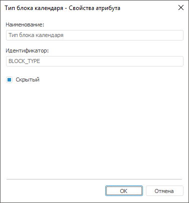

# Свойства атрибута

Свойства атрибута
-

# Свойства атрибута

Для определения свойств системного или пользовательского [атрибутов](UiMd_reference_book_Master_Calendar_page3.htm)
 в настольном приложении используйте окно «Свойства
 атрибута».

## Свойства системного атрибута

Системные атрибуты создаются автоматически и недоступны для удаления
 и переименования.

При установке флажка «Скрытый»
 атрибут будет участвовать в построении справочника, но при этом в справочнике
 отображаться не будет. По умолчанию флажок установлен.

## Свойства пользовательского атрибута

При [добавлении/редактировании](UiMd_reference_book_Master_Calendar_page3.htm)
 пользовательского атрибута календарного справочника будет открыт диалог:

Задайте параметры атрибута:

	- Наименование. Введите
	 наименование атрибута;

	- Идентификатор. Введите
	 уникальный идентификатор атрибута. Допускается использование только
	 латинских букв, цифр, знаков «_», не допускается использование пробелов;

	- Скрытый атрибут. По
	 умолчанию флажок не установлен. При установке данного флажка атрибут
	 будет участвовать в построении справочника, но при этом в справочнике
	 отображаться не будет;

	- Назначение атрибута.
	 Группа содержит флажки, соответствующие назначению атрибута:

		- Наименование. Атрибут,
		 значение которого будет отображаться в качестве имени элемента
		 при открытии справочника. Один атрибут должен обязательно иметь
		 назначение «Наименование»;

		- Альтернативная иерархия.
		 По умолчанию флажок не установлен. При установленном флажке атрибут
		 будет использоваться для настройки [альтернативной
		 иерархии](../look-and-feel_Reference_book/Attributes_as_alt_hier.htm);

	- Значение атрибута для уровней
	 календаря. В списке «Уровни»
	 будут отображаться все уровни, включенные в состав [структуры
	 справочника](UiMd_reference_book_Master_Calendar_page2.htm). Для каждого уровня календаря в отдельности или для
	 всех сразу можно задать выражение, по которому будет формироваться
	 значение атрибута. Для этого выберите уровень и:

		- нажмите кнопку «Редактировать»;

		- дважды щёлкните по наименованию уровню.

Будет открыто окно «[Редактор
 выражения](UiNav.chm::/GUI/ExpressionEditor.htm)», в котором формируется выражение.
 При формировании выражений можно использовать стандартные атрибуты календаря,
 условный оператор, макрос из модуля
 (см. раздел: «[Примеры
 выражений](UiMd_reference_book_Master_Calendar_page3Example.htm)») или задать пользовательский [формат
 даты и времени](UiMd_reference_book_Master_Calendar_page3Dataformat.htm). Выражение, установленное для атрибута, должно возвращать
 символьный тип данных.

Для удаления выражения выбранного уровня
 нажмите кнопку «Очистить». Будет
 запрошено подтверждение о выполняемом действии.

См. также:

[Атрибуты справочника](UiMd_reference_book_Master_Calendar_page3.htm)

		Справочная
		 система на версию 10.9
		 от 18/08/2025,
		 © ООО «ФОРСАЙТ»,
