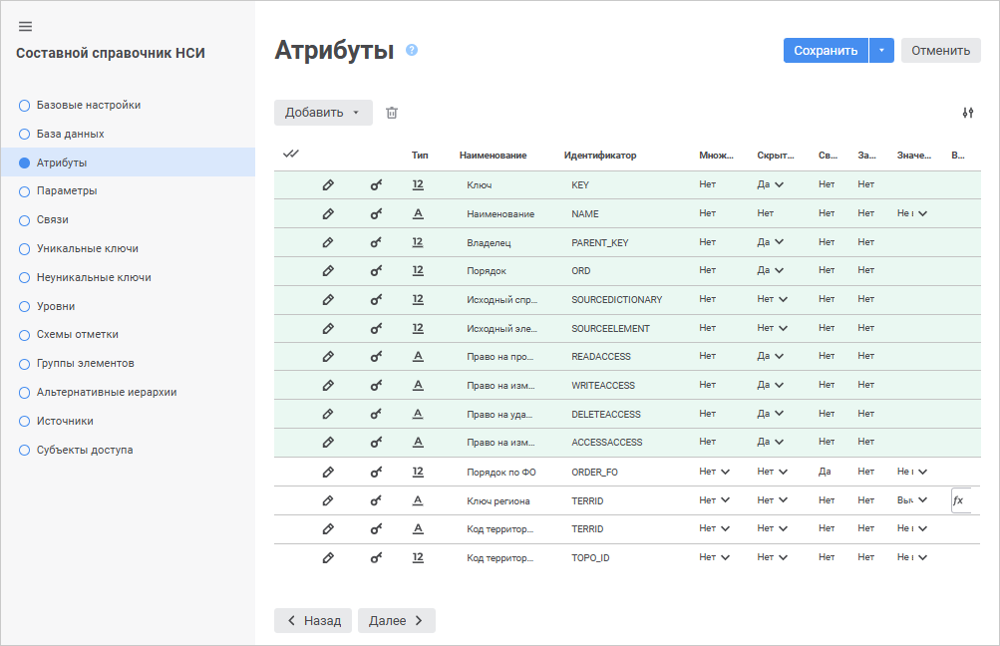
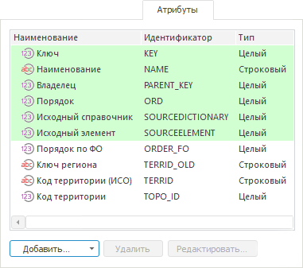

# Страница «Атрибуты»: Составной справочник НСИ

Страница «Атрибуты»: Составной справочник НСИ
-

# Добавление атрибутов

На странице «Атрибуты» в веб-приложении
 и настольном приложении формируется список атрибутов справочника.

Атрибуты определяют набор характеристик,
 которые будет иметь каждый элемент справочника.

	 Веб-приложение

	 Настольное
	 приложение

		

		

		При установке флажка «[Переводить
		 справочник на другие языки](../Master_RDS_reference_book/base_settings.htm#translate_dictionary)» пиктограмма атрибутов типа
		 «Строка» и «Длинный
		 текст», требующих перевода, будет изменена на изображение
		 флага страны, использующей текущий язык перевода в качестве государственного.

Атрибуты бывают следующих типов:

	- Системные. Обязательные
	 атрибуты составного справочника НСИ, которые нельзя удалять. При создании
	 составного справочника НСИ на странице «Атрибуты»
	 уже находится минимальный набор системных атрибутов:

		- Ключ (KEY);

Примечание.
 В составных справочниках НСИ поддерживаются ключи элементов, входящие
 в диапазон от 0 до 2 млрд.

		- Наименование (NAME);

Примечание.
 Для атрибута «Наименование» можно
 формировать [значение
 по формуле](../Master_RDS_reference_book/Attributes/Attribute.htm#calc_values).

		- Порядок (ORD);

		- Владелец (PARENT_KEY).
		 Атрибут добавляется автоматически при установке флажка «[Элементы
		 имеют иерархию](base_settings.htm#hierarchy)»;

		- Исходный справочник (SOURCEDICTIONARY).
		 В атрибуте хранится ключ (KEY) справочника-источника. Заполняется
		 автоматически;

		- Исходный элемент (SOURCEELEMENT).
		 В атрибуте хранится ключ (KEY) элемента справочника-источника.
		 Заполняется автоматически;

		- Версия (VERSION).
		 Атрибут добавляется автоматически при установке флажка «[Элементы
		 могут изменяться во времени](base_settings.htm#change_in_time)»;

		- Дата начала (INDATE).
		 Атрибут добавляется автоматически при установке флажка «[Элементы
		 могут изменяться во времени](base_settings.htm#change_in_time)». По умолчанию дата начала
		 01.01.1900;

		- Дата окончания (OUTDATE).
		 Атрибут добавляется автоматически при установке флажка «[Элементы
		 могут изменяться во времени](base_settings.htm#change_in_time)». По умолчанию дата окончания
		 31.12.2999;

		- Скрыть (HIDDEN).
		 Атрибут добавляется автоматически при установке флажка «[Элементы
		 имеют признак скрытости](base_settings.htm#hidden_attribute)»;

		- Право на просмотр (READACCESS).
		 Атрибут добавляется автоматически при установке флажка «[Элементы
		 имеют дискреционные права доступа](base_settings.htm#discretion_access_permissions)»;

		- Право на изменение (WRITEACCESS).
		 Атрибут добавляется автоматически при установке флажка «[Элементы
		 имеют дискреционные права доступа](base_settings.htm#discretion_access_permissions)»;

		- Право на удаление (DELETEACCESS).
		 Атрибут добавляется автоматически при установке флажка «[Элементы
		 имеют дискреционные права доступа](base_settings.htm#discretion_access_permissions)»;

		- Право на изменение прав
		 (ACCESSACCESS). Атрибут добавляется автоматически при установке
		 флажка «[Элементы
		 имеют дискреционные права доступа](base_settings.htm#discretion_access_permissions)»;

		- Мандатный доступ (MANDATORYACCESS).
		 Атрибут добавляется автоматически при установке флажка «[Элементы
		 имеют дискреционные права доступа](base_settings.htm#discretion_access_permissions)».

На странице «Атрибуты»
 все системные атрибуты выделены зеленым цветом. В зависимости от параметров,
 указанных на странице «[Описание](Master_CompositeTable.htm#structure)»,
 набор системных атрибутов может измениться;

	- Пользовательские. Атрибуты
	 справочника, которые создаются пользователем:

		- [Обычные](../Master_RDS_reference_book/Attributes/Attribute.htm).
		 Используются для создания полей справочника;

		- [Заимствованные](../Master_RDS_reference_book/Attributes/Imported_Attribute.htm).
		 Используются для создания полей справочника, значения которых
		 заимствуются из связанного справочника.

Примечание.
 При работе с [инструментами
 анализа данных и построения отчётов](DataAnalysis.chm::/DataAnalysis_Title.htm) сохранить данные в справочники
 со множественными значениями заимствованного атрибута нельзя.

## Операции над атрибутами справочника

[Добавление
 атрибута справочника](javascript:TextPopup(this))

Для добавления атрибута справочника:

	- в веб-приложении:

		- выполните команду «Добавить >
		 Обычный атрибут» для создания обычного атрибута. Будет
		 открыто окно «[Свойства
		 атрибута](../Master_RDS_reference_book/Attributes/Attribute.htm)»;

		- выполните команду «Добавить >
		 Заимствованный атрибут» для создания заимствованного атрибута.
		 Будет открыто окно «[Свойства
		 заимствованного атрибута](../Master_RDS_reference_book/Attributes/Imported_Attribute.htm)»;

	- в настольном приложении:

		- Выполните одно из действий:

			- нажмите кнопку «Добавить»;

			- вызовите контекстное меню на свободной области вкладки
			 «Атрибуты»;

			- дважды щёлкните по свободной области вкладки «Атрибуты».

		- Выберите тип атрибута:

			- Обычный атрибут.
			 Будет открыто окно «[Свойства
			 атрибута](../Master_RDS_reference_book/Attributes/Attribute.htm)»;

			- Заимствованный атрибут.
			 Будет открыто окно «[Свойства
			 заимствованного атрибута](../Master_RDS_reference_book/Attributes/Imported_Attribute.htm)».

В справочник будет добавлен атрибут выбранного типа.

Примечание.
 Создание заимствованного атрибута доступно, если у справочника установлена
 [связь](../Master_RDS_reference_book/Link.htm)
 с другим справочником.

[Редактирование
 атрибута справочника](javascript:TextPopup(this))

Для редактирования свойств выбранного атрибута справочника:

	- в веб-приложении нажмите кнопку  «Редактировать»;

	- в настольном приложении:

		- нажмите кнопку «Редактировать»;

		- выполните команду «Редактировать»
		 в контекстном меню атрибута;

		- дважды щёлкните по наименованию атрибута.

В появившемся окне «[Свойства
 атрибута](../Master_RDS_reference_book/Attributes/Attribute.htm)» или «[Свойства
 заимствованного атрибута](../Master_RDS_reference_book/Attributes/Imported_Attribute.htm)» внесите требуемые изменения.

В веб-приложении также существует возможность изменения полей атрибута
 на самой странице «Атрибуты» мастера
 справочника.

[Изменение
 порядка атрибутов](javascript:TextPopup(this))

Для изменения порядка расположения атрибутов в списке справочника:

	- в веб-приложени перетащите требуемые атрибуты в нужные места
	 с помощью механизма Drag&Drop;

	- в настольном приложении:

		- используйте кнопки «Вверх»
		 и «Вниз»;

		- выполните команду «Переместить
		 вверх/вниз» в контекстном меню атрибута.

После изменения порядка следования атрибутов автоматически изменится
 порядок полей в текущем справочнике.

[Удаление
 атрибута справочника](javascript:TextPopup(this))

Для удаления выбранного атрибута:

	- в веб-приложении нажмите кнопку  «Удалить»;

	- в настольном приложении:

		- нажмите кнопку «Удалить»;

		- нажмите сочетание клавиш CTRL+DELETE;

		- выполните команду «Удалить»
		 в контекстном меню атрибута.

Будет запрошено подтверждение о выполняемом действии. Для удаления атрибута,
 участвующего в [параметре](../Master_RDS_reference_book/Parameters.htm),
 [уникальном](../Master_RDS_reference_book/Unique_Keys.htm)
 или [неуникальном
 ключе](../Master_RDS_reference_book/Non_Unique_Keys.htm), сначала нужно удалить параметр или ключ.

[Добавление
 атрибута справочника в обновление](javascript:TextPopup(this))

Примечание.
 Доступно только в настольном приложении.

Для добавления атрибута справочника в обновление:

	- Откройте справочник на редактирование и перейдите на вкладку
	 «Описание». Затем перейдите
	 на вкладку «Атрибуты».

	- Вызовите контекстное меню выбранного атрибута.

	- Выберите пункт «Добавить в
	 обновление».

Если ранее справочник еще не был включён в обновление, будет открыто
 окно «[Добавление в обновление](UpdManager.chm::/CreateUpdate/Features/Admin_CreateUpdate_Features_Tables.htm)».
 Задайте в нём параметры обновления. Если ранее справочник уже был включён
 в обновление, при добавлении новых атрибутов настраивать параметры повторно
 не нужно.

В результате выполненных действий в состав обновления в менеджере обновлений
 будет добавлен выбранный атрибут. В соответствующем поле в столбце «Перенос данных» в [менеджере обновлений](UpdManager.chm::/admin_upmbobj_runmanager.htm)
 будет указано, что обновление справочника частичное:

[Удаление
 атрибута справочника из обновления](javascript:TextPopup(this))

Примечание.
 Доступно только в настольном приложении.

Для удаления атрибута справочника из обновления:

	- Откройте справочник на редактирование и перейдите на вкладку
	 «Описание». Затем перейдите
	 на вкладку «Атрибуты».

	- Вызовите контекстное меню выбранного атрибута.

	- Выберите пункт «Убрать из обновления».

В результате выполненных действий выбранный атрибут будет исключён из
 состава обновления.

[Изменение количества
 отображаемых свойств в веб-приложении](javascript:TextPopup(this))

	Для изменения количества отображаемых свойств в веб-приложении нажмите
	 кнопку  «Настройки»
	 и установите/снимите флажок напротив наименования свойств.

Также для атрибутов справочника можно настроить [разграничение
 прав доступа](../Master_RDS_reference_book/Attributes/Access_Permissions.htm).

См. также:

[Составной
 справочник НСИ](Master_CompositeTable.htm)

		Справочная
		 система на версию 10.9
		 от 18/08/2025,
		 © ООО «ФОРСАЙТ»,
