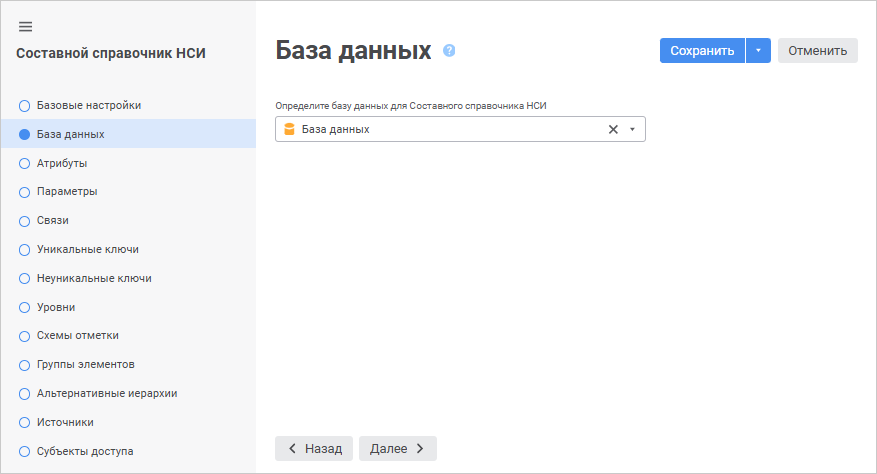
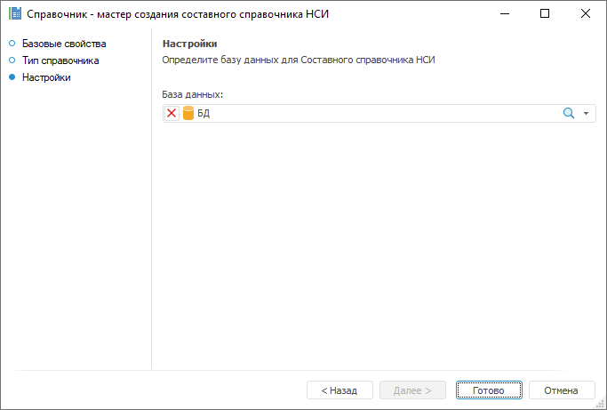

# Страница «База данных»: Составной справочник НСИ

Страница «База данных»: Составной справочник НСИ
-

# База данных

На странице «База данных» в
 веб-приложении и «Настройки» в
 настольном приложении выбирается база данных для хранения данных составного
 справочника НСИ.

	 Веб-приложение

	 Настольное
	 приложение

		

		

По умолчанию используется база данных, заданная в [настройках
 репозитория](UiNav.chm::/02_Navigator/Repo_Default.htm#objects_default).

Для изменения базы данных:

	- в веб-приложении выберите базу данных в раскрывающемся списке.

Для быстрого выбора объекта в поле для поиска
 введите его название/идентификатор/ключ, в зависимости от настроек отображения.
 Поиск будет выполняться автоматически по мере ввода текста. Список будет
 содержать объекты, наименования/идентификаторы/ключи которых содержат
 вводимый текст.

Для настройки отображения объектов репозитория
 в списке нажмите кнопку  «Отображение объекта» и выберите
 в раскрывающемся меню вариант отображения:

		- Наименование. Объекты
		 отображаются под своими наименованиями. Вариант по умолчанию;

		- Идентификатор. Объекты
		 отображаются под своими идентификаторами;

		- Ключ. Объекты отображаются
		 под своими ключами.

Выбрать можно несколько вариантов. Идентификатор
 и ключ будут указаны в скобках;

	- в настольном приложении выберите базу данных в раскрывающемся
	 списке «База данных» и нажмите
	 кнопку «Готово».

Для сброса отметки выбранной базы данных:

	- в веб-приложении нажмите кнопку  «Очистить»;

	- в настольном приложении нажмите кнопку 
	 «Очистить».

См. также:

[Составной
 справочник НСИ](Master_CompositeTable.htm)

		Справочная
		 система на версию 10.9
		 от 18/08/2025,
		 © ООО «ФОРСАЙТ»,
