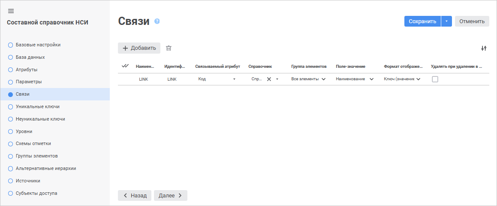
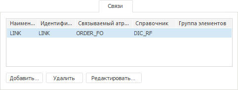

# Страница «Связи»: Составной справочник НСИ

Страница «Связи»: Составной справочник НСИ
-

# Создание связей

На странице «Связи» в веб-приложении
 и настольном приложении создаются и настраиваются связи по атрибутам с
 другими справочниками. Создание связей необходимо:

	- для создания [заимствованных
	 атрибутов](../Master_RDS_reference_book/Attributes/Imported_Attribute.htm);

	- для реализации механизма передачи значения атрибута параметру
	 связанного справочника;

	- для заполнения [параметра](Parameters.htm) значениями
	 из другого справочника.

Связи между атрибутами можно создавать в пустом и не в пустом справочнике.
 При создании связей в непустом справочнике удостоверьтесь, что все значения
 связываемого атрибута пустые. В противном случае построить связь не удастся.

	 Веб-приложение

	 Настольное
	 приложение

		

		

## Операции над связями

[Добавление
 связи](javascript:TextPopup(this))

Для добавления связи:

	- в веб-приложении нажмите кнопку  «Добавить». Новая связь будет добавлена
	 в список связей. Наименование и идентификатор связи будут заданы по
	 умолчанию: «LINK<Порядковый номер>».
	 Для настройки параметров связи задайте свойства связи в соответствующих
	 столбцах;

	- в настольном приложении:

		- нажмите кнопку «Добавить»;

		- выполните команду «Добавить»
		 в контекстном меню на свободной области вкладки «Связи»;

		- дважды щёлкните по свободной области вкладки «Связи».

Будет открыто окно «Свойства
 связи».

Примечание.
 Создание связи для справочников, построенных на разных объектах базы данных,
 невозможно.

[Редактирование
 свойств связи](javascript:TextPopup(this))

Для редактирования свойств выбранной связи:

	- в веб-приложении измените свойства в соответствующих столбцах
	 требуемой связи на странице «Связи»
	 мастера справочника. Для настройки параметров привязки нажмите кнопку
	  «Параметры
	 привязки». В открывшемся окне «[Параметры
	 привязки](../Master_RDS_reference_book/Link_Property.htm#add)» внесите требуемые изменения;

	- в настольном приложении:

		- нажмите кнопку «Редактировать»;

		- выполните команду «Редактировать»
		 в контекстном меню связи;

		- дважды щёлкните по наименованию связи.

В открывшемся окне «Свойства
 связи» внесите требуемые изменения.

[Удаление
 связи](javascript:TextPopup(this))

Для удаления выбранной связи:

	- в веб-приложении нажмите кнопку  «Удалить»;

	- в настольном приложении:

		- нажмите кнопку «Удалить»;

		- нажмите сочетание клавиш CTRL+DELETE;

		- выполните команду «Удалить»
		 в контекстном меню связи.

Будет запрошено подтверждение о выполняемом действии.

[Изменение количества
 отображаемых свойств в веб-приложении](javascript:TextPopup(this))

	Для изменения количества отображаемых свойств в веб-приложении нажмите
	 кнопку  «Настройки»
	 и установите/снимите флажок напротив наименования свойств.

См. также:

[Составной
 справочник НСИ](Master_CompositeTable.htm)

		Справочная
		 система на версию 10.9
		 от 18/08/2025,
		 © ООО «ФОРСАЙТ»,
