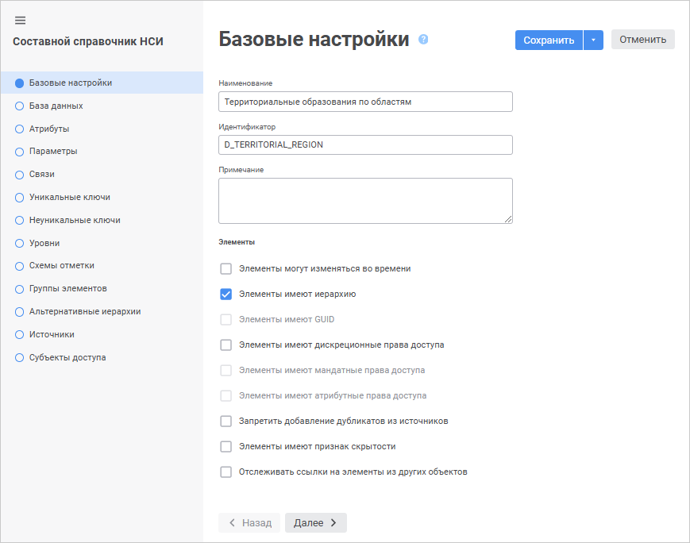
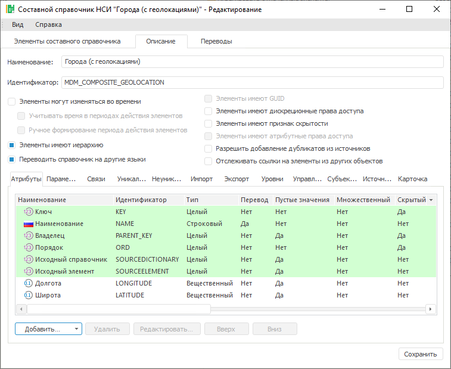

# Составной справочник НСИ

Составной справочник НСИ
-

# Составной справочник НСИ

Справочник предназначен для структурированного представления элементов
 с возможностью их преобразования. Для создания справочника не требуется
 источник данных. Данные в справочник могут быть внесены вручную или загружены
 из источника данных с помощью встроенных инструментов ETL. Элементы справочника
 могут изменяться во времени, то есть иметь несколько версий. Составной
 справочник НСИ включает в себя как свои собственные элементы, так и элементы
 из других справочников НСИ. Для создания составного справочника НСИ требуется
 БД для хранения данных справочника. Составной справочник НСИ может быть
 создан в любом месте репозитория. Составной справочник НСИ использует
 для хранения информации отдельную таблицу. Она создается автоматически
 при создании справочника и является его дочерним объектом. Поля таблицы
 соответствуют атрибутам справочника.

Мастер составного справочника НСИ отличается в веб-приложении и настольном
 приложении.

[Создание
 составного справочника НСИ](javascript:TextPopup(this))

	Для создания составного справочника НСИ в [навигаторе
	 объектов](GetStarted.chm::/Interface/Interface_Navigator.htm):

	- в веб-приложении нажмите кнопку  «Создать» в главном меню и выберите
	 тип объекта на боковой панели «[Новый объект](UiNav.chm::/02_Navigator/General_Principles_of_Work.htm#add_object)»;

	- в настольном приложении выполните одно из действий:

		- нажмите кнопку «Новый объект
		 > Справочник» в группе «Создать»
		 на вкладке «Главная» ленты
		 инструментов;

		- выполните команду «Создать
		 > Справочник» в контекстном меню навигатора объектов.

Выберите тип создаваемого справочника на
 странице «Тип справочника» в мастере
 справочника.

	 Веб-приложение

	 Настольное
	 приложение

		

		В
		 мастере доступны страницы:

			- [Базовые
			 настройки](base_settings.htm). Задаются наименование, идентификатор,
			 примечание и прочие базовые настройки справочника;

			- [База данных](Database.htm).
			 Выбирается база данных для хранения данных справочника;

			- [Атрибуты](Attributes.htm).
			 Формируется список атрибутов справочника;

			- [Параметры](Parameters.htm).
			 Формируется список параметров справочника;

			- [Связи](Link_composite.htm).
			 Настраиваются связи между атрибутами;

			- [Уникальные
			 ключи](Unique_Keys.htm). Настройка базовых идентификаторов
			 для записей составного справочника НСИ;

			- [Неуникальные
			 ключи](Non_Unique_Keys.htm). Настройка дополнительных идентификаторов
			 для записей составного справочника НСИ;

			- [Уровни](Level.htm).
			 Настраиваются уровни агрегации данных;

			- [Субъекты доступа](Access_Subjects.htm). Формируется
			 список субъектов доступа;

	- [Схемы отметки](../look-and-feel_Reference_book/UiMd_reference_book_look-and-feel_Scheme.htm). Задаются
	 схемы отметки для автоматизации выделения элементов справочника по
	 заданным правилам. Переход на страницу доступен после сохранения настроек
	 справочника;

	- [Группы элементов](../look-and-feel_Reference_book/UiMd_reference_book_look-and-feel_Group.htm). Определяются
	 группы элементов для ограничения списка доступных элементов справочника.
	 Переход на страницу доступен после сохранения настроек справочника;

			- [Альтернативные иерархии](../look-and-feel_Reference_book/Use_AlterHier_ForRefBook.htm).
			 Устанавливаются связи для сопоставления элементов исходного
			 и альтернативного справочников. Переход на страницу доступен
			 после сохранения настроек справочника;

			- [Источники](Sources.htm).
			 Формируется список справочников, используемых в качестве источников
			 данных для составного справочника НСИ.

		

		В
		 мастере доступны страницы:

			- [Базовые
			 свойства](base_settings.htm). Задаются наименование, идентификатор
			 и примечание;

			- [Настройки](Database.htm).
			 Выбирается база данных для хранения данных справочника.

Для сохранения настроек в мастере справочника:

	- в веб-приложении:

		- нажмите кнопку «Сохранить»;

		- выполните команду «Сохранить
		 и закрыть» в раскрывающемся меню кнопки «Сохранить».
		 По завершению выполнения команды будут сохранены заданные настройки,
		 закрыт мастер и выполнен переход в [режим
		 редактирования](../Work/Work_Dictionary.htm#composite_rds).

Примечание.
 Команда «Сохранить и закрыть»
 доступна только при [редактировании
 настроек](../Work/Work_Dictionary.htm#edit).

	- в настольном приложении нажмите кнопку «Готово».

## Настройка структуры справочника

Настройка структуры составного справочника НСИ отличается в веб-приложении
 и настольном приложении:

	- в веб-приложении настройка выполняется при [создании](#add_composite_d)
	 нового составного справочника НСИ с помощью мастера и может изменяться
	 при редактировании существующего составного справочника НСИ;

	- в настольном приложении настройка выполняется только при [редактировании](../Work/Work_Dictionary.htm#edit) существующего
	 составного справочника НСИ на странице «Описание»:

Для настройки структуры справочника
 выполните шаги:

	- Задайте
	 [базовые
	 настройки справочника](base_settings.htm).

	- Выберите
	 [базу данных
	 справочника](Database.htm).

	- [Добавьте атрибуты](Attributes.htm).

	- [Добавьте параметры](Parameters.htm), если
	 требуется.

	- [Создайте связи](Link_composite.htm), если
	 требуется.

	- [Добавьте уникальные ключи](Unique_Keys.htm),
	 если требуется.

	- [Добавьте неуникальные ключи](Non_Unique_Keys.htm),
	 если требуется.

	- [Создайте схемы импорта/экспорта](../Master_RDS_reference_book/Import.htm),
	 если требуется. Доступно только в настольном приложении.

	- [Создайте уровни](Level.htm), если требуется.

	- [Настройте
	 схему отметки](../look-and-feel_Reference_book/UiMd_reference_book_look-and-feel_Scheme.htm) для автоматизации выделения элементов
	 по заданным правилам. Переход на страницу доступен после сохранения
	 настроек справочника.

	- [Определите
	 группы элементов](../look-and-feel_Reference_book/UiMd_reference_book_look-and-feel_Group.htm) для ограничения списка доступных
	 элементов справочника. Переход на страницу доступен после сохранения
	 настроек справочника.

	- [Настройте
	 альтернативные иерархии](../look-and-feel_Reference_book/Use_AlterHier_ForRefBook.htm). Переход на страницу доступен
	 после сохранения настроек справочника.

	- [Управляйте
	 параметрами вложенных элементов](../Master_RDS_reference_book/Manage_Nested_Object_Parameters.htm), если требуется.
	 Доступно только в настольном приложении.

	- [Управляйте
	 субъектами доступа](../Master_RDS_reference_book/Access_Subjects.htm), если требуется.

	- [Выберите источники данных](Sources.htm) для
	 составного справочника НСИ.

	- [Замените предустановленный
	 вид диалога](../Master_RDS_reference_book/Element_Card.htm), если требуется. Доступно только в
	 настольном приложении.

	- [Переведите справочник
	 на другие языки](uinav.chm::/Multilanguage/UiRds_Locale.htm), если требуется. Доступно только
	 в настольном приложении. Для получения подробной информации о настройке
	 мультиязычности содержимого репозитория и общей системы обратитесь
	 к разделу «[Настройка
	 мультиязычности](uinav.chm::/Multilanguage/Multilanguage_setting.htm)».

Для работы с составными справочниками
 НСИ обратитесь к разделу «[Работа
 со справочником](../Work/Work_Dictionary.htm)».

См. также:

[Создание
 справочников](../Create.htm) | [Справочник
 НСИ](../Master_RDS_reference_book/Master_RDS.htm)

		Справочная
		 система на версию 10.9
		 от 18/08/2025,
		 © ООО «ФОРСАЙТ»,
