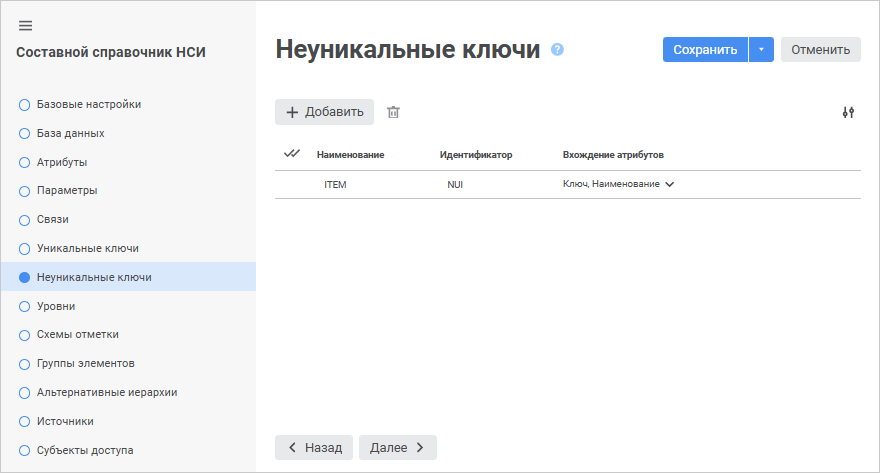
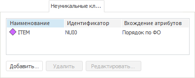
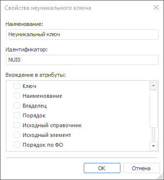

# Страница «Неуникальные ключи»: Составной справочник НСИ

Страница «Неуникальные ключи»: Составной справочник НСИ
-

# Добавление неуникальных ключей

На странице «Неуникальные ключи»
 в веб-приложении и настольном приложении создаются и настраиваются неуникальные
 ключи.

Неуникальный ключ - дополнительный
 идентификатор для записей справочника. Используется для:

	- настройки атрибута в качестве [альтернативной
	 иерархии](../look-and-feel_Reference_book/Attributes_as_alt_hier.htm);

	- для задания [индекса](../look-and-feel_Reference_book/Use_AlterHier_ForRefBook.htm)
	 для связи с альтернативными иерархиями.

Ключ может состоять:

	- из единственного атрибута справочника, значения которого могут
	 повторяться для каждого элемента;

	- из нескольких атрибутов, совокупность значений которых не уникальна.

	 Веб-приложение

	 Настольное
	 приложение

		

		

## Операции над неуникальными ключами

[Добавление](javascript:TextPopup(this))

Для добавления неуникального ключа:

	- в веб-приложении нажмите кнопку  «Добавить». Новый ключ будет добавлен
	 в список неуникальных ключей. Наименование и идентификатор ключа будут
	 заданы по умолчанию. Значение свойства «Наименование»
	 по умолчанию - «ITEM<Порядковый
	 номер>». Значение свойства «Идентификатор»
	 по умолчанию - «NUI<Порядковый
	 номер>»;

	- в настольном приложении:

		- нажмите кнопку «Добавить»;

		- выполните команду «Добавить»
		 в контекстном меню на свободной области вкладки «Неуникальные
		 ключи»;

		- дважды щёлкните по свободной области вкладки «Неуникальные
		 ключи».

Будет открыто окно «Свойства
 неуникального ключа»:

Задайте свойства неуникального ключа:

	- Наименование. Введите
	 наименование неуникального ключа;

	- Идентификатор. Введите
	 идентификатор неуникального ключа. Допускается использование только
	 латинских букв, цифр, знаков «_», не допускается использование пробелов;

	- Вхождение в атрибуты.
	 Список содержит флажки, соответствующие всем атрибутам справочника.
	 Выберите один или несколько атрибутов, которые должны входить в неуникальный
	 ключ.

[Редактирование](javascript:TextPopup(this))

Для редактирования свойств выбранного неуникального ключа:

	- в веб-приложении измените свойства в соответствующих столбцах
	 требуемого неуникального ключа на странице «Неуникальные
	 ключи» мастера справочника;

	- в настольном приложении:

		- нажмите кнопку «Редактировать»;

		- выполните команду «Редактировать»
		 в контекстном меню неуникального ключа;

		- дважды щёлкните по наименованию неуникального ключа.

В появившемся окне «Свойства
 неуникального ключа» для [справочника
 НСИ](../Master_RDS_reference_book/Non_Unique_Keys.htm#add)/[составного
 справочника НСИ](Non_Unique_Keys.htm#add) внесите требуемые изменения.

[Удаление](javascript:TextPopup(this))

Для удаления выбранного неуникального ключа:

	- в веб-приложении нажмите кнопку  «Удалить»;

	- в настольном приложении:

		- нажмите кнопку «Удалить»;

		- нажмите сочетание клавиш CTRL+DELETE;

		- выполните команду «Удалить»
		 в контекстном меню неуникального ключа.

Будет запрошено подтверждение выполняемого действия.

[Изменение количества
 отображаемых свойств в веб-приложении](javascript:TextPopup(this))

	Для изменения количества отображаемых свойств в веб-приложении нажмите
	 кнопку  «Настройки»
	 и установите/снимите флажок напротив наименования свойств.

[Создание
 неуникального индекса в дочерней таблице на основе неуникального ключа](javascript:TextPopup(this))

Возможность доступна с помощью языка Fore. Неуникальный индекс в дочерней
 таблице справочника позволят быстрее выполнять запросы.

Для создания неуникального индекса:

	- Создайте или получите существующий неуникальный ключ в справочнике.

	- Приведите полученный ключ к интерфейсу [IMetaIndex](KeRds.chm::/Interface/IMetaIndex/IMetaIndex.htm).

	- Установите значение свойства [IMetaIndex.Enabled](KeRds.chm::/Interface/IMetaIndex/IMetaIndex.Enabled.htm)
	 в True.

	- Сохраните изменения.

В результате в дочерней таблице справочника будет создан неуникальный
 индекс на основе неуникального ключа из справочника.

Примечание.
 Если неуникальный ключ в справочнике содержит заимствованные атрибуты
 или атрибуты с множественными значениями, то создание неуникального индекса
 на его основе невозможно.

Для получения примера обратитесь
 к разделу «[Создание
 неуникального индекса в таблице справочника НСИ](KeRds.chm::/Samples/KeRds_Sample11.htm)».

См. также:

[Составной
 справочник НСИ](Master_CompositeTable.htm)

		Справочная
		 система на версию 10.9
		 от 18/08/2025,
		 © ООО «ФОРСАЙТ»,
