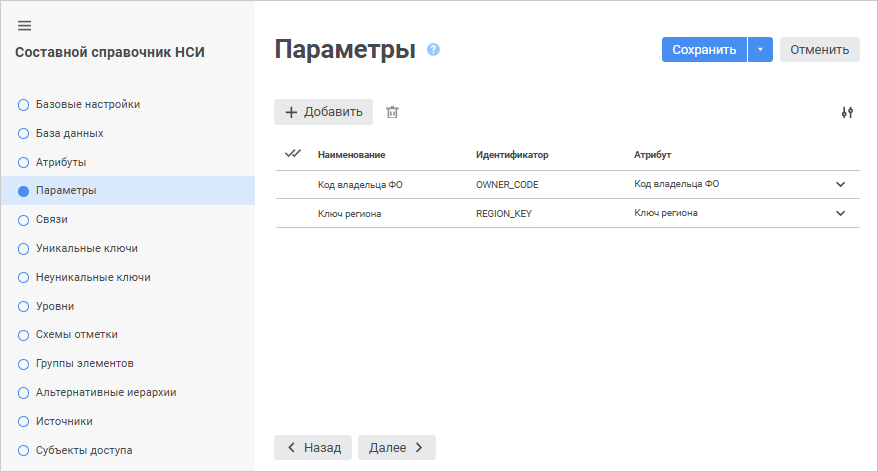
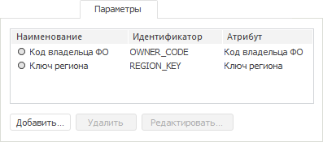
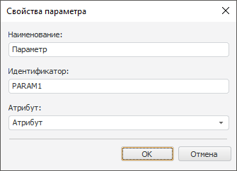

# Страница «Параметры»: Составной справочник НСИ

Страница «Параметры»: Составной справочник НСИ
-

# Добавление параметров

На странице «Параметры» в веб-приложении
 и настольном приложении возможно динамически изменять содержимое справочника.
 Справочники с заданными параметрами называются параметрическими.

Примечание.
 Для создания параметра «Дата актуальности»
 установите флажок «[Элементы
 могут изменяться во времени](../Master_RDS_reference_book/base_settings.htm#change_in_time)» на странице «[Базовые настройки](../Master_RDS_reference_book/base_settings.htm)».

	 Веб-приложение

	 Настольное
	 приложение

		

		После добавления параметров при каждом открытии справочника
		 на [просмотр](../Work/Work_Dictionary.htm#view) будет
		 открываться диалог «[Установка
		 значений параметров](uinav.chm::/02_Navigator/General_Principles_of_Work.htm#open_param_object)», в котором можно
		 задать значение созданных параметров. Созданные параметры также
		 будут отображены в виде полей ввода на рабочей области справочника,
		 открытого на [просмотр](../Work/Work_Dictionary.htm#view).

		

		Параметры, созданные на данной вкладке, будут отображены на
		 [вкладке с элементами
		 справочника](../Work/Work_Dictionary.htm#rds) в виде полей ввода.

## Операции над параметрами справочника

[Добавление
 параметра](javascript:TextPopup(this))

Для добавления параметра:

	- в веб-приложении нажмите кнопку  «Добавить». Новый параметр будет
	 добавлен в список параметров. Наименование и идентификатор параметра
	 будут заданы по умолчанию: «PARAM<Порядковый
	 номер>»;

	- в настольном приложении:

		- нажмите кнопку «Добавить»;

		- выполните команду «Добавить»
		 в контекстном меню на свободной области вкладки «Параметры»;

		- дважды щёлкните по свободной области вкладки «Параметры».

Будет открыто окно «Свойства
 параметра»:

Задайте свойства параметра:

	- Наименование.
	 Введите имя параметра;

	- Идентификатор.
	 Введите уникальный идентификатор параметра. Допускается использование
	 только латинских букв, цифр, знаков «_», не допускается использование
	 пробелов;

	- Атрибут.
	 Выберите из раскрывающегося списка один из атрибутов справочника.
	 Список состоит из [обычных
	 и заимствованных атрибутов](../Master_RDS_reference_book/Attributes.htm).

[Редактирование
 свойств параметра](javascript:TextPopup(this))

Для редактирования свойств выбранного параметра:

	- в веб-приложении измените свойства в соответствующих столбцах
	 требуемого параметра на странице «Параметры»
	 мастера справочника;

	- в настольном приложении:

		- нажмите кнопку «Редактировать»;

		- выполните команду «Редактировать»
		 в контекстном меню параметра;

		- дважды щёлкните по наименованию параметра.

В появившемся окне «[Свойства
 параметра](../Master_RDS_reference_book/Parameters.htm#add)» внесите требуемые изменения.

[Удаление
 параметра](javascript:TextPopup(this))

Для удаления выбранного параметра:

	- в веб-приложении нажмите кнопку  «Удалить»;

	- в настольном приложении:

		- нажмите кнопку «Удалить»;

		- нажмите сочетание клавиш CTRL+DELETE;

		- выполните команду «Удалить»
		 в контекстном меню параметра.

Будет запрошено подтверждение о выполняемом действии.

[Изменение количества
 отображаемых свойств в веб-приложении](javascript:TextPopup(this))

	Для изменения количества отображаемых свойств в веб-приложении нажмите
	 кнопку  «Настройки»
	 и установите/снимите флажок напротив наименования свойств.

См. также:

[Составной
 справочник НСИ](Master_CompositeTable.htm)

		Справочная
		 система на версию 10.9
		 от 18/08/2025,
		 © ООО «ФОРСАЙТ»,
