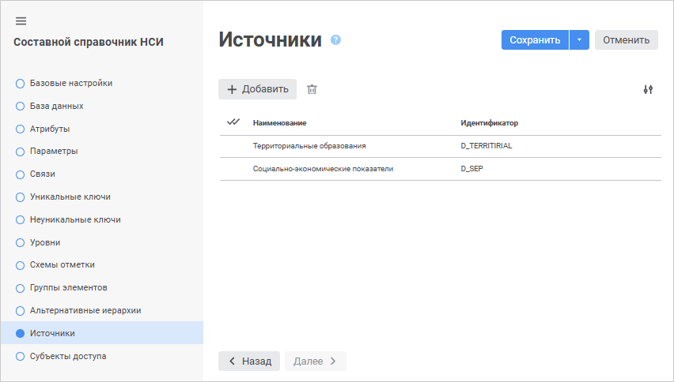
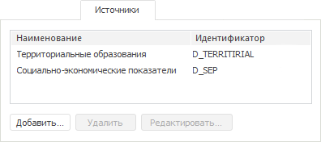
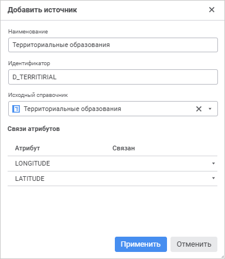
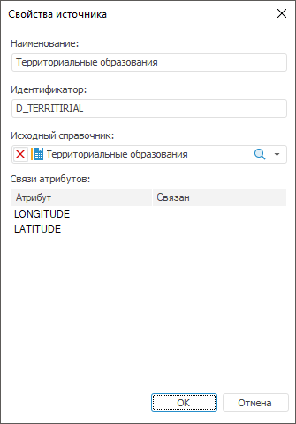

# Выбор источников данных

Выбор источников данных
-

# Выбор источников данных

На странице «Источники» в веб-приложении
 и настольном приложении формируется список справочников, которые будут
 являться источником данных для составного справочника НСИ.

	 Веб-приложение

	 Настольное
	 приложение

		

		

Для добавления источника:

	- в веб-приложении нажмите кнопку  «Добавить»;

	- в настольном приложении:

		- нажмите «Добавить»;

		- выполните команду «Добавить»
		 в контекстном меню на свободной области вкладки «Источники»;

		- дважды щёлкните по свободной
		 области вкладки «Источники».

Будет открыто окно «Добавить источник»
 в веб-приложении и окно «Свойства источника»
 в настольном приложении:

	 Веб-приложение

	 Настольное
	 приложение

		

		

Задайте свойства источника:

[Наименование
 и идентификатор](javascript:TextPopup(this))

	В соответствующих полях укажите наименование и идентификатор источника.

	Примечание.
	 Для идентификатора допускается использование только латинских букв,
	 цифр, знаков «_», не допускается использование пробелов.

[Исходный справочник](javascript:TextPopup(this))

	Выберите из раскрывающегося списка справочник-источник.

Для быстрого выбора объекта в поле для поиска введите его название/идентификатор/ключ,
 в зависимости от настроек отображения. Поиск будет выполняться автоматически
 по мере ввода текста. Список будет содержать объекты, наименования/идентификаторы/ключи
 которых содержат вводимый текст.

Для настройки отображения объектов репозитория в списке нажмите кнопку
  «Отображение
 объекта» и выберите в раскрывающемся меню вариант отображения:

	- Наименование. Объекты
	 отображаются под своими наименованиями. Вариант по умолчанию;

	- Идентификатор. Объекты
	 отображаются под своими идентификаторами;

	- Ключ. Объекты отображаются
	 под своими ключами.

Выбрать можно несколько вариантов. Идентификатор и ключ будут указаны
 в скобках.

Для сброса отметки выбранных объектов нажмите кнопку 
 «Очистить».

	Примечание.
	 Настройка отображения объекта доступна в веб-приложении.

	В качестве справочника-источника можно использовать справочник НСИ
	 или составной справочник НСИ.

[Связи атрибутов](javascript:TextPopup(this))

	Установите связь между атрибутами составного справочника и атрибутами
	 исходного справочника, если таковые имеются. В столбце «Атрибут»
	 отражаются идентификаторы всех имеющихся атрибутов составного справочника,
	 кроме системных. В столбце «Связан»
	 укажите идентификатор атрибута исходного справочника.

## Операции над источниками

[Редактирование
 источника](javascript:TextPopup(this))

	Для редактирования свойств выбранного источника:

		- в веб-приложении дважды щёлкните по источнику. Откроется
		 окно «Редактирование источника»,
		 аналогичное окну «Добавить источник»;

		- в настольном приложении:

			- нажмите кнопку «Редактировать»;

			- выполните команду «Редактировать» в контекстном
			 меню источника;

			- дважды щёлкните по наименованию
			 источника.

	В появившемся окне «Редактирование
	 источника» в веб-приложении или «Свойства
	 источника» в настольном приложении внесите требуемые изменения.

[Удаление
 источника](javascript:TextPopup(this))

	Для удаления выбранного источника

		- в веб-приложении нажмите кнопку 
		 «Удалить»;

		- в настольном приложении:

			- нажмите кнопку «Удалить»;

			- выполните команду «Удалить»
			 в контекстном меню источника;

			- нажмите сочетание клавиш CTRL+DELETE.

	Будет запрошено подтверждение о выполняемом действии.

См. также:

[Составной
 справочник НСИ](Master_CompositeTable.htm)

		Справочная
		 система на версию 10.9
		 от 18/08/2025,
		 © ООО «ФОРСАЙТ»,
