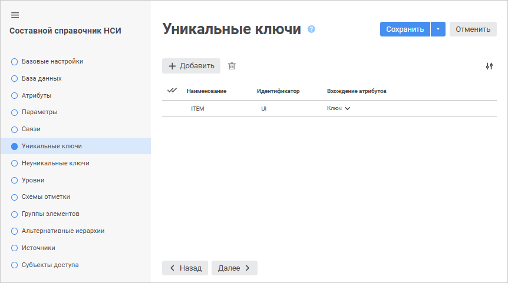
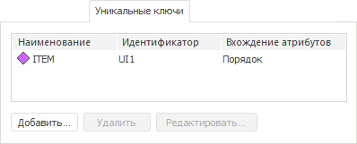
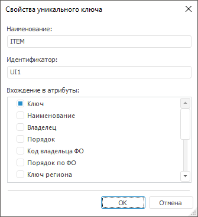

# Страница «Уникальные ключи»: Составной справочник НСИ

Страница «Уникальные ключи»: Составной справочник НСИ
-

# Добавление уникальных ключей

На странице «Уникальные ключи»
 в веб-приложении и настольном приложении создаются и настраиваются уникальные
 ключи.

Уникальный ключ - базовый
 идентификатор для записей справочника.

Ключ может состоять:

	- из единственного атрибута справочника, значения которого уникальны
	 для каждого элемента;

	- из нескольких атрибутов, совокупность значений которых гарантирует
	 уникальность.

Примечание.
 Ключ может состоять из нескольких атрибутов, если справочник не имеет
 единственного уникального атрибута.

	 Веб-приложение

	 Настольное
	 приложение

		

		

## Операции над уникальными ключами

[Добавление](javascript:TextPopup(this))

Для добавления уникального ключа:

	- в веб-приложении нажмите кнопку  «Добавить».
	 Новый ключ будет добавлен в список уникальных ключей. Наименование
	 и идентификатор ключа будут заданы по умолчанию. Значение свойства
	 «Наименование» по умолчанию -
	 «ITEM<Порядковый номер>».
	 Значение свойства «Идентификатор»
	 по умолчанию - «UI<Порядковый
	 номер>»;

	- в настольном приложении:

		- нажмите кнопку «Добавить»;

		- выполните команду «Добавить»
		 в контекстном меню на свободной области вкладки «Уникальные
		 ключи»;

		- дважды щёлкните по свободной области вкладки «Уникальные
		 ключи».

Будет открыто окно «Свойства
 уникального ключа»:

Задайте свойства уникального ключа:

	- Наименование. Введите
	 наименование уникального ключа;

	- Идентификатор. Введите
	 идентификатор уникального ключа. Допускается использование только
	 латинских букв, цифр, знаков «_», не допускается использование пробелов;

	- Вхождение в атрибуты.
	 Список содержит флажки, соответствующие атрибутам справочника, включая
	 системные: «Наименование»
	 и «Порядок». Выберите один
	 или несколько атрибутов, которые должны входить в уникальный ключ.

[Редактирование](javascript:TextPopup(this))

Для редактирования свойств выбранного уникального ключа:

	- в веб-приложении измените свойства в соответствующих столбцах
	 требуемого уникального ключа на странице «Уникальные
	 ключи» мастера справочника;

	- в настольном приложении:

		- нажмите кнопку «Редактировать»;

		- выполните команду «Редактировать»
		 в контекстном меню уникального ключа;

		- дважды щёлкните по наименованию уникального ключа.

В появившемся диалоге «Свойства
 уникального ключа» для [справочника
 НСИ](../Master_RDS_reference_book/Unique_Keys.htm#add)/[составного
 справочника НСИ](Unique_Keys.htm#add) внесите требуемые изменения.

[Удаление](javascript:TextPopup(this))

Для удаления выбранного уникального ключа:

	- в веб-приложении нажмите кнопку  «Удалить»;

	- в настольном приложении:

		- нажмите кнопку «Удалить»;

		- нажмите сочетание клавиш CTRL+DELETE;

		- выполните команду «Удалить»
		 в контекстном меню уникального ключа.

Будет запрошено подтверждение выполняемого действия.

[Изменение количества
 отображаемых свойств в веб-приложении](javascript:TextPopup(this))

	Для изменения количества отображаемых свойств в веб-приложении нажмите
	 кнопку  «Настройки»
	 и установите/снимите флажок напротив наименования свойств.

См. также:

[Составной
 справочник НСИ](Master_CompositeTable.htm)

		Справочная
		 система на версию 10.9
		 от 18/08/2025,
		 © ООО «ФОРСАЙТ»,
