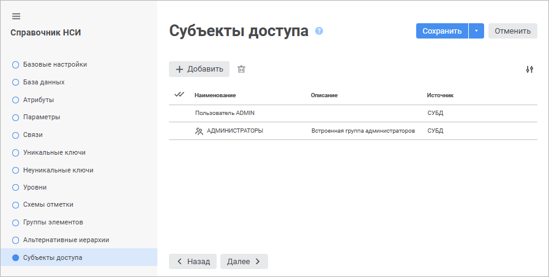
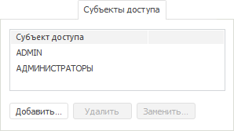

# Управление субъектами доступа

Управление субъектами доступа
-

# Управление субъектами доступа

На странице «Субъекты доступа»
 в веб-приложении и настольном приложении формируется список субъектов
 доступа.

Субъекты доступа - субъекты безопасности, для которых в дальнейшем будут
 настраиваться [права
 доступа к элементам](../Work/Access_Elements.htm) и [атрибутам](Attributes.htm)
 справочника. В субъекты доступа могут быть добавлены любые пользователи
 или группы пользователей.

Примечание.
 Максимально возможное количество субъектов доступа в справочниках равно
 2048 субъектам.

	 Веб-приложение Настольное приложение

		

		Страница «Субъекты доступа»
		 доступна, если на странице «[Базовые
		 настройки](base_settings.htm)» установлен флажок «[Элементы
		 имеют дискреционные права доступа](base_settings.htm#discretion_access_permissions)».

		

		Если на вкладке «[Описание](Master_RDS.htm#structure)»
		 установлены флажки «[Элементы
		 имеют дискреционные права доступа](base_settings.htm#discretion_access_permissions)», «[Элементы
		 имеют мандатные права доступа](base_settings.htm#mandatory_access_permissions)», «[Элементы имеют атрибутные права
		 доступа](base_settings.htm#abac)», то пользователь сможет добавить элемент справочника,
		 только если он входит в одну из групп, имеющих эффективные права
		 на добавление элементов в данном справочнике, в [метке](Admin.chm::/03_Admin/Admin_AdminObjects_Marks.htm).

## Операции над субъектами доступа

[Добавление
 субъекта доступа](javascript:TextPopup(this))

Для добавления субъекта доступа:

	- в веб-приложении нажмите кнопку  «Добавить»;

	- в настольном приложении:

		- нажмите кнопку «Добавить»;

		- выполните команду «Добавить»
		 в контекстном меню на свободной области вкладки «Субъекты
		 доступа»;

		- дважды щёлкните по свободной области вкладки «Субъекты
		 доступа».

Будет открыто окно «[Выбор
 групп и пользователей](Admin.chm::/03_Admin/Admin_UsersGroups.htm)».

[Замена
 субъекта доступа](javascript:TextPopup(this))

Для замены выбранного субъекта в настольном приложении:

	- нажмите кнопку «Заменить»;

	- выполните команду «Заменить»
	 в контекстном меню субъекта;

	- дважды щёлкните по наименованию субъекта.

Для выбора другого субъекта доступа будет открыто окно «[Выбор
 групп и пользователей](Admin.chm::/03_Admin/Admin_UsersGroups.htm)».

Примечание.
 Список субъектов безопасности справочника может быть сформирован/отредактирован
 на вкладке «[Метки
 безопасности](Admin.chm::/03_Admin/Admin_AdminObjects_Marks.htm)» окна «Параметры
 управления доступом».

[Удаление
 субъекта доступа](javascript:TextPopup(this))

Для удаления выбранного субъекта:

	- в веб-приложении нажмите кнопку  «Удалить»;

	- в настольном приложении:

		- нажмите кнопку «Удалить»;

		- выполните команду «Удалить»
		 в контекстном меню субъекта;

		- нажмите сочетание клавиш CTRL+DELETE.

Будет запрошено подтверждение о выполняемом действии.

Примечание.
 Рекомендуется не удалять субъекты, а [заменять](Access_Subjects.htm#replace)
 их. Подробное описание приведено в разделе «[Метки
 безопасности](Admin.chm::/03_Admin/Admin_AdminObjects_Marks.htm)».

[Изменение количества
 отображаемых свойств в веб-приложении](javascript:TextPopup(this))

	Для изменения количества отображаемых свойств в веб-приложении нажмите
	 кнопку  «Настройки»
	 и установите/снимите флажок напротив наименования свойств.

См. также:

[Справочник
 НСИ](Master_RDS.htm)

		Справочная
		 система на версию 10.9
		 от 18/08/2025,
		 © ООО «ФОРСАЙТ»,
