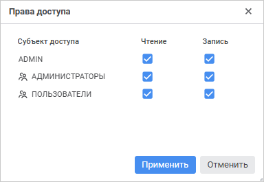
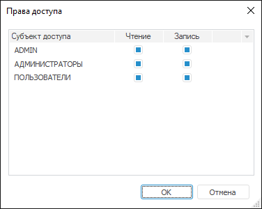

# Настройка прав доступа

Настройка прав доступа
-

# Настройка прав доступа

Настройка прав доступа позволяет
 в дальнейшем ограничить доступ определённых пользователей или групп пользователей
 к данным справочника НСИ/составного справочника НСИ по определённым атрибутам.

Для разграничения прав доступа на уровне атрибутов справочника:

	- в веб-приложении нажмите кнопку  «Права
	 доступа» на странице «Атрибуты»;

	- в настольном приложении выполните команду «Права
	 доступа» в контекстном меню атрибута на вкладке «Атрибуты».

Примечание.
 Для разграничения прав доступа предварительно установите флажок «Элементы имеют дискреционные права доступа»
 на странице «Базовые настройки»
 для [справочника
 НСИ](../base_settings.htm#discretion_access_permissions)/[составного
 справочника НСИ](../../Master_Composite_Table_reference_book/base_settings.htm#discretion_access_permissions).

Будет открыто окно «Права доступа»:

	 Веб-приложение

	 Настольное
	 приложение

		

		

В окне отражен список [всех субъектов
 доступа](../Access_Subjects.htm), определенных для справочника. Напротив определённого субъекта
 доступа установите необходимые флажки в столбцах «Чтение»
 и «Запись». Если для пользователей
 не определена ни одна из операций, то данный атрибут не будет отображаться
 для данных пользователей.

Примечание.
 Права доступа на атрибуты справочника может изменять пользователь, имеющий
 соответствующую [привилегию](Admin.chm::/04_SecurityPolicy/Admin_Priv.htm).

См. также:

[Добавление
 атрибутов](../Attributes.htm)

		Справочная
		 система на версию 10.9
		 от 18/08/2025,
		 © ООО «ФОРСАЙТ»,
