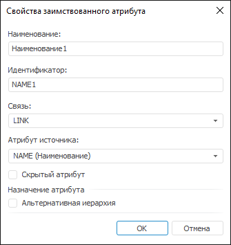

# Свойства заимствованного атрибута

Свойства заимствованного атрибута
-

# Свойства заимствованного атрибута

При [создании](../Attributes.htm#add)/[редактировании](../Attributes.htm#edit)
 заимствованного атрибута задайте его свойства с помощью окна «Свойства
 заимствованного атрибута».

Примечание.
 При работе с [инструментами
 анализа данных и построения отчётов](DataAnalysis.chm::/DataAnalysis_Title.htm) сохранить данные
 в справочники со множественными значениями заимствованного атрибута нельзя.

[Для открытия
 окна](javascript:TextPopup(this))

	Для открытия окна при создании заимствованного атрибута:

		- Выполните одно из действий:

			- нажмите кнопку «Добавить»;

			- вызовите контекстное меню
			 на свободной области вкладки «Атрибуты»;

			- дважды щёлкните по свободной
			 области вкладки «Атрибуты».

		- Выберите тип «Заимствованный
		 атрибут».

	Примечание.
	 Создание заимствованного атрибута доступно, если у справочника НСИ
	 установлена [связь](../Link.htm) с другим справочником
	 НСИ.

	Для открытия окна при редактировании заимствованного атрибута выполните
	 одно из действий:

		- нажмите кнопку «Редактировать»;

		- выполните команду «Редактировать»
		 в контекстном меню атрибута;

		- дважды щёлкните по наименованию атрибута.

	 Веб-приложение Настольное приложение

		

		

Задайте параметры:

	- Наименование. Введите
	 наименование атрибута;

	- Идентификатор. Введите
	 уникальный идентификатор атрибута;

Совет.
 Сначала задайте используемую связь и атрибут источника, тогда наименование
 и идентификатор заимствованного атрибута будут сформированы автоматически
 и будут совпадать с наименованием и идентификатором атрибута источника.
 Если в текущем справочнике НСИ или составном справочнике НСИ уже существует
 атрибут с таким наименованием и идентификатором, то к ним будет добавлен
 порядковый номер, например, «Наименование1» и «NAME1».

	- Связь. В раскрывающемся
	 списке выберите одну из [связей](../Link.htm). Если связь
	 настроена с атрибутом, имеющим множественное значение, то и у заимствованного
	 атрибута будет множественное значение;

	- Атрибут источника. В
	 раскрывающемся списке выберите атрибут справочника НСИ/составного
	 справочника НСИ, с которым установлена [связь](../Link.htm);

Примечание.
 В качестве заимствованного атрибута можно использовать заимствованный
 атрибут из справочника, с которым установлена [связь](../Link.htm).

	- Скрытый атрибут. При
	 установке флажка атрибут будет участвовать в построении справочника,
	 но при этом в справочнике отображаться не будет. Флажок доступен,
	 если атрибут может иметь пустое значение. Скрытые атрибуты на вкладке
	 «[Атрибуты](../Attributes.htm)»
	 выделены серым цветом;

	- Альтернативная иерархия.
	 По умолчанию для системных [атрибутов](../Attributes.htm)
	 флажок не установлен, для пользовательских - установлен. При установленном
	 флажке атрибут будет использоваться для настройки [альтернативной
	 иерархии](../../UiMd_reference_book_Hierarchy.htm#alternativehierarchy) справочника НСИ/составного справочника НСИ.

Значение заимствованного атрибута будет совпадать со значением атрибута,
 указанного в поле «Атрибут источника».

Примечание.
 Значение заимствованного атрибута недоступно для изменения при [редактировании
 элемента справочника](../../Work/Work_Elements.htm#edit).

При добавлении заимствованного атрибута будет осуществлена проверка
 циклических зависимостей.

См. также:

[Добавление
 атрибутов](../Attributes.htm) | [Как
 создать заимствованный атрибут?](../../FAQ/ImportedAttribute_Create.htm)

		Справочная
		 система на версию 10.9
		 от 18/08/2025,
		 © ООО «ФОРСАЙТ»,
