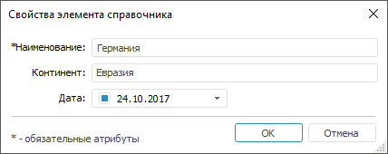
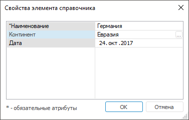
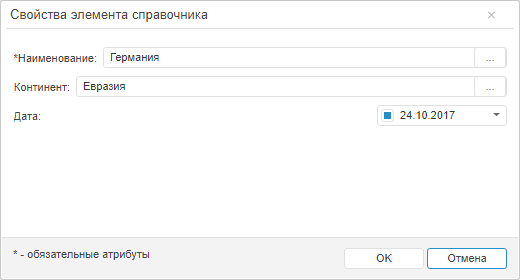
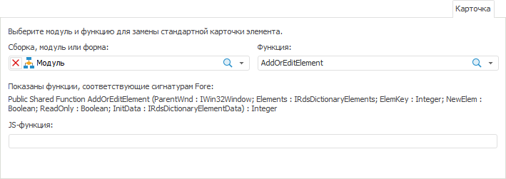
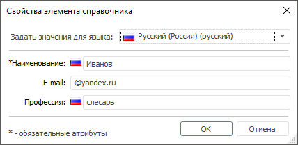
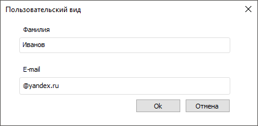

# Замена предустановленного вида диалога

Замена предустановленного вида диалога
-

# Замена предустановленного вида диалога

Вкладка «Карточка» используется
 для переопределения предустановленного вида диалога «Свойства
 элемента справочника» на пользовательский.

Примечание.
 Замена предустановленного вида диалога доступна только в настольном приложении.

Для определения предустановленного вида диалога используйте вкладку
 «Настройки по умолчанию» в диалоге
 «[Параметры](UiNav.chm::/02_Navigator/Repo_Default.htm)».

[Для открытия
 диалога «Параметры»](javascript:TextPopup(this))

		- Перейдите в навигатор объектов.

		- Выполните команду главного меню «Сервис >
		 Параметры».

	Отобразится диалог «Параметры».

В зависимости от настроек диалог «Свойства
 элемента справочника» может принимать предустановленный вид или
 пользовательский.

Предустановленные виды:

	Стандартный вид Табличный вид

		

		

В веб-приложении используется стандартный вид диалога:

Стандартный вид диалога установлен по умолчанию.

Для замены предустановленного диалога на пользовательский используйте
 вкладку «Карточка»:

На вкладке в раскрывающемся списке выберите [сборку](UiDevEnv.chm::/01_Development_Environment/02_Work_in_Development_Environment/DevEnv_Object/DevEnv_Assembly.htm),
 модуль или [форму](UiDevEnv.chm::/01_Development_Environment/02_Work_in_Development_Environment/DevEnv_Object/DevEnv_Form.htm)
 и функцию для замены диалога в настольном приложении; укажите js-функцию
 для замены диалога в веб-приложении.

В функции в качестве параметров должны передаваться:

	- ParentWnd: IWin32Window.
	 Форма, используемая для создания пользовательского диалога;

	- Elements: IRdsDictionaryElements.
	 Параметр, позволяющий работать с элементом справочника: возвращать
	 данные элемента, создавать объект, содержащий данные элемента, осуществлять
	 вставку нового элемента и обновление данных элемента;

	- ElemKey: Integer. Параметр,
	 передающий ключ редактируемого элемента справочника;

	- NewElem: Boolean. Параметр,
	 определяющий наличие нового элемента, который создается при редактировании;

	- ReadOnly: Boolean. Параметр,
	 определяющий права на редактирование элемента;

	- InitData: IRdsDictionaryElementData.
	 Параметр, определяющий значение элемента, который создается при редактировании,
	 по указанному атрибуту.

В js-функции в качестве параметров должны передаваться:

	- Tree: PP.Rds.Ui.DictionaryTree.
	 Дерево справочника НСИ, элементы которого будут изменяться;

	- Operation: PP.Rds.ElementOperation.
	 Запрашиваемая операция, позволяющая добавлять или обновлять изменяемый
	 элемент;

	- ItemKey: String. Ключ
	 редактируемого или копируемого элемента;

	- ParentKey: String. Ключ
	 родительского элемента при добавлении или копировании;

	- IsReadOnly: Boolean.
	 Параметр, определяющий права на редактирование элемента.

В результате замены предустановленного диалога на пользовательский
 при добавлении или редактировании элемента в настольном приложении будет
 отображаться пользовательский диалог, в веб-приложении изменения значений
 атрибутов будут происходить без отображения диалога в соответствии с прописанными
 в функции действиями.

Для получения подробной информации
 о создании пользовательского диалога обратитесь к статье «[Как создать пользовательский
 вид диалога «Свойства элемента справочника»?](../FAQ/Create_custom_view.htm)».

## Пример пользовательского вида диалога

Стандартный вид диалога:

Пользовательский вид:

См. также:

[Справочник
 НСИ](Master_RDS.htm) | [Составной
 справочник НСИ](../Master_Composite_Table_reference_book/Master_CompositeTable.htm)

		Справочная
		 система на версию 10.9
		 от 18/08/2025,
		 © ООО «ФОРСАЙТ»,
