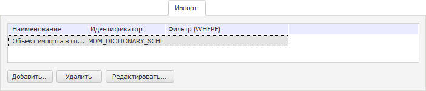
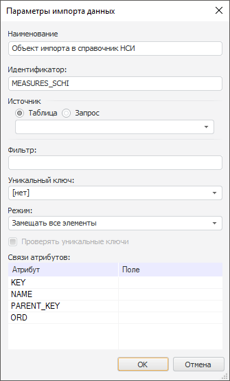
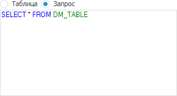
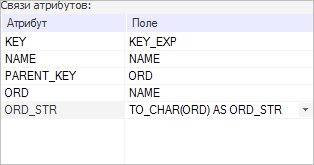
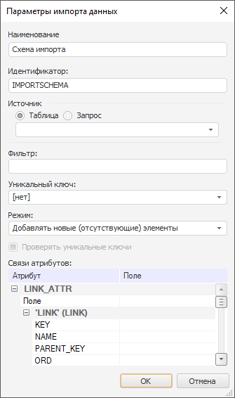
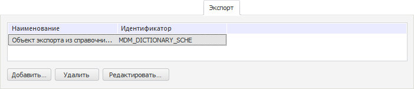
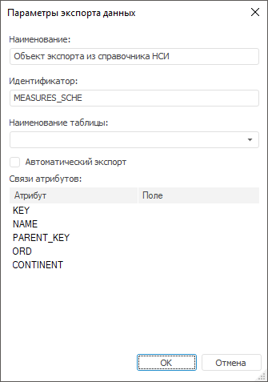
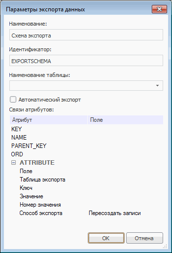

# Создание схем импорта/экспорта

Создание схем импорта/экспорта
-

# Создание схем импорта/экспорта

Схемы импорта/экспорта являются наборами параметров, позволяющих производить
 загрузку/выгрузку данных.

Примечание.
 Создание схем импорта/экспорта доступно только в настольном приложении.

## Импорт

Схема импорта справочника НСИ/составного
 справочника НСИ - набор параметров, в соответствии с которыми производится
 загрузка данных из таблицы в справочник НСИ.

Для формирования списка схем импорта используйте вкладку «Импорт»
 на вкладке «[Описание](Master_RDS.htm#structure)»
 в окне редактируемого справочника НСИ или вкладку «[Описание](../Master_Composite_Table_reference_book/Master_CompositeTable.htm#structure)»
 для составного справочника НСИ:

### Добавление схемы импорта

Для добавления схемы импорта:

	- нажмите кнопку «Добавить»;

	- выполните команду «Добавить»
	 в контекстном меню на свободной области вкладки «Импорт»;

	- дважды щёлкните по свободной области вкладки «Импорт».

Будет открыто окно «Параметры импорта
 данных»:

Задайте параметры схемы импорта:

[Наименование
 и идентификатор](javascript:TextPopup(this))

	В соответствующих полях укажите наименование и идентификатор схемы
	 импорта.

	Примечание.
	 Для идентификатора опускается использование только латинских букв,
	 цифр, знаков «_», не допускается использование пробелов.

[Источник](javascript:TextPopup(this))

		- Таблица. После установки
		 переключателя в поле, расположенном ниже, укажите физическое имя
		 таблицы, из которой будут загружаться данные. Имя таблицы также
		 можно выбрать из раскрывающегося списка. В раскрывающемся списке
		 отображаются таблицы репозитория, расположенные в той же базе
		 данных, что и справочник;

		- Запрос. После установки
		 переключателя в поле, расположенном ниже, введите SQL-запрос:

	

[Фильтр](javascript:TextPopup(this))

	Загружаемые данные можно отфильтровать. Для этого в поле «Фильтр» укажите условие фильтрации,
	 используя идентификаторы полей таблицы, из которой будут загружаться
	 данные.

[Уникальный ключ](javascript:TextPopup(this))

	Уникальный ключ - базовый
	 идентификатор, гарантирующий уникальность импортируемых записей. В
	 раскрывающемся списке выберите уникальный ключ, созданный на вкладке
	 «[Уникальные
	 ключи](Unique_Keys.htm)». Если выбран вариант «[Нет]»,
	 то по умолчанию в качестве уникального ключа используется системный
	 атрибут с идентификатором «KEY».

[Режим](javascript:TextPopup(this))

	В раскрывающемся списке выберите режим импорта элементов:

		- Замещать все элементы.
		 Используется по умолчанию. Импортироваться будут все элементы.
		 При этом все элементы, существующие в справочнике, будут замещены;

		- Добавлять новые (отсутствующие)
		 элементы. Импортироваться будут только элементы, отсутствующие
		 в текущем справочнике;

		- Обновлять существующие
		 элементы. При импорте будет производиться только обновление
		 существующих элементов справочника;

		- Добавлять новые элементы
		 и обновлять существующие. Импортироваться будут элементы,
		 отсутствующие в текущем справочнике, значения существующих элементов
		 будут обновлены.

[Проверять уникальные
 ключи](javascript:TextPopup(this))

	Загружаемые данные будут проверены на соответствие всем пользовательским
	 уникальным ключам. По умолчанию флажок установлен. Флажок доступен
	 для устаревших видов справочников НСИ/составных справочников НСИ.

[Связи атрибутов](javascript:TextPopup(this))

	Список «Связи атрибутов»
	 состоит из двух столбцов:

		- Атрибут. В столбце
		 отображаются идентификаторы всех имеющихся атрибутов справочника;

		- Поле. Напротив идентификаторов
		 атрибутов укажите идентификаторы полей таблицы, из которой будут
		 загружаться данные. Также в столбце «Поле»
		 напротив идентификаторов атрибутов можно ввести SQL-функции, например:

	

	SQL-функции можно использовать для любого
	 вида источника.

	Примечание.
	 При привязке поля таблицы к [атрибуту справочника](Attributes.htm)
	 «KEY» необходимо помнить,
	 что в справочниках НСИ и составных справочниках НСИ поддерживаются
	 ключи элементов, входящие в диапазон от 0 до 2 млрд.

### Операции над схемами импорта

[Редактирование
 схемы импорта](javascript:TextPopup(this))

	Для редактирования свойств выбранной схемы импорта:

		- нажмите кнопку «Редактировать»;

		- выполните команду «Редактировать»
		 в контекстном меню схемы импорта;

		- дважды щёлкните по наименованию схемы импорта.

	В появившемся окне «[Параметры
	 импорта данных](#add)» внесите требуемые изменения.

[Удаление
 схемы импорта](javascript:TextPopup(this))

	Для удаления выбранной схемы импорта:

		- нажмите кнопку «Удалить»;

		- выполните команду «Удалить»
		 в контекстном меню схемы импорта;

		- нажмите сочетание клавиш CTRL+DELETE.

	Будет запрошено подтверждение о выполняемом действии.

[Применение
 схемы импорта](javascript:TextPopup(this))

	Созданную схему импорта можно применить для загрузки данных из таблицы
	 в справочник.

	Подробное описание операции приведено в разделе «[Наполнение
	 справочника данными](../Work/Work_Elements.htm#import)».

### Особенности импорта

[Импорт версионного
 справочника](javascript:TextPopup(this))

	При импорте [версионного
	 справочника](base_settings.htm#change_in_time) создается новая версия элементов, в соответствующие
	 поля добавляются даты их изменения.

	Для импорта версионного справочника предусмотрены следующие подходы:

		- Полный импорт. Из
		 таблицы, в которой содержатся даты ввода и вывода элементов, будут
		 импортированы все версии элемента, имеющиеся в таблице. Данный
		 подход используется, если выбран режим импорта «Замещать
		 все элементы»;

		- Инкрементный импорт.
		 Из таблицы будут импортированы только те версии элементов, которые
		 не выведены на настоящий момент либо были изменены с момента предыдущего
		 импорта. Данный подход используется, если выбран режим импорта
		 «Добавлять новые элементы и
		 обновлять существующие».

[Импорт множественного
 атрибута](javascript:TextPopup(this))

	Для настройки параметров импорта значений множественного атрибута
	 используйте раскрывающуюся группу атрибутов в списке «Связь
	 атрибутов». Название группы совпадает с идентификатором атрибута,
	 который может иметь множественные значения.

	Импорт каждого элемента множественного атрибута происходит из двух
	 таблиц: основной, физическое имя которой указано в группе «Источник»,
	 и дочерней, указанной в списке «Связь
	 атрибутов». Из основной импортируются параметры атрибута, из
	 дочерней - множественные значения.

	Пример окна «Параметры импорта
	 данных» для настройки импорта в справочник, содержащий множественный
	 атрибут «PARTNERS»:

	

	Задайте параметры импорта значений множественного атрибута:

		- Поле. Укажите идентификатор
		 поля основной таблицы, по данному полю будут связаны основная
		 и дочерняя таблицы;

		- Таблица импорта.
		 Укажите физическое имя дочерней таблицы;

		- Ключ, Значение,
		 Номер значения. Укажите
		 идентификаторы полей в дочерней таблице, содержащие атрибуты с
		 ключом, значением и номером значения.

[Импорт связываемого
 атрибута](javascript:TextPopup(this))

	Для настройки параметров импорта значений связываемого атрибута
	 используйте раскрывающуюся группу атрибутов в списке «Связь
	 атрибутов». Название группы совпадает с идентификатором связываемого
	 атрибута.

	Пример окна «Параметры импорта
	 данных» для настройки импорта в справочник, содержащий связываемый
	 атрибут «LINK_ATTR»:

	

	Задайте параметры импорта значений связываемого атрибута:

		- Поле. Укажите идентификатор
		 поля таблицы;

		- Раскрывающаяся группа атрибутов.
		 Укажите идентификаторы полей таблицы, из которой будут загружаться
		 данные. Название группы совпадает с идентификатором связи, установленной
		 для атрибута. Группа содержит идентификаторы атрибутов справочника,
		 с которым установлена связь.

## Экспорт

Схема экспорта справочника НСИ/составного
 справочника НСИ - набор параметров, в соответствии с которыми
 производится выгрузка данных из справочника НСИ в таблицу.

Для формирования списка схем экспорта используйте вкладку «Экспорт»
 на вкладке «[Описание](Master_RDS.htm#structure)»
 в окне редактируемого справочника НСИ или вкладку «[Описание](../Master_Composite_Table_reference_book/Master_CompositeTable.htm#structure)»
 для составного справочника НСИ:

### Добавление схемы экспорта

Для добавления схемы экспорта:

	- нажмите кнопку «Добавить»;

	- выполните команду «Добавить»
	 в контекстном меню на свободной области вкладки «Экспорт»;

	- дважды щёлкните по свободной области вкладки «Экспорт».

Будет открыто окно «Параметры экспорта
 данных»:

Задайте параметры схемы экспорта:

[Наименование
 и идентификатор](javascript:TextPopup(this))

	В соответствующих полях укажите наименование и идентификатор схемы
	 экспорта.

	Примечание.
	 Для идентификатора допускается использование только латинских букв,
	 цифр, знаков «_», не допускается использование пробелов.

[Наименование
 таблицы](javascript:TextPopup(this))

	В раскрывающемся списке выберите физическое имя таблицы, в которую
	 будут экспортироваться данные. Нельзя указывать имя таблицы, которой
	 не существует.

[Автоматический
 экспорт](javascript:TextPopup(this))

	Установка данного флажка позволяет выполнять автоматический экспорт.
	 При автоматическом экспорте выгружаются только те данные, которых
	 не было в таблице-приёмнике до экспорта, то есть данные справочника,
	 которые создаются или изменяются.

[Связи атрибутов](javascript:TextPopup(this))

	Список связей атрибутов состоит из двух столбцов. В столбце «Атрибут» отражаются идентификаторы
	 всех имеющихся атрибутов справочника. В столбце «Поле»
	 укажите идентификаторы полей таблицы, в которую будут выгружаться
	 данные, напротив идентификаторов атрибутов.

### Операции над схемами экспорта

[Редактирование
 схемы экспорта](javascript:TextPopup(this))

	Для редактирования свойств выбранной схемы экспорта:

		- нажмите кнопку «Редактировать»;

		- выполните команду «Редактировать»
		 в контекстном меню схемы экспорта;

		- дважды щёлкните по наименованию схемы экспорта.

	В появившемся окне «[Параметры
	 экспорта данных](#add)» внесите требуемые изменения.

[Удаление
 схемы экспорта](javascript:TextPopup(this))

	Для удаления выбранной схемы экспорта:

		- нажмите кнопку «Удалить»;

		- выполните команду «Удалить»
		 в контекстном меню схемы экспорта;

		- нажмите сочетание клавиш CTRL+DELETE.

	Будет запрошено подтверждение о выполняемом действии.

[Применение
 схемы экспорта](javascript:TextPopup(this))

	Созданную схему экспорта можно применить для выгрузки данных из
	 справочника в таблицу.

	Подробное описание операции приведено в разделе «[Наполнение
	 справочника данными](../Work/Work_Elements.htm#export)».

### Особенности экспорта

[Экспорт множественного
 атрибута](javascript:TextPopup(this))

	Для настройки параметров экспорта значений множественного атрибута
	 используйте раскрывающуюся группу атрибутов в списке «Связь
	 атрибутов». Название группы совпадает с идентификатором атрибута,
	 который может иметь множественные значения.

	Экспорт каждого элемента множественного атрибута происходит в две
	 таблицы: основную, физическое имя которой указано в поле «Наименование
	 таблицы», и дочернюю, указанную в списке «Связь
	 атрибутов». В основную экспортируются параметры атрибута, а
	 в дочернюю сами множественные значения элемента.

	Окно «Параметры экспорта данных»
	 для настройки экспорта справочника, содержащего множественный атрибут
	 «ATTRIBUTE»:

	

	Задайте параметры экспорта значений множественного атрибута:

		- Поле. Укажите идентификатор
		 поля основной таблицы, по данному полю будут связаны основная
		 и дочерняя таблицы;

		- Таблица экспорта.
		 Укажите физическое имя дочерней таблицы;

		- Ключ, Значение,
		 Номер значения. Укажите
		 идентификаторы полей в дочерней таблице, содержащие атрибуты с
		 ключом, значением и номером значения;

		- Способ экспорта.
		 Укажите способ обновления записей в дочерней таблице. Доступные
		 варианты:

			- Пересоздать
			 записи. Выбран по умолчанию. При экспорте сначала из
			 дочерней таблицы удаляются все записи, а затем производится
			 экспорт значений множественного атрибута;

			- Обновить
			 записи. При экспорте производится сравнение существующих
			 записей в дочерней таблице и значений множественного атрибута.
			 Если в дочерней таблице не найдена запись, соответствующая
			 значению множественного атрибута, то она будет туда добавлена.
			 Если в дочерней таблице найдена запись, которая не соответствуют
			 ни одному из значений множественного атрибута, то она будет
			 удалена. Если в дочерней таблице найдена запись, соответствующая
			 значению множественного атрибута, то она будет обновлена.

См. также:

[Справочник
 НСИ](Master_RDS.htm) | [Составной
 справочник НСИ](../Master_Composite_Table_reference_book/Master_CompositeTable.htm)

		Справочная
		 система на версию 10.9
		 от 18/08/2025,
		 © ООО «ФОРСАЙТ»,
