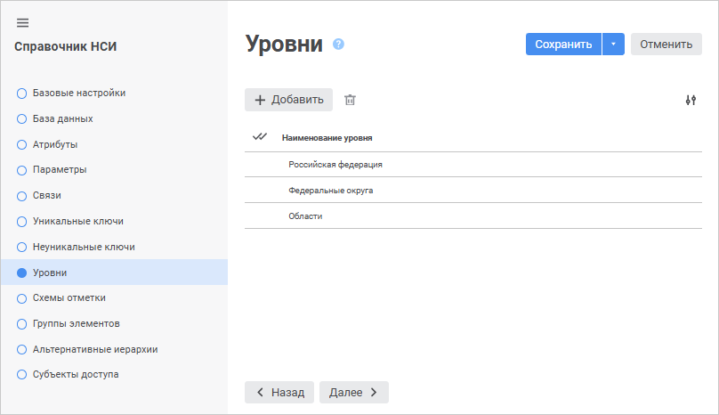
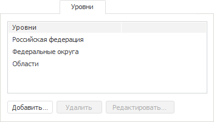

# Страница «Уровни»: Справочник НСИ

Страница «Уровни»: Справочник НСИ
-

# Создание уровней

На странице «Уровни» в веб-приложении
 и настольном приложении настраиваются уровни для настройки [агрегации
 данных в кубе](../../Cube/CreateCube/Master_Standart/UiMd_Cube_CreateCube_Master_Standart_7.htm), который использует справочник в качестве измерения.

Агрегация - это расчёт
 данных верхнего уровня на основе данных нижнего уровня. Например, данные,
 рассчитанные по месяцам, суммируются для получения квартальных данных.

Предположим, в справочнике существует следующая иерархия элементов:

	- Российская Федерация:

		- Северный район:

			- Архангельская область;

			- Вологодская область;

		- Северо-западный район:

			- г. Санкт-Петербург.

Для данных элементов следует создать уровни:

	- Российская Федерация;

	- Федеральные округа;

	- Области.

Примечание.
 Каждый создаваемый уровень должен соответствовать фактическому уровню
 иерархии элементов справочника.

Если использовать данный справочник в качестве измерения куба, то можно
 настроить агрегацию. Например, значения для государств могут быть просуммированы
 для получения значений для континента в целом.

	 Веб-приложение Настольное приложение

		

		

## Операции над уровнями

[Добавление
 уровня](javascript:TextPopup(this))

Для добавления уровня:

	- в веб-приложении нажмите кнопку  «Добавить». В конец списка будет
	 добавлена строка, в которой будет указано наименование уровня. По
	 умолчанию «Уровень<Порядковый
	 немер>»;

	- в настольном приложении:

		- нажмите кнопку «Добавить»;

		- выполните команду «Добавить»
		 в контекстном меню на свободной области вкладки «Уровни»;

		- дважды щёлкните по свободной области вкладки «Уровни».

Будет открыто окно «Новый
 уровень»:

Укажите наименование создаваемого уровня.

[Редактирование
 наименования уровня](javascript:TextPopup(this))

Для редактирования свойств выбранного уровня справочника:

	- в веб-приложении измените наименование в соответствующем столбце
	 требуемого уровня на странице «Уровни»
	 мастера справочника;

	- в настольном приложении:

		- нажмите кнопку «Редактировать»;

		- выполните команду «Редактировать»
		 в контекстном меню уровня;

		- дважды щёлкните по наименованию уровня.

В появившемся окне «Переименовать
 уровень» введите новое наименование уровня. Окно «Переименовать
 уровень» аналогично окну «Новый
 уровень» для [справочника
 НСИ](Level.htm#add)/[составного
 справочника НСИ](../Master_Composite_Table_reference_book/Level.htm#add).

[Удаление
 уровня](javascript:TextPopup(this))

Для удаления выбранного уровня:

	- в веб-приложении нажмите кнопку  «Удалить»;

	- в настольном приложении:

		- нажмите кнопку «Удалить»;

		- выполните команду «Удалить»
		 в контекстном меню уровня;

		- нажмите сочетание клавиш CTRL+DELETE.

Будет запрошено подтверждение о выполняемом действии.

[Изменение количества
 отображаемых свойств в веб-приложении](javascript:TextPopup(this))

	Для изменения количества отображаемых свойств в веб-приложении нажмите
	 кнопку  «Настройки»
	 и установите/снимите флажок напротив наименования свойств.

В веб-приложении для перехода на вкладки мастера «[Схемы
 отметки](../look-and-feel_Reference_book/UiMd_reference_book_look-and-feel_Scheme.htm)», «[Группы элементов](../look-and-feel_Reference_book/UiMd_reference_book_look-and-feel_Group.htm)»,
 «[Альтернативные иерархии](../look-and-feel_Reference_book/Use_AlterHier_ForRefBook.htm)» сохраните
 настройки справочника, для этого нажмите кнопку «Сохранить».

См. также:

[Справочник
 НСИ](Master_RDS.htm)

		Справочная
		 система на версию 10.9
		 от 18/08/2025,
		 © ООО «ФОРСАЙТ»,
