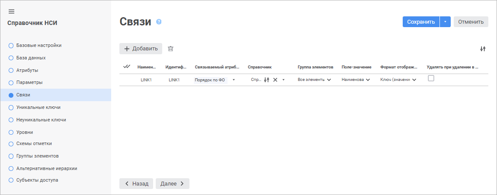
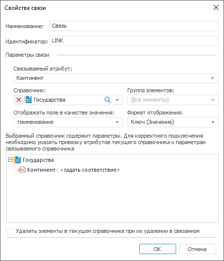
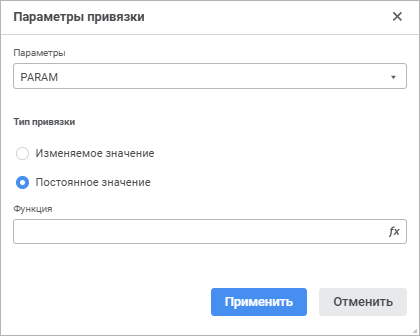
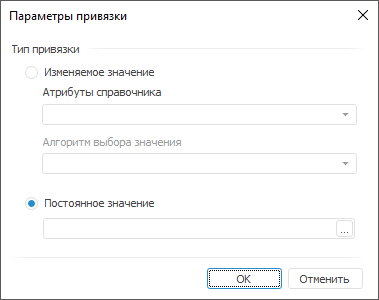
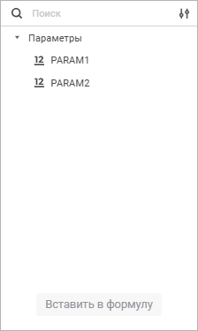
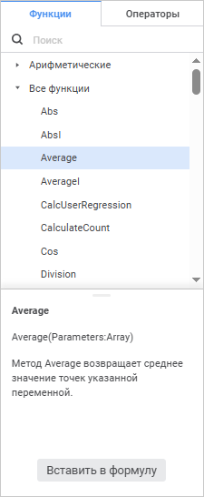

# Свойства связи

Свойства связи
-

# Свойства связи

Для настройки связи между атрибутами:

	- в веб-приложении задайте свойства связи в соответствующих столбцах
	 на странице «Связи» в мастере
	 [справочника НСИ](Link.htm)/[составного
	 справочника НСИ](../Master_Composite_Table_reference_book/Link_composite.htm).

	 Справочник
	 НСИ

	 Составной
	 справочник НСИ

		

		

	- в настольном приложении используйте окно «Свойства
	 связи».

[Для
 открытия окна](javascript:TextPopup(this))

	Выполните операции [добавления](Link.htm#add)
	 новой или [редактирования](Link.htm#edit) уже созданной
	 связи на вкладке «[Связи](Link.htm)».

Определите параметры связи:

[Наименование
 и идентификатор](javascript:TextPopup(this))

	Введите наименование и уникальный идентификатор связи.
	 Для идентификатора допускается использование только
	 латинских букв, цифр, знаков «_», не допускается использование пробелов.

[Связываемый
 атрибут](javascript:TextPopup(this))

	В раскрывающемся списке выберите атрибут, по которому создается
	 связь с другим справочником. В списке содержатся только те атрибуты,
	 которые ещё не задействованы для связей. Связываемый атрибут должен
	 быть целого типа. Если связываемый [атрибут](Attributes/Attribute.htm)
	 не целого типа данных, будет предложено сменить тип данных атрибута.

[Справочник](javascript:TextPopup(this))

	В раскрывающемся списке выберите справочник, с которым будет установлена
	 связь по системному атрибуту с идентификатором «KEY».

Для быстрого выбора объекта в поле для поиска введите его название/идентификатор/ключ,
 в зависимости от настроек отображения. Поиск будет выполняться автоматически
 по мере ввода текста. Список будет содержать объекты, наименования/идентификаторы/ключи
 которых содержат вводимый текст.

Для настройки отображения объектов репозитория в списке нажмите кнопку
  «Отображение
 объекта» и выберите в раскрывающемся меню вариант отображения:

	- Наименование. Объекты
	 отображаются под своими наименованиями. Вариант по умолчанию;

	- Идентификатор. Объекты
	 отображаются под своими идентификаторами;

	- Ключ. Объекты отображаются
	 под своими ключами.

Выбрать можно несколько вариантов. Идентификатор и ключ будут указаны
 в скобках.

Для сброса отметки выбранных объектов нажмите кнопку 
 «Очистить».

	Примечание.
	 Настройка отображения объекта доступна в веб-приложении.

	После выбора справочника будут доступны списки «Группа
	 элементов», «Поле-значения»
	 и «Формат отображения».

	Если выбранный справочник является параметрическим, задайте [привязку](#add)
	 атрибутов текущего справочника к параметрам связываемого справочника.

	В настольном приложении при выборе параметрического справочника
	 отображается дерево параметров. Дерево параметров предназначено для
	 задания привязки атрибутов текущего справочника к параметрам связываемого
	 справочника или задания постоянного значения.

	Примечание.
	 Если идентификатор параметра и его тип совпадают с данными параметра
	 какого-либо атрибута редактируемого справочника, то соответствие будет
	 установлено автоматически.

	Для быстрого выбора объекта в списке введите название искомого объекта
	 в поле поиска. Поиск будет выполняться автоматически по мере ввода
	 текста. В списке будут отображаться только те объекты, наименования
	 которых содержат вводимый текст.

	Для сброса отметки выбранного справочника
	 нажмите кнопку  «Очистить».

[Группа элементов](javascript:TextPopup(this))

	Раскрывающийся список содержит все группы элементов справочника,
	 выбранного в поле «Справочник».
	 По умолчанию установлен вариант «[Все
	 элементы]». Если у справочника нет групп элементов, то список
	 содержит только вариант «[Все элементы]».

	Если выбран вариант «[Все элементы]»,
	 то при создании/редактировании элемента справочника НСИ, для которого
	 создается связь, в значении связываемого атрибута будут отображаться
	 все элементы справочника, с которым установлена связь.

	Если выбрана группа, то при создании/редактировании элемента справочника
	 в значении связываемого атрибута будут отображаться только те элементы,
	 которые включены в указанную группу.

[Поле-значение/Отображать
 поле в качестве значения](javascript:TextPopup(this))

	В раскрывающемся списке выберите атрибут связываемого справочника,
	 значения которого будут отображаться в качестве значений для связываемого
	 атрибута текущего справочника. По умолчанию используются значения
	 атрибута «Наименование».

[Формат отображения](javascript:TextPopup(this))

	В раскрывающемся списке выберите формат отображения значения связываемого
	 атрибута. Доступны следующие форматы отображения: «Ключ»,
	 «Значение» и «Ключ(Значение)».
	 По умолчанию отображается «Ключ(Значение)».

[Удалять при
 удалении в связанном справочнике/Удалять элементы в текущем справочнике
 при их удалении в связанном](javascript:TextPopup(this))

	При установке данного флажка связанные элементы в текущем справочнике
	 будут удалены, если произошло их удаление в связанном.

Для сохранения свойств связи нажмите кнопку «Сохранить»/«OK».

## Создание привязки

Для создания привязки:

	- в веб-приложении нажмите кнопку 
	 «Параметры привязки», расположенную
	 в столбце «Справочник» напротив
	 [добавленной связи](Link.htm);

Примечание.
 Создание привязки доступно только для [справочника
 НСИ](Master_RDS.htm).

	- в настольном приложении дважды щёлкните
	 по выбранному параметру в [дереве параметров](#dict) в
	 окне «Свойства связи».

Будет открыто окно «Параметры привязки»:

	Веб-приложение Настольное приложение

		

		

В веб-приложении в раскрывающемся списке «Параметры»
 выберите параметр, по которому создаётся связь между атрибутами текущего
 справочника НСИ и параметрами связываемого справочника.

Определите тип привязки, установив соответствующий переключатель:

	- Изменяемое значение.
	 Данный тип осуществляет привязку параметра к атрибуту редактируемого
	 справочника. Такая привязка позволяет при изменении значения атрибута
	 менять и значение параметра в связываемом справочнике:

		- Атрибуты справочника.
		 В раскрывающемся списке выберите атрибут справочника, значения
		 которого будут передаваться в качестве значения параметра. Раскрывающийся
		 список содержит все атрибуты текущего справочника;

		- Алгоритм выбора значения.
		 В раскрывающемся списке выберите алгоритм выбора значения при
		 множественной отметке для атрибута:

			- Все. В параметр
			 будет передаваться массив всех значений атрибута;

			- Первый. В параметр
			 будет передаваться первое значение атрибута;

			- Последний. В
			 параметр будет передаваться последнее значение атрибута;

Примечание.
 Раскрывающийся список «Алгоритм выбора
 значения» доступен, если связываемый [атрибут](Attributes.htm)
 может иметь множественное значение.

	- Постоянное значение.
	 Данный тип позволяет задать конкретное постоянное значение. Возможны
	 следующие ситуации:

		- если в связанном справочнике параметр привязан к какому-то
		 другому справочнику, то в поле будет отображен список элементов
		 этого справочника;

		- если параметр не привязан к другому справочнику, то можно
		 задать значение, соответствующее типу параметра. Для задания значения
		 нажмите кнопку 
		 / «Задать
		 формулу». Будет открыт [редактор выражения](UiNav.chm::/GUI/ExpressionEditor.htm).

Для сохранения настроек параметров привязки нажмите кнопку «Применить»/«OK».

[Редактирование
 привязки](javascript:TextPopup(this))

	Для редактирования привязки:

		- в веб-приложении нажмите кнопку  «Редактировать», расположенную
		 в столбце «Справочник»
		 напротив [добавленной связи](Link.htm);

		- в настольном приложении дважды щёлкните по привязке.

	Будет открыто окно «Параметры привязки»,
	 аналогичное окну при создании привязки.

[Удаление привязки](javascript:TextPopup(this))

	Для удаления выбранной привязки в настольном приложении нажмите
	 клавишу DELETE.

## Редактор
 выражения

Настройка формул выполняется с помощью редактора выражения:

	- редактор выражения в настольном приложении универсален для всех
	 инструментов и объектов платформы. Описание универсального редактора
	 выражения приведено в разделе «[Создание формул и выражений](uinav.chm::/GUI/ExpressionEditor.htm)»;

	- редактор выражения в веб-приложении отличается в зависимости
	 от настраиваемого инструмента или объекта.

Окно редактора выражения для задания постоянного значения привязки в
 веб-приложении имеет вид:

Сформируйте формулу, по которой будет рассчитываться привязка.

В формуле допускается использование операндов, арифметических операций,
 функций, цифр, знаков сравнения и круглых скобок. При этом имеются некоторые
 особенности:

	- вставка всех типов элементов, кроме цифр, может осуществляться
	 как с помощью клавиатуры, так и с помощью специальных панелей;

	- вставка цифр осуществляется только с помощью клавиатуры.

[Вставка операндов](javascript:TextPopup(this))

	Операнды отображаются на панели операндов редактора выражения:

	

	В качестве операндов используются [параметры
	 справочника НСИ](../../Cube/CreateCube/Master_Standart/parameters.htm).

Для вставки операнда в область формул выполните одно из действий:

	- с помощью панели операндов:

		- выделите операнд и нажмите кнопку «Вставить
		 в формулу»;

		- дважды щёлкните по операнду;

		- перенесите операнд в область формул с помощью механизма
		 Drag&Drop;

	- с помощью области формул:

		- введите наименование операнда в области формул;

		- щёлкните в области формул в том месте, куда нужно вставить
		 операнд, нажмите сочетание клавиш CTRL+SHIFT и выберите на всплывающей
		 панели требуемый операнд.

Для быстрого поиска операнда начните вводить его наименование частично
 или целиком в строке поиска. После выполнения действия на панели операндов
 будут отображены те операнды, наименования которых удовлетворяют условиям
 поиска.

Для настройки отображения списка операндов используйте команды в раскрывающемся
 меню кнопки  «Настройки
 отображения»:

	- Наименование. По умолчанию.
	 Отображение только наименований операндов;

	- Идентификатор. Отображение
	 только идентификаторов операндов;

	- Наименование и идентификатор.
	 Отображение наименований и идентификаторов операндов в формате: <наименование> (<идентификатор>).

Для скрытия панели операндов нажмите кнопку  «Скрыть панель операндов», для отображения -
 нажмите кнопку  «Отобразить
 панель операндов».

[Вставка функций
 и операторов](javascript:TextPopup(this))

	Функции и операторы отображаются на панели функций и операторов
	 на соответствующих вкладках:

	

	Для вставки функции или оператора в область формул выполните одно
	 из действий:

		- с помощью панели функций и операторов:

			- выделите функцию/оператор. Отобразится панель с описанием:

	

	Нажмите кнопку «Вставить
	 в формулу»;

			- дважды щёлкните по функции/оператору;

			- перенесите функцию/оператор в область формул с помощью
			 механизма Drag&Drop;

		- с помощью области формул:

			- введите функцию/оператор в области формул;

			- щёлкните в области формул в том месте, куда нужно вставить
			 функцию/оператор, нажмите сочетание клавиш CTRL+SHIFT и выберите
			 на всплывающей панели требуемую функцию/оператор.

	Для быстрого поиска функции или оператора начните вводить функцию/оператор
	 частично или целиком в строке поиска. После выполнения действия на
	 панели функций и операторов будут отображены функции/операторы, удовлетворяющие
	 условиям поиска.

	Для скрытия панели функций и операторов нажмите кнопку  «Скрыть
	 панель функций и операторов», для отображения - нажмите
	 кнопку  «Отобразить
	 панель функций и операторов».

См. также:

[Создание связей](Link.htm)

		Справочная
		 система на версию 10.9
		 от 18/08/2025,
		 © ООО «ФОРСАЙТ»,
