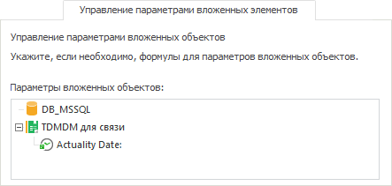

# Управление параметрами вложенных элементов

Управление параметрами вложенных элементов
-

# Управление параметрами вложенных элементов

На вкладке «Управление параметрами
 вложенных элементов» осуществляется настройка передачи значений
 в параметры объектов, от которых зависит работа справочника НСИ или составного
 справочника НСИ.

Примечание.
 Управление параметрами вложенных элементов доступно только в настольном
 приложении.

На вкладке отображается список вложенных объектов, связанных со справочниками.
 Возможны следующие варианты:

	- если элемент не имеет параметров, то отображается только его
	 наименование;

	- если элемент имеет некоторый набор параметров, то отображается
	 список параметров данного объекта.

Установка значений параметров производится в [редакторе
 выражения](UiNav.chm::/GUI/ExpressionEditor.htm), которое вызывается двойным щелчком по выбранному
 параметру.

См. также:

[Справочник
 НСИ](Master_RDS.htm) | [Составной
 справочник НСИ](../Master_Composite_Table_reference_book/Master_CompositeTable.htm)

		Справочная
		 система на версию 10.9
		 от 18/08/2025,
		 © ООО «ФОРСАЙТ»,
