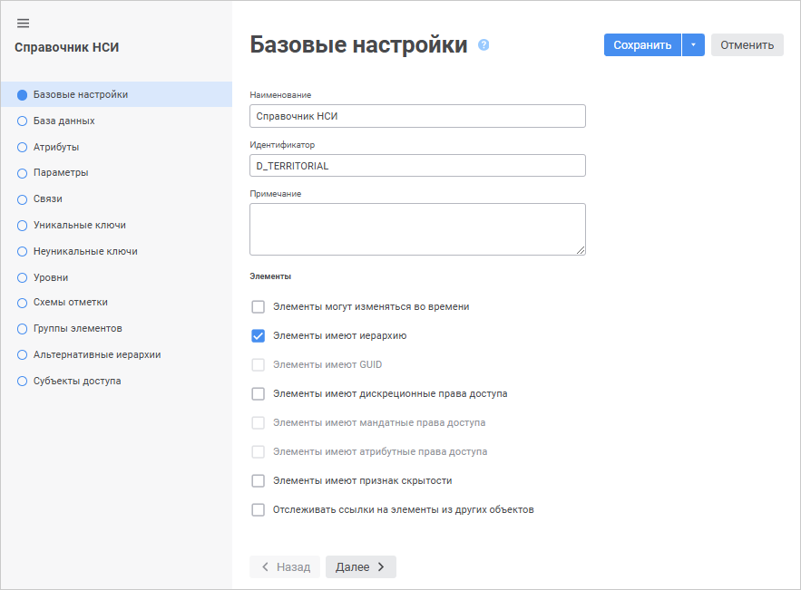
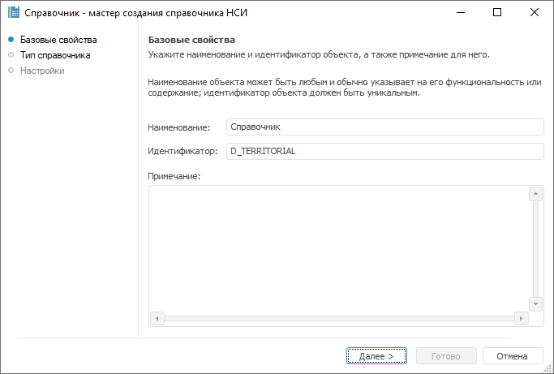
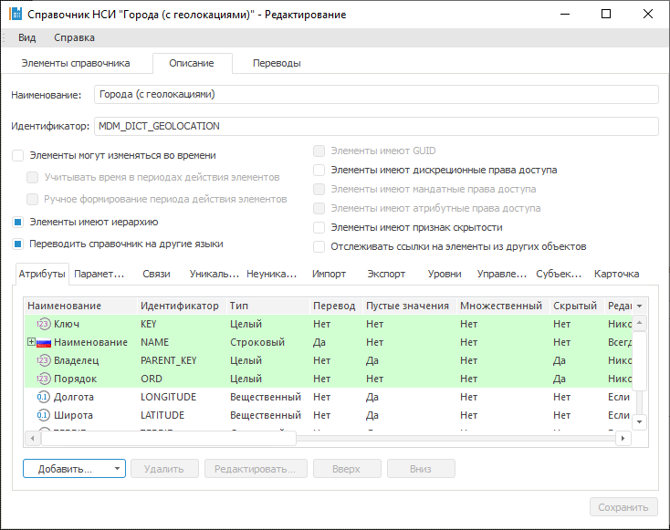
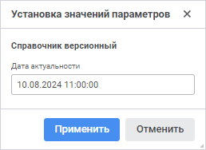

# Страница «Базовые настройки»: Справочник НСИ

Страница «Базовые настройки»: Справочник НСИ
-

# Базовые настройки

На странице «Базовые настройки»
 в веб-приложении и «Базовые свойства»
 в настольном приложении задаются наименование объекта, идентификатор,
 примечание и выполняется настройка структуры справочника НСИ. В настольном
 приложении настройка структуры справочника НСИ доступна только после создания
 справочника.

	 Веб-приложение Настольное приложение

		

		

		Для настройки структуры откройте справочник НСИ на редактирование
		 и перейдите на вкладку «Описание»:

		

Задайте общие параметры:

	- Наименование. Строка
	 символов, несущая смысловую нагрузку (функциональность объекта или
	 его содержание). Наименование объекта отображается в навигаторе объектов
	 и в большинстве мест интерфейса. Понятное наименование облегчает интерпретацию
	 объекта в системе;

	- Идентификатор. Последовательность
	 букв латинского алфавита, цифр и знаков подчёркивания, начинающаяся
	 с буквы. Идентификатор должен быть уникальным в пределах репозитория;

	- Примечание. Заметки
	 или аннотации к объекту. Поле необязательно для заполнения.

Задайте настройки структуры справочника:

[Элементы
 могут изменяться во времени](javascript:TextPopup(this))

	По умолчанию флажок снят.

	Для настройки версионности справочника установите флажок «Элементы могут изменяться во времени».

	После установки флажка при каждом открытии справочника на просмотр
	 в веб-приложении будет открываться диалог «Установка
	 значений параметров», в котором можно задать параметр «Дата актуальности»:

	

	После установки флажка на вкладке «[Элементы
	 справочника](../Work/Work_Dictionary.htm#rds)» будет создан параметр «Дата
	 актуальности», а в списке системных атрибутов будут созданы
	 атрибуты, позволяющие вести учёт версии элементов. Такой справочник
	 будет называться [версионным](../FAQ/UiRds_Work_RDS_Elements_work_2.htm).

	После установки флажка становятся доступными следующие опции:

		- Учитывать время
		 в периодах действия элементов. Установка флажка изменяет
		 тип системных атрибутов INDATE
		 и OUTDATE с типа «Дата» (дата актуальности представляется
		 без учета времени) на «ДатаВремя»
		 (с учетом времени), что влияет только на тип даты актуальности
		 элемента;

		- Ручное формирование
		 периода действия элементов. Установка флажка позволяет
		 на вкладке «Элементы справочника»
		 для элементов [версионного
		 справочника](../FAQ/UiRds_Work_RDS_Elements_work_2.htm) вручную задавать диапазоны дат. В противном случае,
		 диапазон формируется автоматически по правилу: дата начала равняется
		 дате актуальности, дата окончания - «31.12.2999».

[Элементы
 имеют иерархию](javascript:TextPopup(this))

По умолчанию флажок установлен.

При установке флажка автоматически будет создан атрибут «Владелец».

При снятии флажка «Элементы имеют иерархию»
 справочник станет одноуровневым, то есть у элементов справочника не может
 быть дочерних элементов. При попытке снять флажок у справочника, в котором
 есть хотя бы один дочерний элемент, будет выдано сообщение о невозможности
 операции.

[Переводить
 справочник на другие языки](javascript:TextPopup(this))

Доступно только в настольном приложении. По умолчанию флажок снят.

Установка флажка «Переводить справочник
 на другие языки» позволяет создавать мультиязычный справочник.
 Он хранит наименования всех атрибутов и значения строковых атрибутов не
 только для текущего языка, но и для языков, на которых предполагается
 использовать справочник.

После установки флажка будет отображаться вкладка «[Переводы](UiNav.chm::/Multilanguage/UiRds_Locale.htm)».

Примечание.
 Перевод атрибутов и элементов справочников доступен, если для репозитория
 задан язык по умолчанию. Выбрать язык репозитория по умолчанию можно один
 раз: при [создании
 репозитория](setup.chm::/05_RepoMngr/Setup_RepoMngr_CreateRepo.htm) или позднее в [настройках репозитория](UiNav.chm::/02_Navigator/Repo_Default.htm).

Для получения подробной информации
 о настройке мультиязычности содержимого репозитория и общей системы обратитесь
 к разделу «[Настройка
 мультиязычности](uinav.chm::/Multilanguage/Multilanguage_setting.htm)».

[Элементы
 имеют GUID](javascript:TextPopup(this))

По умолчанию флажок снят. Флажок доступен только для устаревших видов
 справочников и используется для совместимости с прошлыми версиями.

GUID (Globally Unique Identifier) -
 статистически уникальный 128-битный идентификатор. Его главная особенность -
 уникальность, которая позволяет создавать расширяемые сервисы и приложения
 без опасения конфликтов, вызванных совпадением идентификаторов. Хотя уникальность
 каждого отдельного GUID не гарантируется, общее количество уникальных
 ключей настолько велико (2128), что вероятность того, что в
 мире будут независимо сгенерированы два совпадающих ключа, достаточно
 мала.

После установки флажка в список атрибутов будет добавлен системный атрибут
 «Уникальный идентификатор» строкового
 типа. Данный атрибут автоматически заполняется при добавлении элементов
 в справочник. При установке данного флажка для справочника, который уже
 содержит элементы, атрибут так же автоматически заполняется.

[Элементы
 имеют дискреционные права доступа](javascript:TextPopup(this))

По умолчанию флажок снят.

Для разграничения дискреционных прав доступа на элементы справочника:

	- Убедитесь, что установлен флажок «[Использовать
	 дискреционный контроль](Admin.chm::/04_SecurityPolicy/Admin_SecPolicy.htm#access_control)» в разделе «Редактор политик» менеджера безопасности.

	- Установите флажок «Элементы
	 имеют дискреционные права доступа» в базовых настройках справочника.

После установки флажка в список атрибутов справочника будут добавлены
 четыре [обязательных
 атрибута](../Master_Composite_Table_reference_book/Attributes.htm), позволяющие настраивать права доступа для элементов справочника.

Список субъектов доступа формируется на странице «[Субъекты
 доступа](../Master_Composite_Table_reference_book/Access_Subjects.htm)».

Примечание.
 При разделении ролей между администратором информационной безопасности
 и прикладным администратором после установки флажка «Элементы
 имеют дискреционные права доступа» и сохранения справочника снять
 флажок можно только в менеджере безопасности. Устанавливать данный флажок
 может прикладной администратор или пользователь, имеющий соответствующие
 права.

Если в [редакторе
 политик](Admin.chm::/04_SecurityPolicy/Admin_SecPolicy.htm#access_control) совместно используются [дискреционный](Admin.chm::/04_SecurityPolicy/Admin_PermSep_D.htm)
 и [атрибутный](Admin.chm::/04_SecurityPolicy/Admin_ABAC.htm)
 методы разграничения доступа, то после установки флажка будет доступен
 флажок «[Элементы
 имеют атрибутные права доступа](../Master_Composite_Table_reference_book/base_settings.htm#abac)» для применения политик и правил
 настроенного атрибутного метода разграничения доступа для каждого элемента
 справочника.

[Элементы
 имеют мандатные права доступа](javascript:TextPopup(this))

По умолчанию флажок снят.

Для разграничения мандатных прав доступа на элементы справочника:

	- Убедитесь, что установлен флажок «[Использовать
	 мандатный доступ](Admin.chm::/04_SecurityPolicy/Admin_SecPolicy.htm#access_control)» в разделе «Редактор
	 политик» менеджера безопасности.

	- Установите флажок «Элементы
	 имеют мандатные права доступа» в базовых настройках справочника.

После установки флажка для каждого элемента справочника можно настроить
 мандатный контроль доступа с помощью диалога «[Права доступа](../Work/Access_Elements.htm)».

Примечание.
 Установка флажка «Элементы имеют мандатные
 права доступа» доступна только в настольном приложении.

[Элементы
 имеют атрибутные права доступа](javascript:TextPopup(this))

По умолчанию флажок снят.

Для разграничения атрибутных прав доступа на элементы справочника:

	- Убедитесь, что установлен флажок «[Использовать атрибутный доступ](admin.chm::/04_SecurityPolicy/Admin_SecPolicy.htm#access_control)»
	 в разделе «Редактор политик»
	 менеджера безопасности.

	- Установите флажок «Элементы
	 имеют атрибутные права доступа» в базовых настройках справочника.

После установки флажка для каждого элемента составного справочника будут
 применяться политики и правила настроенного [атрибутного
 метода](Admin.chm::/03_Admin/Admin_ElementAccess.htm#abac) разграничения доступа.

[Элементы
 имеют признак скрытости](javascript:TextPopup(this))

По умолчанию флажок снят.

При установке флажка к списку системных атрибутов будет добавлен атрибут
 «Скрыть» логического типа. По
 умолчанию для элементов справочника данный атрибут имеет значение FALSE. При значении TRUE
 элемент будет скрыт в дереве элементов справочника.

Для отображения всех скрытых элементов снимите флажок.

[Отслеживать
 ссылки на элементы из других объектов](javascript:TextPopup(this))

Отслеживание ссылок на элементы справочника из других объектов позволяет
 сохранить целостность этих объектов и предотвратить возможное удаление
 элементов, которые в них используются. Например, элемент справочника участвует
 в отметке области данных в регламентном отчёте. При попытке удалить такой
 элемент будет выдано предупреждение о том, что он используется и его удаление
 может нарушить целостность других объектов.

Посмотреть список объектов, которые ссылаются на элементы справочника,
 можно в [свойствах](UiNav.chm::/03_Objects/UiNav_Obj_BasicProp.htm)
 этого справочника. По умолчанию флажок снят, при этом отслеживание ссылок
 на элементы не производится.

См. также:

[Справочник
 НСИ](Master_RDS.htm)

		Справочная
		 система на версию 10.9
		 от 18/08/2025,
		 © ООО «ФОРСАЙТ»,
