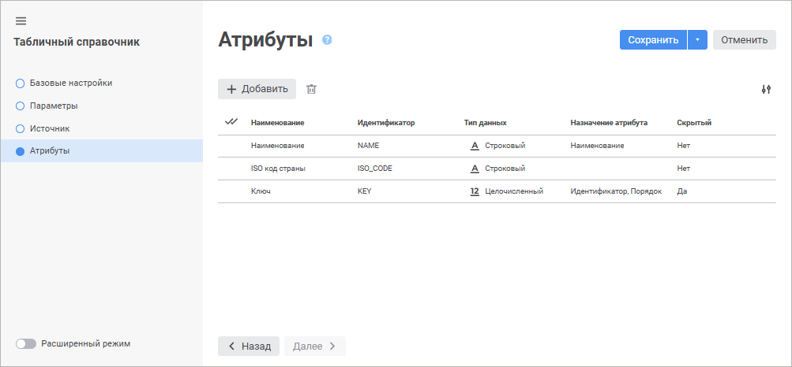
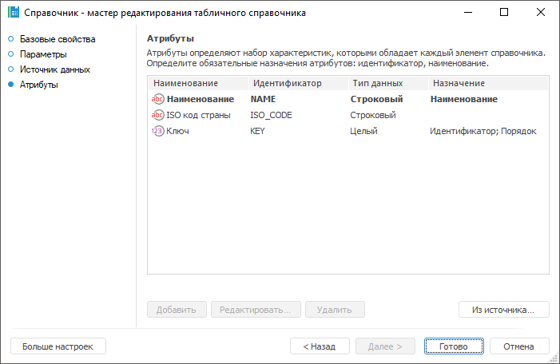

# Страница «Атрибуты» (Упрощенная): Табличный справочник

Страница «Атрибуты» (Упрощенная): Табличный справочник
-

# Атрибуты

На странице «Атрибуты» задаётся
 список атрибутов справочника и их назначение. Список атрибутов определяет
 набор характеристик, которые будет иметь каждый элемент справочника.

	Веб-приложение Настольное приложение

		

		

Для формирования списка атрибутов на основании списка полей источника:

	- в веб-приложении нажмите кнопку  «Добавить». В конец списка атрибутов
	 будет добавлена новая строка, и откроется панель «[Свойства
	 атрибута](UiMd_reference_book_Master_Table_page1_AttProps.htm)» для настройки добавленного атрибута;

	- в настольном приложении нажмите кнопку «Из
	 источника». Кнопка актуальна, если производилось изменение
	 структуры источника, на котором основан справочник, и необходимо обновить
	 структуру справочника.

Добавление атрибутов доступно при редактировании таблицы.

Примечание.
 При формировании списка атрибутов на основании списка полей источника
 уже имеющиеся атрибуты справочника будут удалены.

Для редактирования атрибута:

	- в веб-приложении щёлкните по атрибуту. Откроется панель «[Свойства
	 атрибута](UiMd_reference_book_Master_Table_page1_AttProps.htm)», в которой внесите необходимые изменения;

	- в настольном приложении выполните одно из действий:

		- дважды щёлкните по атрибуту;

		- выделите атрибут и нажмите кнопку «Редактировать»;

		- выполните команду «Редактировать»
		 в контекстном меню атрибута.

Откроется окно «[Свойства
 атрибута](UiMd_reference_book_Master_Table_page1_AttProps.htm)», в котором внесите необходимые изменения.

Для изменения количества отображаемых свойств атрибутов в веб-приложении
 нажмите кнопку  «Настройки»
 и установите/снимите флажок напротив наименования свойств.

Для удаления одного или нескольких атрибутов выделите их, после чего
 выполните одно из действий:

	- в веб-приложении нажмите кнопку  «Удалить»;

	- в настольном приложении:

		- нажмите кнопку «Удалить»;

		- выполните команду «Удалить»
		 в контекстном меню атрибута;

		- нажмите сочетание клавиш CTRL+DELETE.

Будет запрошено подтверждение выполняемого действия. Удаление атрибутов
 доступно при редактировании справочника.

Для сохранения настроек в мастере справочника:

	- в веб-приложении:

		- нажмите кнопку «Сохранить»;

		- выполните команду «Сохранить
		 и закрыть» в раскрывающемся меню кнопки «Сохранить».
		 После этого будут сохранены заданные настройки, закрыт мастер
		 и выполнен переход в [навигатор
		 объектов](getstarted.chm::/Interface/Interface_Navigator.htm).

Примечание.
 Команда «Сохранить и закрыть»
 доступна только при [редактировании
 настроек](../Work/Work_Dictionary.htm#edit).

	- в настольном приложении нажмите кнопку «Готово».

См. также:

[Табличный справочник](Master_Table.htm)

		Справочная
		 система на версию 10.9
		 от 18/08/2025,
		 © ООО «ФОРСАЙТ»,
