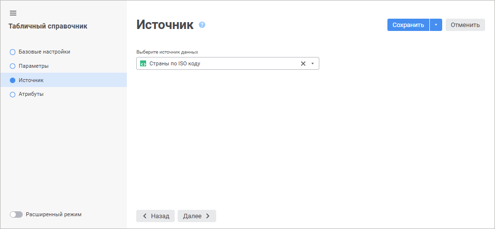
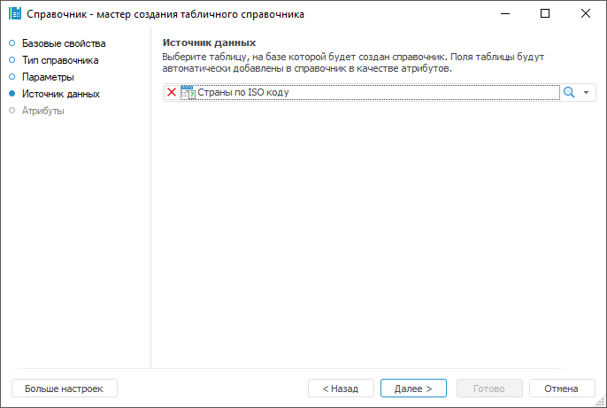

# Страница «Источник данных»: Табличный справочник

Страница «Источник данных»: Табличный справочник
-

# Источник данных

На странице «Источник» в веб-приложении
 или «Источник данных» в настольном
 приложении выбирается объект репозитория, на базе которого будет построен
 справочник. Доступные типы объектов репозитория: таблица, справочник НСИ.
 В веб-приложении также доступна таблица модели данных.

Примечание.
 Страница «Источник данных» доступна
 только при использовании [упрощённого](Master_Table.htm#simple_mode)
 режима создания табличного справочника.

	Веб-приложение Настольное приложение

		

		Выберите источник данных в раскрывающемся списке. При переходе
		 на [следующую страницу](Attributes_Simple.htm) мастера
		 список атрибутов будет сформирован автоматически на основании
		 списка полей выбранного источника.

Для быстрого выбора объекта в поле для поиска введите его название/идентификатор/ключ,
 в зависимости от настроек отображения. Поиск будет выполняться автоматически
 по мере ввода текста. Список будет содержать объекты, наименования/идентификаторы/ключи
 которых содержат вводимый текст.

Для настройки отображения объектов репозитория в списке нажмите кнопку
  «Отображение
 объекта» и выберите в раскрывающемся меню вариант отображения:

	- Наименование. Объекты
	 отображаются под своими наименованиями. Вариант по умолчанию;

	- Идентификатор. Объекты
	 отображаются под своими идентификаторами;

	- Ключ. Объекты отображаются
	 под своими ключами.

Выбрать можно несколько вариантов. Идентификатор и ключ будут указаны
 в скобках.

Для сброса отметки выбранных объектов нажмите кнопку 
 «Очистить».

		

		Из раскрывающегося списка выберите необходимый объект репозитория
		 или воспользуйтесь одним из доступных видов [поиска](UiNav.Chm::/GUI/combine_list.htm).
		 При переходе на [следующую страницу](Attributes_Simple.htm)
		 мастера список атрибутов будет сформирован автоматически на основании
		 списка полей выбранного источника.

См. также:

[Табличный справочник](Master_Table.htm)

		Справочная
		 система на версию 10.9
		 от 18/08/2025,
		 © ООО «ФОРСАЙТ»,
