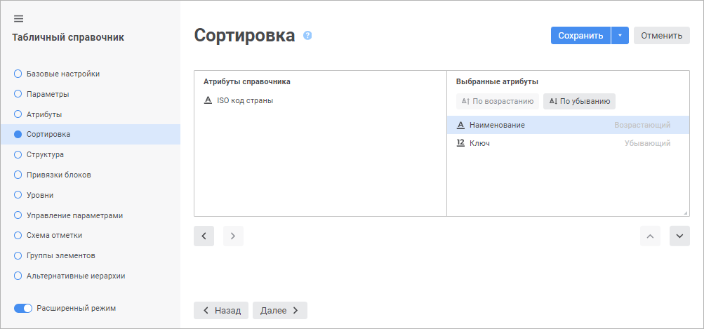
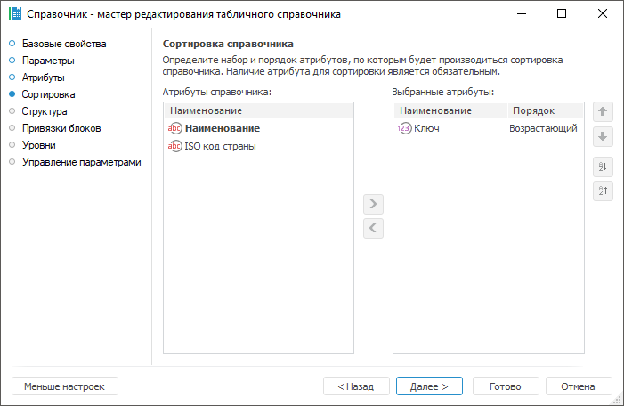

# Страница «Сортировка»: Табличный справочник

Страница «Сортировка»: Табличный справочник
-

# Сортировка

На странице «Сортировка» настраивается
 порядок сортировки элементов, который будет применяться при открытии справочника.

	Веб-приложение Настольное приложение

		

		

В списке «Атрибуты справочника»
 отображены все имеющиеся атрибуты справочника. В данном списке не отображаются
 атрибуты, которые добавлены в список «Выбранные
 атрибуты».

В списке «Выбранные атрибуты»
 отображаются атрибуты, по которым будет производиться сортировка.

По умолчанию всегда проводится возрастающая сортировка по атрибуту,
 для которого установлено [назначение](UiMd_reference_book_Master_Table_page1_AttProps.htm) -
 «Порядок».

Для добавления атрибута из списка «Атрибуты
 справочника» в список «Выбранные
 атрибуты» выполните одно из следующих действий:

	- используйте кнопку  «Добавить атрибут» в веб-приложении
	 или кнопку  «Добавить атрибут» в настольном приложении;

	- перетащите атрибут справочника в список «Выбранные
	 атрибуты» с помощью механизма Drag&Drop.

Для возврата атрибута обратно в список «Атрибуты
 справочника» используйте кнопку  «Вернуть атрибут» в веб-приложении
 или кнопку  «Вернуть атрибут» в настольном приложении.

Для настройки сортировки следует выбрать атрибут в списке «Выбранные
 атрибуты» и определить для него способ сортировки:

	- По убыванию. Используйте
	 кнопки  «По убыванию» в веб-приложении или
	  «По убыванию» в настольном приложении;

	- По возрастанию. Используйте
	 кнопки  «По возрастанию» в веб-приложении
	 или  «По возрастанию» в настольном приложении.

При настройке сортировки важен порядок расположения атрибутов, так как
 именно в этом порядке будет проводиться сортировка. Для изменения порядка
 сортировки атрибутов используются кнопки  «Переместить на один уровень вверх»
 и  «Переместить
 на один уровень вниз» в веб-приложении или кнопки  «Переместить
 на один уровень вверх» и  «Переместить
 на один уровень вниз» в настольном приложении.

Примечание.
 При работе со справочником можно будет изменить [сортировку
 элементов](../Work/Sort_Elements.htm).

См. также:

[Табличный справочник](Master_Table.htm)

		Справочная
		 система на версию 10.9
		 от 18/08/2025,
		 © ООО «ФОРСАЙТ»,
