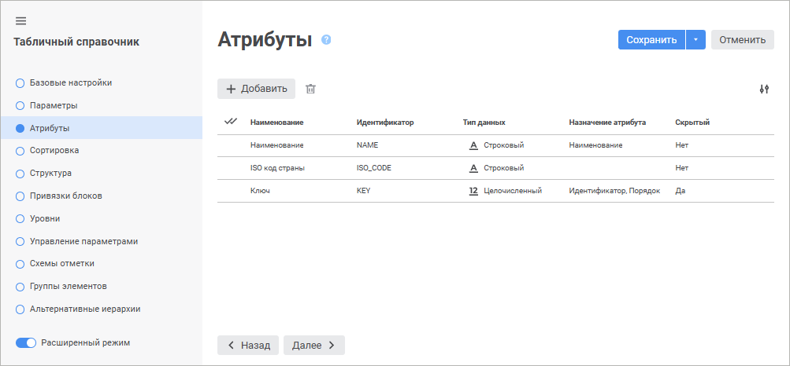
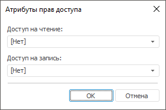

# Страница «Атрибуты» (Расширенная): Табличный справочник

Страница «Атрибуты» (Расширенная): Табличный справочник
-

# Атрибуты справочника

На странице «Атрибуты» задаётся
 список атрибутов справочника и их назначение. Список атрибутов определяет
 набор характеристик, которые будет иметь каждый элемент справочника.

	Веб-приложение Настольное приложение

		

		Для формирования списка атрибутов на основании списка полей
		 источника нажмите кнопку  «Добавить». В конец списка атрибутов
		 будет добавлена новая строка, и откроется панель «[Свойства атрибута](UiMd_reference_book_Master_Table_page1_AttProps.htm)» для настройки
		 добавленного атрибута. Добавление атрибутов доступно при редактировании
		 таблицы.

		Для редактирования атрибута щёлкните по нему. Будет открыта панель «[Свойства
		 атрибута](UiMd_reference_book_Master_Table_page1_AttProps.htm)», в которой можно внести необходимые изменения.

		Для изменения количества отображаемых свойств атрибутов нажмите
		 кнопку  «Настройки»
		 и установите/снимите флажок напротив наименования свойств.

		Для удаления одного или нескольких атрибутов выделите их и нажмите
		 кнопку  «Удалить».
		 Будет запрошено подтверждение выполняемого действия. Удаление
		 атрибутов доступно при редактировании справочника.

		

		Доступные операции для атрибутов:

			- Создание атрибута.
			 Для создания нового атрибута нажмите кнопку «Добавить».
			 Будет открыто окно «[Свойства
			 атрибута](UiMd_reference_book_Master_Table_page1_AttProps.htm)»;

			- Редактирование атрибута.
			 Для редактирования атрибута выполните одно из действий:

				- дважды щёлкните по атрибуту;

				- выделите атрибут и нажмите кнопку «Редактировать»;

				- выполните команду «Редактировать»
				 в контекстном меню атрибута.

		Будет открыто окно «[Свойства
		 атрибута](UiMd_reference_book_Master_Table_page1_AttProps.htm)»;

			- Удаление атрибута.
			 Для удаления атрибута:

				- Выделите атрибут в списке.

				- Выполните одно из действий:

					- нажмите кнопку «Удалить»;

					- выполните команду «Удалить»
					 в контекстном меню атрибута.

		Будет запрошено подтверждение о выполняемом
		 действии. Атрибут будет удален из структуры справочника.

			- Настройка атрибутов
			 прав доступа по элементам. Указание атрибутов прав
			 доступа позволяет в дальнейшем, при использовании справочника
			 в кубах, ограничить доступ определенных пользователей к данным
			 по определенным элементам.

		Для указания атрибутов выполните
		 действия:

				- Создайте или выберите два целочисленных атрибута.

				- Нажмите кнопку «Права
				 доступа». Будет открыт диалог:

		

				- В раскрывающихся списках выберите атрибуты, для
				 которых необходимо задать доступ на чтение или запись.

				- Нажмите кнопку «OK».

		В полях, к которым будут [привязаны
		 указанные атрибуты](UiMd_reference_book_Master_Table_page3.htm), должны храниться десятичные значения,
		 соответствующее битовой маске безопасности. В соответствии с данной
		 маской для определенных пользователей будет разрешено/запрещено
		 чтение или редактирование данных по определенным элементам справочника.
		 Каждому биту маски ставится в соответствие субъект безопасности,
		 добавленный на вкладке «[Метки безопасности](admin.chm::/03_admin/admin_adminobjects_marks.htm)».
		 Номер бита соответствует номеру субъекта в списке. Значение бита
		 определяет разрешение/запрет на выполнение действий данному субъекту.

		Значение бита маски:

				- 0. Действие
				 запрещено;

				- 1. Действие
				 разрешено.

		Пример составления маски:

				 Значение маски
				 ... 1 1 1 0 1 1 0

				 Порядок следования субъектов в списке
				 на вкладке "Метки безопасности"

				 ... 6 5 4 3 2 1 0

				 Значение атрибута доступа

				     118

		Следовательно, субъекту, находящемуся
		 в списке первым (0), действие запрещено; субъекту, находящемуся
		 в списке вторым (1), действие разрешено и т.д.

			- Скрытие недоступных
			 элементов в справочнике. Если для справочника были
			 определены атрибуты прав доступа, то установка флажка «Скрывать недоступные элементы в
			 справочнике» позволяет скрыть элементы справочника
			 для пользователей, которые не имеют доступа на чтение.

См. также:

[Табличный справочник](Master_Table.htm)

		Справочная
		 система на версию 10.9
		 от 18/08/2025,
		 © ООО «ФОРСАЙТ»,
