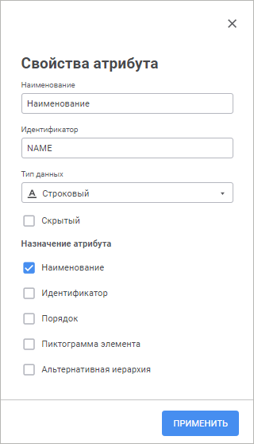

# Свойства атрибута

Свойства атрибута
-

# Свойства атрибута

Для определения свойств атрибута справочника используйте боковую панель
 «Свойства атрибута» в веб-приложении
 или окно «Свойства атрибута» в
 настольном приложении.

Примечание.
 Боковая панель «Свойства атрибута»
 и окно «Свойства атрибута» доступны
 только для [табличного](Master_Table.htm) и [вычисляемого](../Master_Calculation_reference_book/Master_Calculation.htm)
 справочников.

[Для открытия
 окна/боковой панели](javascript:TextPopup(this))

	На странице «[Атрибуты](UiMd_reference_book_Master_Table_page1.htm)» мастера справочника:

		- в веб-приложении щёлкните по необходимому атрибуту;

		- в настольном приложении:

			- дважды щёлкните по необходимому атрибуту;

			- выполните команду «Редактировать»
			 в контекстном меню атрибута;

			- выберите необходимый атрибут и нажмите кнопку «Редактировать».

	Веб-приложение Настольное приложение

		

		

Задайте свойства атрибута:

	- Наименование. Введите
	 наименование атрибута. По умолчанию: «Атрибут<порядковый
	 номер>»;

	- Идентификатор. Введите
	 уникальный идентификатор атрибута. Идентификатор должен содержать
	 только буквы латинского алфавита, цифры, знак «_», не должен содержать
	 пробелов и не должен начинаться с цифры. По умолчанию: ATTR<порядковый номер>;

	- Тип данных. Выберите
	 в раскрывающемся списке тип данных атрибута. По умолчанию используется
	 строковый тип данных;

	- Скрытый. Данный флажок
	 доступен для всех атрибутов, кроме атрибутов, назначение которых -
	 «Наименование». При установке
	 данного флажка атрибут будет участвовать в построении справочника,
	 но при этом в справочнике отображаться не будет;

	- Назначение атрибута.
	 Группа свойств содержит флажки, соответствующие назначению атрибута:

		- Наименование. Атрибут,
		 значение которого будет отображаться в качестве наименования элемента
		 при открытии справочника. Один атрибут должен обязательно иметь
		 назначение «Наименование».
		 При выполнении [агрегации данных](../../Cube/Agregation.htm)
		 атрибут должен быть с единственным назначением «Наименование»
		 в списке атрибутов;

		- Идентификатор. Атрибут,
		 значение которого будет отображаться в качестве идентификатора
		 элемента и позволит выделить элемент единственным образом. В дальнейшем
		 при работе со справочником значения данного атрибута будут использоваться
		 при составлении различных внутренних формул. Также идентификаторы
		 будут сохраняться в таблицах для привязки конкретных данных к
		 конкретным элементам справочников. Значения идентификаторов должны
		 быть уникальными среди всех источников, на базе которых строится
		 справочник. Также не допускается использование пустого значения
		 в качестве идентификатора. Один атрибут должен обязательно иметь
		 назначение «Идентификатор».
		 При выполнении [агрегации данных](../../Cube/Agregation.htm)
		 атрибут должен быть с единственным назначением «Идентификатор»
		 в списке атрибутов;

Примечание.
 Если справочник был создан в Prognoz Platform
 7 или более ранних версиях, то для корректной работы нужно убедиться,
 что один из атрибутов справочника имеет назначение «Идентификатор».

		- Порядок. Атрибут,
		 по значениям которого будет осуществляться первичная сортировка
		 при открытии справочника. Данный атрибут автоматически будет включен
		 в список на странице мастера «[Сортировка](UiMd_reference_book_Master_Table_Sorting.htm)».
		 Один атрибут должен обязательно иметь назначение «Порядок».
		 При выполнении [агрегации данных](../../Cube/Agregation.htm)
		 атрибут должен быть с единственным назначением «Порядок»
		 в списке атрибутов;

		- Пиктограмма элементов.
		 Атрибут, определяющий индекс значка, отображаемого для элемента
		 справочника. Используется, если для репозитория установлен документ,
		 содержащий [пиктограммы
		 элементов измерений](UiNav.chm::/02_Navigator/Repo_Default.htm). Если данный атрибут установлен,
		 то около наименования элементов будет выводиться изображение,
		 индекс которого соответствует значению атрибута. Атрибут является
		 необязательным.

		- Альтернативная иерархия.
		 Атрибут используется для настройки [альтернативной
		 иерархии](../look-and-feel_Reference_book/Attributes_as_alt_hier.htm). Атрибут является необязательным.

Шаги
 для формирования иерархической структуры [табличного справочника](Master_Table.htm)
 в [расширенном
 режиме](Master_Table.htm#advanced_mode) описаны в разделе «[Иерархия справочника](../UiMd_reference_book_Hierarchy.htm)».

См. также:

[Табличный
 справочник](Master_Table.htm) | [Календарный
 справочник](../Master_Calendar_reference_book/Master_Calendar.htm) | [Вычисляемый
 справочник](../Master_Calculation_reference_book/Master_Calculation.htm) | [Атрибуты
 справочника](UiMd_reference_book_Master_Table_page1.htm)

		Справочная
		 система на версию 10.9
		 от 18/08/2025,
		 © ООО «ФОРСАЙТ»,
