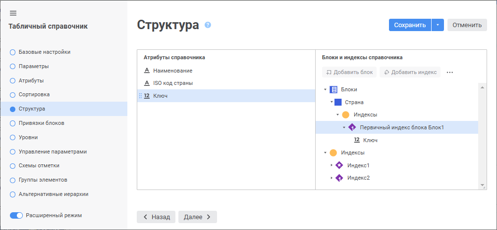
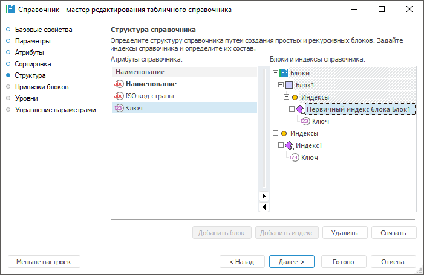
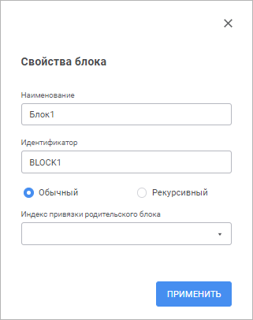
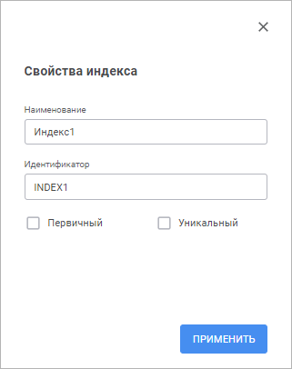

# Страница «Структура»: Табличный справочник

Страница «Структура»: Табличный справочник
-

# Структура

	На странице «Структура»
	 создаётся логическая структура будущего дерева элементов.

		Веб-приложение Настольное приложение

			

			

## Блоки

	Основой всей структуры справочника является блок. Блок
	 - это условный элемент, который при построении справочника предоставит
	 все элементы из одного источника
	 данных. Количество блоков не ограничено, каждый будет [связан](UiMd_reference_book_Master_Table_page3.htm)
	 со своим источником. Блоки могут быть простыми
	 и рекурсивными.

	Создание простого блока
	 подразумевает прямую проекцию записей источника в элементы справочника
	 без определения иерархии. Один простой блок будет предоставлять один
	 уровень элементов.

	Создание рекурсивного блока
	 подразумевает создание иерархии справочника, где один элемент будет
	 являться родительским для множества других элементов. Глубина рекурсии
	 зависит в этом случае от данных в источнике и заранее не может быть
	 вычислена.

### Создание блока

	Для создания блока выделите элемент «Блоки»
	 или заголовок уже созданного блока, после чего выполните одно из действий:

		- в веб-приложении нажмите кнопку  «Добавить блок». Откроется панель
		 «Свойства блока»;

		- в настольном приложении нажмите кнопку «Добавить
		 блок». Откроется окно «Свойства
		 блока».

		 Веб-приложение Настольное приложение

			

			

	Задайте наименование и уникальный идентификатор блока, а также тип
	 блока: обычный или рекурсивный.

	Раскрывающийся список «Индекс привязки
	 родительского блока» будет доступен если создаваемый блок будет
	 являться дочерним для какого-либо уже созданного блока.

	Для каждого блока автоматически создаётся первичный индекс. Данный
	 индекс будет использоваться при построении справочника для проверки
	 на уникальность и идентификации элементов только этого блока.

### Подготовка структуры для иерархического справочника

	При разработке иерархического справочника (справочника, в котором
	 элементы могут располагаться в несколько уровней) учитывается место
	 расположения исходных данных:

		- если все данные предоставляет один источник, то справочник
		 строится на базе рекурсивного блока;

		- если данные предоставляют разные источники, то справочник
		 может быть построен из комбинации простых и рекурсивных блоков.
		 Также можно организовать иерархию из блоков.

#### Иерархия блоков

	Создание иерархии блоков осуществляется по следующему алгоритму:

		- После создания первого (родительского) блока, выделите его
		 наименование в области «Блоки»
		 и нажмите кнопку «Добавить блок».

		- Будет открыт диалог создания второго (дочернего) блока.

		- В раскрывшемся диалоге укажите наименование, идентификатор
		 и тип блока. Также будет доступен список «Индекс
		 привязки родительского блока».

		- В списке необходимо выбрать уникальный индекс родительского
		 блока. При построении справочника по значениям атрибута(ов), входящих
		 в выбранный индекс, будет осуществляться поиск родительских элементов.
		 Сопоставление "родительский-дочерний элемент" будет
		 осуществляться на основании [связи](UiMd_reference_book_Master_Table_page3.htm),
		 установленной для атрибутов индекса.

### Удаление блока

	Для удаления блока выделите его заголовок в списке, после чего выполните
	 одно из действий:

		- в веб-приложении нажмите кнопку  «Удалить»;

		- в настольном приложении нажмите кнопку «Удалить».

	После подтверждения блок будет удалён.

	Примечание.
	 Дочерние блоки также будут удалены.

## Индексы

	В структуре справочника можно выделить два вида индексов:

		- Индексы блока. Создаются
		 внутри блока, используются для проверки уникальности и идентификации
		 элементов только этого блока. Индекс блока также может использоваться
		 для связи различных блоков;

		- Индексы справочника.
		 Создаются как дочерний элемент у элемента «Индексы»
		 в области «Блоки и индексы справочника».
		 Используются для проверки уникальности и идентификации элементов
		 всего справочника. Индексы справочника будут использоваться при
		 включении справочника в состав структуры какого-либо куба для
		 привязки данных к элементам справочника.

	Совет. В индексах
	 справочника рекомендуется создавать первичный индекс и включать в
	 него атрибут с назначением «[Идентификатор](UiMd_reference_book_Master_Table_page1_AttProps.htm)»
	 или любой другой атрибут, по которому предполагается наличие уникальных
	 значений. Для корректной работы справочника в дальнейшем не рекомендуются
	 в индексы включать атрибуты, по которым могут присутствовать пустые
	 значения.

### Создание индекса

	Для создания индекса выделите элемент «Индексы»
	 в области «Блоки и индексы справочника»
	 или внутри какого-либо блока, после чего выполните одно из действий:

		- в веб-приложении нажмите кнопку  «Добавить индекс». Откроется
		 панель «Свойства индекса»;

		- в настольном приложении нажмите кнопку «Добавить
		 индекс». Откроется окно «Свойства
		 индекса».

		 Веб-приложение Настольное приложение

			

			

	Задайте наименование и уникальный идентификатор
	 индекса. Также, используя флажки, можно указать специфику работы индекса:

		- Уникальный. Уникальный
		 индекс осуществляет проверку на уникальность данных по атрибутам,
		 которые будут в него включены;

		- Первичный. Уникальный
		 индекс, используемый для идентификации элементов. Первичный индекс
		 гарантирует, что в справочнике только один элемент будет иметь
		 определенное значение атрибута (комбинацию значений атрибутов).

	Примечание.
	 При настройке табличного справочника в качестве календарного необходимо
	 создать первичный индекс со следующим порядком атрибутов: первый атрибут
	 - BLOCK_TYPE, второй атрибут - START_DATE. Данный индекс должен быть
	 первым в списке индексов справочника.

### Связь индекса и атрибутов

	Для задания атрибутов, значения которых будет проверять индекс при
	 построении справочника, выполните одно из следующих действий:

		- в области «Атрибуты справочника»
		 выделите атрибут, а в области «Блоки
		 и индексы справочника» выберите индекс, после чего нажмите
		 кнопку  «Связать» в веб-приложении или
		 кнопку «Связать» в настольном
		 приложении;

		- в области «Атрибуты справочника»
		 выберите атрибут и перетащите в индекс, расположенный в области
		 «Блоки и индексы справочника»,
		 с помощью механизма Drag&Drop.

### Удаление индекса

	Для удаления индекса выделите его заголовок в списке, после чего
	 выполните одно из действий:

		- в веб-приложении нажмите кнопку  «Удалить»;

		- в настольном приложении нажмите кнопку «Удалить».

	После подтверждения индекс будет удалён.

См. также:

[Табличный справочник](Master_Table.htm)

		Справочная
		 система на версию 10.9
		 от 18/08/2025,
		 © ООО «ФОРСАЙТ»,
