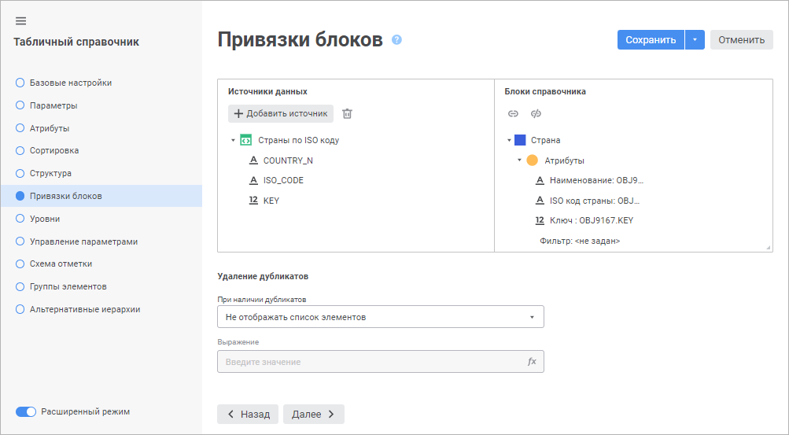
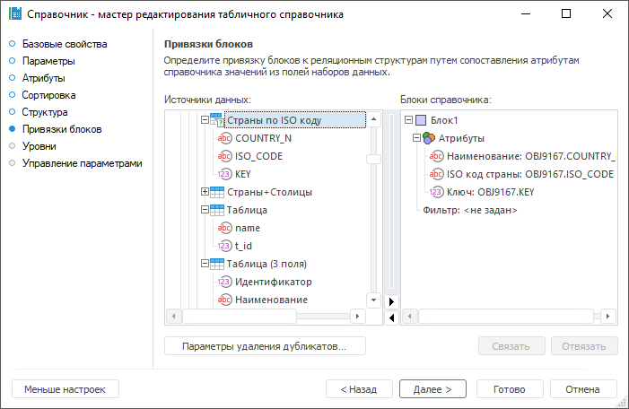

# Страница «Привязки блоков»: Табличный справочник

Страница «Привязки блоков»: Табличный справочник
-

# Привязки блоков

После определения [структуры](UiMd_reference_book_Master_Table_page2.htm)
 справочника в виде блоков необходимо привязать эти блоки к источникам
 данных, которые содержат записи об элементах справочника, на странице
 «Привязки блоков». Для этого в
 каждом определённом блоке необходимо сопоставить атрибуты справочника
 с соответствующими им полями таблицы.

	Веб-приложение Настольное приложение

		

		

[Добавление
 источника данных](javascript:TextPopup(this))

	В веб-приложении для добавления источника данных в область «Источники данных» нажмите кнопку
	  «Добавить источник»
	 и выберите в открывшемся окне необходимый источник данных.

Для быстрого выбора объекта в поле для поиска введите его название/идентификатор/ключ,
 в зависимости от настроек отображения. Поиск будет выполняться автоматически
 по мере ввода текста. Список будет содержать объекты, наименования/идентификаторы/ключи
 которых содержат вводимый текст.

Для настройки отображения объектов репозитория в списке нажмите кнопку
  «Отображение
 объекта» и выберите в раскрывающемся меню вариант отображения:

	- Наименование. Объекты
	 отображаются под своими наименованиями. Вариант по умолчанию;

	- Идентификатор. Объекты
	 отображаются под своими идентификаторами;

	- Ключ. Объекты отображаются
	 под своими ключами.

Выбрать можно несколько вариантов. Идентификатор и ключ будут указаны
 в скобках.

Для сброса отметки выбранных объектов нажмите кнопку 
 «Очистить».

	Для удаления выбранного источника нажмите кнопку 
	 «Удалить источник».

[Привязка блока
 к полям источника](javascript:TextPopup(this))

	Для связи полей источника с атрибутами блока справочника выполните
	 одно из следующих действий:

		- в области «Источники данных»
		 выделите поле в каком-либо источнике, а в области «Блоки
		 справочника» выберите необходимый атрибут и нажмите кнопку
		  «Связать» в веб-приложении или
		 кнопку «Связать» в настольном
		 приложении;

		- в области «Источники данных»
		 выберите поле в источнике и перетащите в атрибут, расположенный
		 в области «Блоки справочника»,
		 с помощью механизма Drag&Drop.

	После этого будет установлена связь и в качестве значений атрибута
	 элемента будут выступать значения из связанного поля источника. Атрибуты
	 одного блока могут быть привязаны к полям только одного и того же
	 источника.

[Параметры фильтрации
 элементов](javascript:TextPopup(this))

	Для установки фильтра необходимо дважды щелкнуть элемент «Фильтр» выбранного блока. В открывшемся
	 окне [редактора
	 выражения](UiNav.chm::/GUI/ExpressionEditor.htm) необходимо задать выражение, в соответствии
	 с которым будут отбираться те элементы, которые будут присутствовать
	 в справочнике. Выражение должно возвращать логическое значение. В
	 справочнике останутся те элементы, для которых выражение вернет значение
	 True.

	Для использования в выражении доступны поля источника, атрибуты
	 справочника и различные функции и операторы.

[Настройка рекурсии
 в рекурсивных блоках](javascript:TextPopup(this))

	Для организации иерархии элементов необходимо определить условие,
	 по которому будет осуществляться взаимосвязь дочерних и родительских
	 элементов. Настройка осуществляется в блоке элементов «Рекурсия»
	 и выполняется в следующем порядке:

		- в подэлементе «Верхний
		 уровень» необходимо определить условия, по которому будут
		 отбираться корневые элементы блока. Данные элементы будут отображаться
		 на самом верхнем уровне и будут являться родительскими элементами
		 для всех остальных элементов. Для установки выражения отбора необходимо
		 дважды щелкнуть по элементу «Верхний
		 уровень». В открывшемся окне [редактора
		 выражения](UiNav.chm::/GUI/ExpressionEditor.htm) необходимо указать условие отбора
		 корневых элементов;

		- в подэлементе «Связь по
		 индексу» необходимо выбрать индекс, содержащий атрибуты,
		 по значениям которых будет строиться взаимосвязь <Родительский
		 элемент>-<Дочерний элемент>. Для выбора индекса необходимо
		 дважды щелкнуть по элементу «Связь
		 по индексу»:

	

	Примечание.
	 Если справочник имеет один индекс, то в связь по индексу будет автоматически
	 настроена с использованием данного индекса.

		- для каждого атрибута, включенного в индекс, необходимо сопоставить
		 атрибут, по которому будут браться значения у дочерних элементов.
		 Данные значения будут искаться среди значений атрибута, входящего
		 в индекс. Найденное значение будет соответствовать родительскому
		 элементу. Для связи атрибута, входящего в состав индекса, необходимо
		 дважды щелкнуть по нему и в открывшемся окне [редактора
		 выражения](UiNav.chm::/GUI/ExpressionEditor.htm) выбрать атрибут справочника.

	Таким образом, по атрибуту, входящему
	 в состав индекса, будут искаться родительские элементы. По атрибуту,
	 который связан с атрибутом индекса, будут браться искомые значения
	 у дочерних элементов.

[Удаление
 дубликатов](javascript:TextPopup(this))

	Удаления дубликатов используется для разрешения конфликтов, возникающих
	 в связи с нарушением уникальности индексов справочников. Для настройки
	 параметров удаления в настольном приложении нажмите кнопку «Параметры удаления дубликатов»:

	

	В веб-приложении используйте область настроек «Удаление
	 дубликатов» на странице «Привязки
	 блоков».

	Выберите метод отбора элементов:

		- Не отображать список элементов;

		- Выбирать элемент по максимальному
		 значению выражения. Удаляются
		 элементы, соответствующие максимальному значению выражения, задаваемого
		 в окне «[Редактор
		 выражения](UiNav.chm::/GUI/ExpressionEditor.htm)». Для вызова окна редактора
		 выражения нажмите кнопку  «Задать выражение» в веб-приложении
		 или кнопку  «Задать
		 выражение»;

		- Выбирать элемент по минимальному
		 значению выражения. Удаляются элементы, соответствующие
		 минимальному значению выражения, задаваемого в окне «[Редактор
		 выражения](UiNav.chm::/GUI/ExpressionEditor.htm)». Для вызова окна редактора
		 выражения нажмите кнопку  «Задать выражение» в веб-приложении
		 или кнопку  «Задать
		 выражение».

	Рассмотрим пример. В первичный индекс блока включен атрибут «Идентификатор». Первичный индекс
	 подразумевает наличие уникальных значений по данному атрибуту. Если,
	 при открытии справочника, возникает нарушение целостности первичного
	 индекса из-за наличия нескольких записей с одинаковым значением атрибута
	 «Идентификатор», то будет
	 осуществлена попытка удаления дублирующих элементов. Если используются
	 настройки, указанные на изображении выше, то для всех дублирующих
	 записей будет вычислено значение атрибута «Порядок».
	 Элемент имеющий максимальное значение данного атрибута попадет в результирующий
	 набор элементов справочника.

См. также:

[Табличный справочник](Master_Table.htm)

		Справочная
		 система на версию 10.9
		 от 18/08/2025,
		 © ООО «ФОРСАЙТ»,
