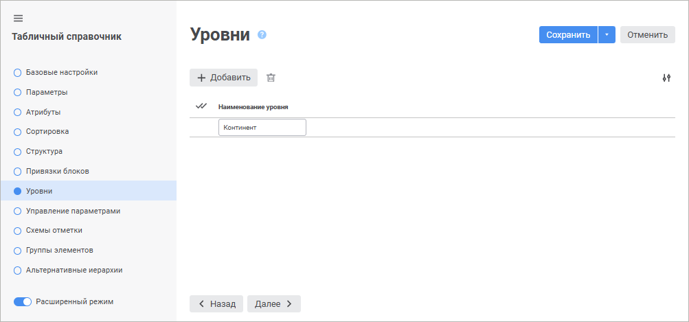
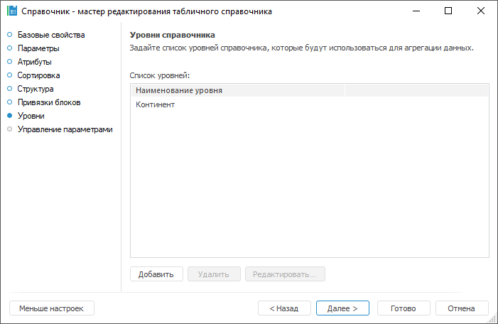

# Страница «Уровни»: Табличный справочник

Страница «Уровни»: Табличный справочник
-

# Уровни

На странице «Уровни» формируется
 список уровней, которые будут храниться вместе со структурой справочника.
 Данные уровни не влияют на фактическое количество уровней элементов, которые
 получатся при построении справочника. Фактическое количество уровней зависит
 только от структуры блоков и исходных данных. Если в справочнике используется
 один обычный блок, то при открытии справочник будет иметь один уровень
 элементов вне зависимости от количества уровней, созданных на данной вкладке.
 Справочник, имеющий рекурсивный блок, полностью зависит от исходных данных
 и может содержать сколько угодной уровней иерархии элементов.

Созданные на данной странице уровни в дальнейшем будут использоваться
 для настройки агрегации в кубах.

	 Веб-приложение Настольное приложение

		

		

[Для
 создания уровня](javascript:TextPopup(this))

		- в веб-приложении нажмите кнопку  «Добавить». Будет добавлена строка
		 нового уровня, в которой необходимо задать наименование созданного
		 уровня;

		- в настольном приложении нажмите кнопку «Добавить».
		 Откроется диалог, в котором необходимо задать наименование создаваемого
		 уровня:

	

	По умолчанию уровень добавляется с наименованием «Уровень<порядковый
	 номер>».

	Примечание.
	 Идентификаторы уровней генерируются автоматически.

[Для редактирования
 уровня](javascript:TextPopup(this))

		- в веб-приложении щёлкните по наименованию уровня и введите
		 новое наименование;

		- в настольном приложении выделите уровень в списке и нажмите
		 кнопку «Редактировать».
		 В открывшемся диалоге измените наименование уровня.

[Для удаления
 уровня](javascript:TextPopup(this))

	Выделите один или несколько требуемых уровней в списке, после чего
	 выполните одно из действий:

		- в веб-приложении нажмите кнопку  «Удалить»;

		- в настольном приложении нажмите кнопку «Удалить».

	После подтверждения выделенные уровни будут удалены.

См. также:

[Табличный справочник](Master_Table.htm)

		Справочная
		 система на версию 10.9
		 от 18/08/2025,
		 © ООО «ФОРСАЙТ»,
