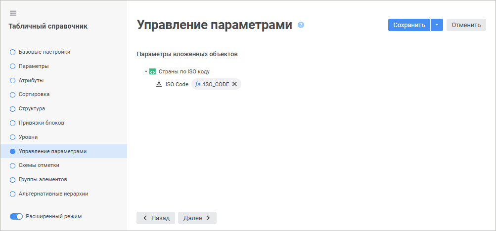
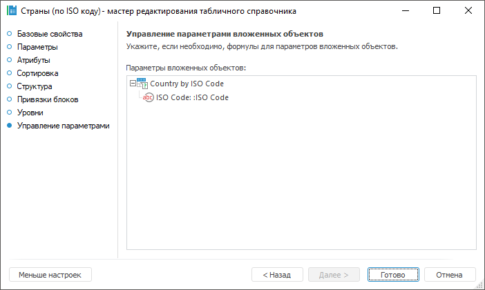

# Страница «Управление параметрами»: Табличный справочник

Страница «Управление параметрами»: Табличный справочник
-

# Управление параметрами

При открытии справочника осуществляется открытие всех источников данных,
 которые он использует. Если в справочнике используются параметрические
 источники данных, то для их открытия необходимо передавать значения параметров.
 Настройка параметров источников данных осуществляется на странице «Управление параметрами» мастера:

	Веб-приложение Настольное приложение

		

		

На странице отображаются все источники данных, используемые справочником.
 Возможны следующие варианты:

	- если объект не имеет параметров, то отображается только его
	 наименование;

	- если объект имеет некоторый набор параметров, то отображается
	 список параметров данного объекта.

Для установки значений параметров:

	- в веб-приложении нажмите кнопку  «Редактор выражения»;

	- в настольном приложении дважды щёлкните по выбранному параметру.

Будет открыто окно [редактора
 выражения](UiNav.chm::/GUI/ExpressionEditor.htm).
 Для параметра объекта можно указать конкретное значение, либо использовать
 в выражении параметры справочника. В этом случае передаваемые значения
 будут напрямую зависеть от значений, указанных при открытии справочника.

См. также:

[Табличный справочник](Master_Table.htm)

		Справочная
		 система на версию 10.9
		 от 18/08/2025,
		 © ООО «ФОРСАЙТ»,
