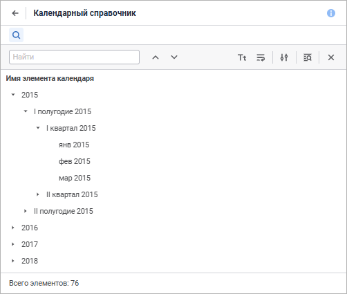
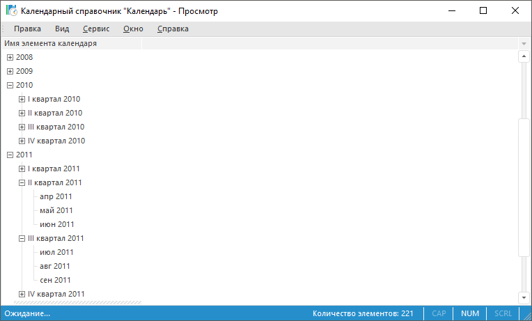

# Управление иерархией справочника

Управление иерархией справочника
-

# Управление иерархией справочника

Объединение элементов образует иерархию справочника. Иерархия справочника
 - это правила, по которым группируются элементы в измерении.

Пользователю предоставляется возможность сворачивать или разворачивать
 иерархию справочника с помощью знаков:

	- + / .
	 Свёрнутая иерархия;

	- - / .
	 Развёрнутая иерархия.

	Веб-приложение Настольное приложение

		

		

Для работы с иерархией используйте команды контекстного меню элементов:

	- Развернуть всё / Развернуть всю иерархию. Все элементы
	 иерархии будут развернуты;

	- Свернуть всё / Свернуть всю иерархию. Все элементы
	 иерархии будут свернуты;

	- [Сортировка](Work/Sort_Elements.htm).
	 Элементы иерархии будут отсортированы по заданным параметрам.

## Альтернативная иерархия

Альтернативная иерархия -
 это альтернативные правила, по которым группируются элементы в измерении.
 Альтернативная иерархия позволяет отображать одни и те же данные с разных
 точек зрения.

Существуют два варианта настройки альтернативной иерархии:

	- [альтернативная
	 иерархия на основе справочников](look-and-feel_Reference_book/Use_AlterHier_ForRefBook.htm);

	- [альтернативная
	 иерархия на основе атрибутов справочника](look-and-feel_Reference_book/Attributes_as_alt_hier.htm).

Примечание.
 Для одного справочника оба варианта могут применяться одновременно.

См. также:

[Работа
 со справочником](Work/Work_Dictionary.htm)

		Справочная
		 система на версию 10.9
		 от 18/08/2025,
		 © ООО «ФОРСАЙТ»,
