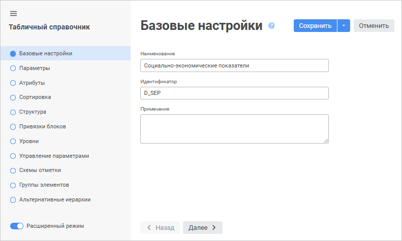
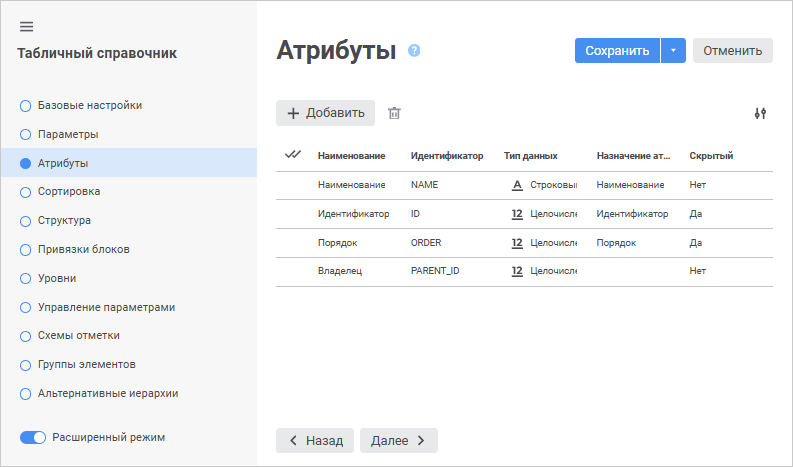
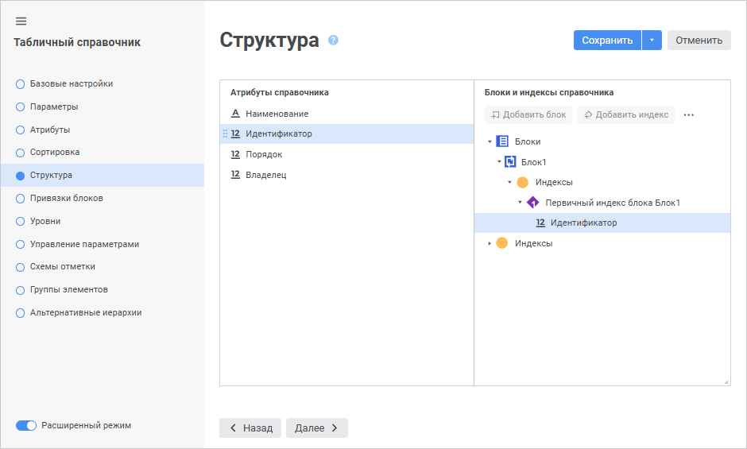
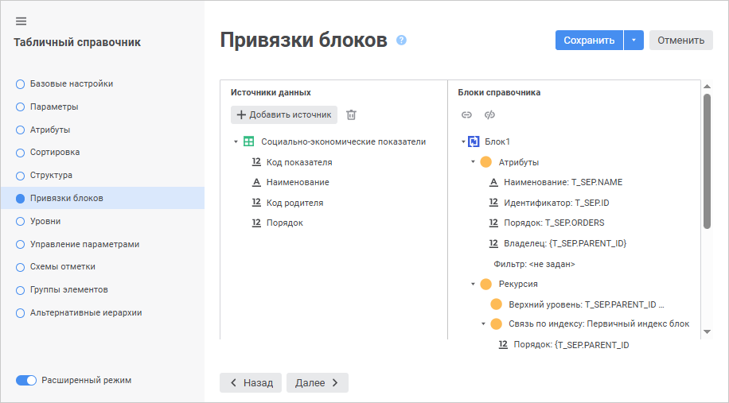
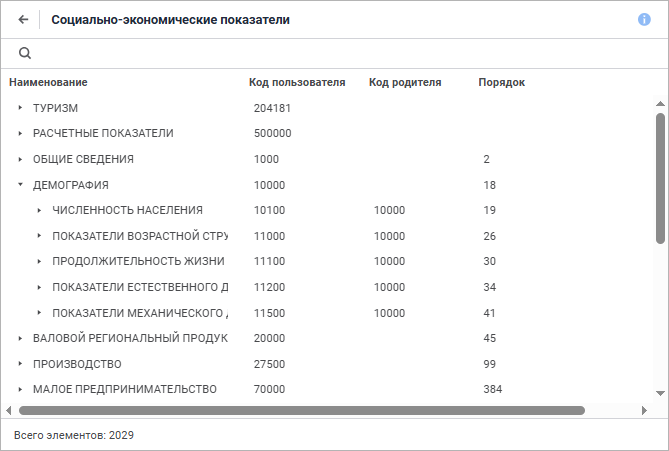

# Справочник «Социально-экономические показатели»

Справочник «Социально-экономические показатели»
-

# Справочник «Социально-экономические показатели»

Рассмотрим подробно процесс создания табличного справочника «Социально-экономические
 показатели».

Для создания справочника в навигаторе объектов выполните пункт контекстного
 меню «Создать > Справочник».
 Будет открыт [мастер справочника](Create.htm).

На странице «Базовые свойства»
 задайте стандартные параметры справочника:

	- Наименование: Социально-экономические
	 показатели;

	- Идентификатор: D_SEP:

Страницу «Параметры» пропускаем,
 так как справочник не является параметрическим. На странице «Тип
 справочника» установите переключатель напротив пункта «Табличный
 справочник», нажмите кнопку «Больше
 настроек» и перейдите на страницу «Атрибуты»:

Создайте следующие атрибуты справочника:

		 №
		 Наименование
		 Идентификатор
		 Тип данных
		 Назначение

		 1
		 Наименование
		 NAME
		 Строковый
		 Наименование

		 2
		 Идентификатор
		 ID
		 Целочисленный
		 Идентификатор

		 3
		 Порядок
		 ORDER
		 Целочисленный
		 Порядок

		 4
		 Владелец
		 PARENT_ID
		 Целочисленный

Свойства атрибутов справочника задаются на боковой панели «Свойства
 атрибута», которое вызывается при нажатии на кнопку  «Добавить»:

Перейдите на страницу «Структура»:

В области «Блоки и индексы справочника»
 выделите «Блоки» и нажмите на
 кнопку «Добавить блок». В открывшемся
 окне установите переключатель «Рекурсивный»
 и нажмите «ОК»:

С помощью механизма перетаскивания Drag&Drop перетащите атрибут
 справочника «Идентификатор» из
 списка атрибутов справочника на элемент «Первичный
 индекс блока Блок1».

Перейдите на следующую страницу мастера для привязки блоков к реляционной
 структуре:

В списке объектов схемы выберите таблицу «Справочник
 социально-экономических показателей», поля которой необходимо привязать
 к атрибутам справочника. Свяжите поля с атрибутами следующим образом:

	- Поле «Наименование»
	 (T_SEP.NAME) связать с атрибутом «Наименование»;

	- Поле «Код показателя»
	 (T_SEP.ID) связать с атрибутом «Идентификатор»;

	- Поле «Порядок» (T_SEP.ORDERS)
	 связать с атрибутом «Порядок»;

	- Поле «Код родителя»
	 (T_SEP.PARENT_ID) связать с атрибутом «Владелец».

Связь производится с помощью механизма перетаскивания поля на соответствующий
 атрибут справочника.

Для организации иерархии элементов будущего справочника задайте параметры
 в разделе «Рекурсия»:

	- Дважды щёлкните элемент «Верхний
	 уровень» и в открывшемся редакторе задайте формулу: T_SEP.PARENT_ID
	 = 0;

	- Связь по индексу: Первичный
	 индекс блока Блок1;

	- Идентификатор: T_SEP.PARENT_ID.

Перейдите на последнюю страницу мастера и нажмите кнопку «Готово».
 После этого созданный справочник появится в навигаторе объектов. Для просмотра
 созданного справочника дважды щёлкните по нему:

См. также:

[Примеры создания справочников](UiMd_reference_book_Examples.htm)

		Справочная
		 система на версию 10.9
		 от 18/08/2025,
		 © ООО «ФОРСАЙТ»,
