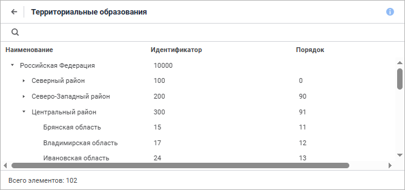

# Справочник «Территориальные образования»

Справочник «Территориальные образования»
-

# Справочник «Территориальные образования»

Справочник создается аналогично приведенному примеру создания справочника
 «[Социально-экономические показатели](UiMd_reference_book_example.htm)»,
 поэтому ниже приведено краткое описание.

	- Базовые свойства:

	-

		- Наименование: Территориальные
		 образования;

		- Идентификатор: D_TO.

	- Структура справочника.
	 Параметры блока:

	-

		- Наименование: Блок1;

		- Идентификатор: BLOCK1;

		- Тип блока: Рекурсивный.

Для индекса «Первичный
 индекс блока Блок1» установите атрибут «Идентификатор»;

	- Привязка
	 блоков. Осуществите привязку полей таблицы «Справочник
	 территориальных образований» с атрибутами справочника следующим
	 образом:

	-

		- Поле «Код» (T_TO.ID)
		 свяжите с атрибутом «Идентификатор»;

		- Поле «Наименование»
		 (T_TO.NAME) свяжите с атрибутом «Наименование»;

		- Поле «Порядок по ФО»
		 (T_TO.POR_FO) свяжите с атрибутом «Порядок».

Также на данной странице мастера задайте
 параметры «Рекурсии»:

	-

		- Верхний уровень: T_TO.FO_ID
		 = 0;

		- Связь по индексу: Первичный
		 индекс блока Блок1;

		- Код: T_TO.FO_ID.

Для настройки фильтра воспользуйтесь «[Редактором
 выражения](UiNav.chm::/GUI/ExpressionEditor.htm)» и создайте следующий фильтр: (T_TO.ID < 100) or
 (T_TO.ID > 1200);

	- Уровни. На данной странице
	 создайте следующие уровни:

	-

		- РФ;

		- ФО;

		- Области.

Добавление уровней осуществляется с помощью
 кнопки «Добавить». После нажатия
 на данную кнопку будет открыто окно, в котором задается наименование уровня.

Далее следует перейти на страницу «Заключительный этап» и нажать на
 кнопку «Готово» для завершения
 процесса создания справочника.

Для просмотра созданного справочника щелкните дважды мышью:

См. также:

[Примеры создания справочников](UiMd_reference_book_Examples.htm)

		Справочная
		 система на версию 10.9
		 от 18/08/2025,
		 © ООО «ФОРСАЙТ»,
