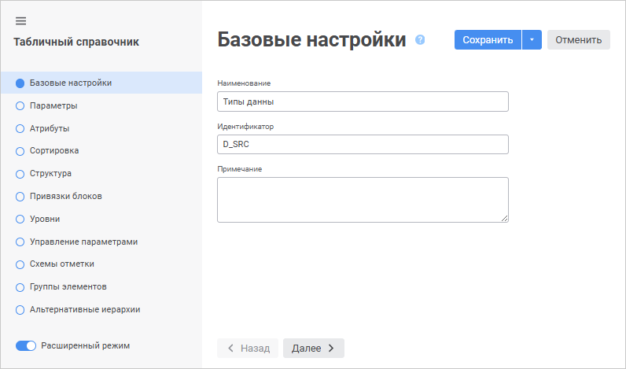
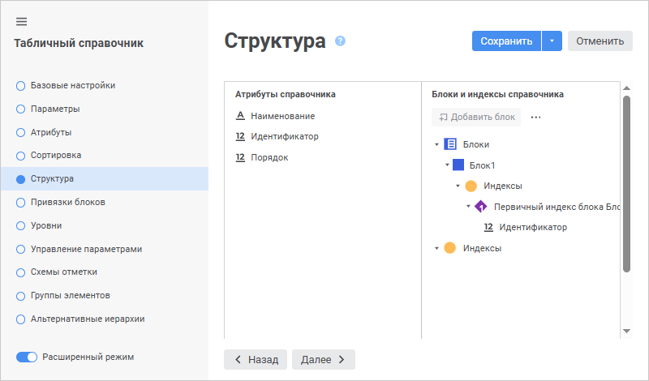
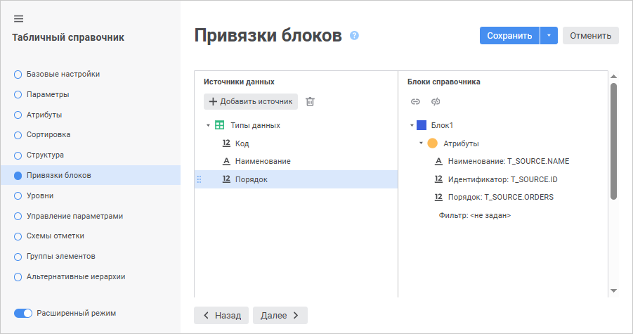

# Справочник «Типы данных»

Справочник «Типы данных»
-

# Справочник «Типы данных»

Для создания справочника в навигаторе объектов выполните команду контекстного
 меню «Создать > Справочник».
 После выполнения команды контекстного меню на экране появится окно [мастера справочника](Create.htm).

На странице «Базовые свойства»
 задайте стандартные параметры объекта:

	- Наименование: Типы данных;

	- Идентификатор: D_SRC:

Страницу «Параметры» пропускаем,
 так как справочник не является параметрическим. На странице «Тип
 справочника» установите переключатель напротив пункта «Табличный
 справочник» и нажмите кнопку «Больше
 настроек».

Страницы «Атрибуты» и «Сортировка» также пропускаем, все
 необходимые настройки на них уже заданы.

Перейдите на страницу «Структура»:

В области «Блоки и индексы справочника»
 выделите «Блоки» и нажмите на
 кнопку «Добавить блок». В открывшемся
 окне «Свойства блока» задайте:

	- Наименование: Блок1;

	- Идентификатор: BLOCK1;

	- Тип блока: Обычный.

С помощью механизма Drag&Drop перетащите
 атрибут справочника «Идентификатор»
 из списка атрибутов справочника на элемент «Первичный
 индекс Блока 1».

Перейдите на страницу мастера «Привязки
 блоков»:

В списке объектов схемы выберите таблицу «Источники
 данных», поля которой необходимо привязать атрибутам справочника.
 Свяжите поля с атрибутами следующим образом:

	- Поле «Код» (T_SOURCE.ID)
	 свяжите с атрибутом «Идентификатор»;

	- Поле «Наименование»
	 (T_SOURCE.NAME) свяжите с атрибутом «Наименование»;

	- Поле «Порядок» (T_SOURCE.ORDERS)
	 свяжите с атрибутом «Порядок».

Связь производится с помощью механизма перетаскивания поля на соответствующий
 атрибут справочника.

Перейдите на последнюю страницу мастера
 и нажмите кнопку «Готово». Для
 просмотра созданного справочника щелкните по нему дважды мышью:

См. также:

[Примеры создания справочников](UiMd_reference_book_Examples.htm)

		Справочная
		 система на версию 10.9
		 от 18/08/2025,
		 © ООО «ФОРСАЙТ»,
