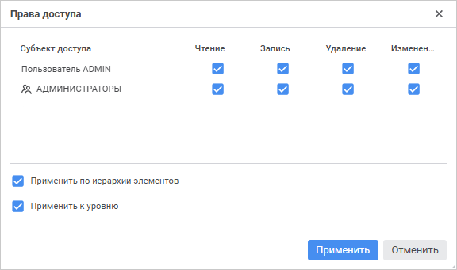
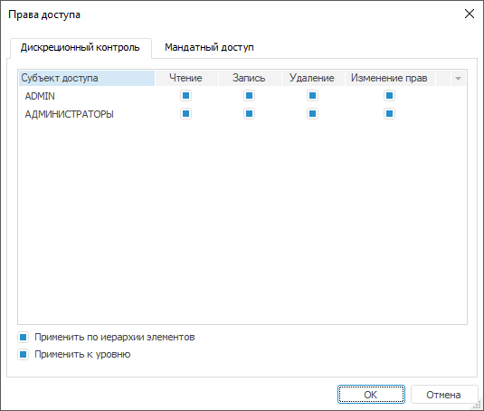
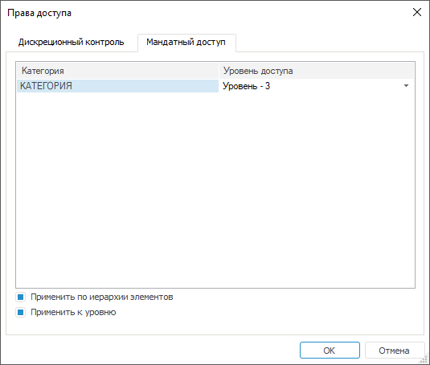

# Разграничение прав доступа на элементы справочника

Разграничение прав доступа на элементы справочника
-

# Разграничение прав доступа на элементы справочника

Возможны следующие методы контроля доступа для элементов справочника
 НСИ/составного справочника НСИ:

	- [Дискреционный
	 контроль](#discret). Основан на использовании списков контроля доступа,
	 назначаемых каждому объекту системы.

	- [Мандатный
	 контроль](#mandatory). Основан на присвоении объектам и субъектам системы
	 меток доступа.

	- [Атрибутный
	 контроль](#abac). Основан на использовании наборов политик и правил
	 доступа.

Допускается применение данных методов по отдельности и совместно: дискреционного
 и мандатного или дискреционного и атрибутного.

Примечание.
 Настройка прав доступа возможна, если применяется контроль доступа и пользователь
 имеет [привилегию](Admin.chm::/04_SecurityPolicy/Admin_Priv.htm)
 на изменение прав.

Если используется [разделение
 ролей](Admin.chm::/04_SecurityPolicy/Editor_of_Politicy/Security_EditorPoliticy_Adm.htm) между администратором информационной безопасности
 и прикладным администратором, то по умолчанию изменять права на элементы
 доступа может только администратор информационной безопасности из [менеджера безопасности](Admin.chm::/03_Admin/Admin_ElementAccess.htm).

## Настройка дискреционного контроля доступа

Для настройки дискреционного контроля доступа:

	- Убедитесь, что уставновлен флажок «Элементы
	 имеют дискреционные права доступа» на странице «Базовые
	 настройки» для [справочника
	 НСИ](../Master_RDS_reference_book/base_settings.htm#discretion_access_permissions)/[составного
	 справочника НСИ](../Master_Composite_Table_reference_book/base_settings.htm#discretion_access_permissions).

	- Выполните команду «Права доступа»
	 в контекстном меню элемента. Откроется окно «Права
	 доступа»:

	 Веб-приложение

	 Настольное
	 приложение

		

		Перейдите на вкладку «Дискреционный
		 контроль»:

		

Окно содержит список всех [субъектов
 доступа](../Master_RDS_reference_book/Access_Subjects.htm), определенных для справочника.

	- Используйте флажки в столбцах «Чтение»,
	 «Запись», «Удаление»
	 и «Изменение прав»:

		- при установленном флажке субъекту
		 доступно соответствующее действие;

		- при снятом флажке субъекту запрещено
		 выполнять данное действие.

Если для субъекта не определена ни одна из
 данных операций, то она не отображается.

	- Используйте флажки для настройки порядка применения прав доступа:

		- Применить
		 по иерархии элементов. Установка флажка позволяет применять
		 права доступа ко всем дочерним элементам настраиваемого элемента;

		- Применить
		 к уровню. Установка флажка позволяет применять права доступа
		 к элементам всего уровня, к которому принадлежит настраиваемый
		 элемент.

## Настройка мандатного контроля доступа

Для настройки мандатного контроля доступа в настольном приложении:

	- Убедитесь, что уставновлен флажок «Элементы
	 имеют мандатные права доступа» для [справочника
	 НСИ](../Master_RDS_reference_book/base_settings.htm#mandatory_access_permissions)/[составного
	 справочника НСИ](../Master_Composite_Table_reference_book/base_settings.htm#mandatory_access_permissions).

	- Выполните команду «Права доступа»
	 в контекстном меню элемента.

	- В открывшемся окне «Права
	 доступа» перейдите на вкладку «Мандатный
	 доступ»:

Окно содержит список всех [категорий
 секретности](Admin.chm::/04_SecurityPolicy/Admin_MandatAccess.htm), определенных в менеджере безопасности.

Для каждой категории секретности установите
 необходимый уровень доступа. По умолчанию для каждой категории установлен
 уровень «Нет доступа».

	- Используйте флажки для настройки порядка применения прав доступа:

		- Применить
		 по иерархии элементов. Установка флажка позволяет применять
		 права доступа ко всем дочерним элементам настраиваемого элемента;

		- Применить
		 к уровню. Установка флажка позволяет применять права доступа
		 к элементам всего уровня, к которому принадлежит настраиваемый
		 элемент.

## Настройка атрибутного контроля доступа

Для настройки атрибутного контроля доступа убедитесь, что установлен
 флажок «Элементы имеют атрибутные права
 доступа» для [справочника
 НСИ](../Master_RDS_reference_book/base_settings.htm#abac)/[составного
 справочника НСИ](../Master_Composite_Table_reference_book/base_settings.htm#abac).

Настройка атрибутного доступа для элементов справочника НСИ доступна
 только в менеджере безопасности.

Для получения подробной информации
 о настройке атрибутного доступа для элементов справочника НСИ обратитесь
 к статье «[Права
 доступа на элементы справочников НСИ](Admin.chm::/03_Admin/Admin_ElementAccess.htm)».

См. также:

[Работа
 со справочником](Work_Dictionary.htm)

		Справочная
		 система на версию 10.9
		 от 18/08/2025,
		 © ООО «ФОРСАЙТ»,
