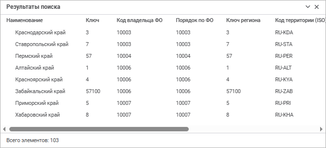
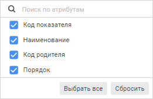

# Поиск элементов справочника

Поиск элементов справочника
-

# Поиск элементов справочника

Поиск элементов справочника предназначен для упрощения получения данных,
 необходимых пользователю.

Для поиска элементов справочников:

	- в веб-приложении:

		- нажмите кнопку  «Поиск»
		 на панели инструментов;

		- нажмите сочетание клавиш CTRL+F;

	- в настольном приложении:

		- выполните команду «Правка
		 > Поиск» в главном меню;

		- нажмите сочетание клавиш CTRL+F.

После выполнения одного из действий будет открыта панель поиска в веб-приложении
 или окно «Найти» в настольном
 приложении:

	Веб-приложение Настольное приложение

		

		

## Работа со строкой поиска

Для поиска данных с помощью панели поиска в веб-приложении:

	- Введите в поле «Найти»
	 искомое значение элементов.

	- Задайте при необходимости [дополнительные
	 параметры поиска](#settings).

	- Передвигайтесь между результатами поиска:

		- для перехода к следующему результату поиска нажмите кнопку
		  «Найти далее» или клавишу ENTER;

		- для перехода к предыдущему результату поиска нажмите кнопку
		  «Найти предыдущее».

При использовании клавиши ENTER направление
 поиска зависит от активного элемента интерфейса:

		- если установлен курсор в поле «Найти»
		 или используется кнопка  «Найти далее», то при последующем
		 нажатии клавиши ENTER выполняется переход к следующему результату
		 поиска;

		- если используется кнопка  «Найти предыдущее», то при последующем
		 нажатии клавиши ENTER выполняется переход к предыдущему результату
		 поиска.

В результате выполнения действий будет осуществлён поиск данных. В случае
 отсутствия искомых данных будет выведено соответствующее сообщение.

Для просмотра всех результатов поиска и быстрой навигации по ним используйте
 панель «[Результаты
 поиска](#results)».

Для скрытия строки поиска/замены нажмите кнопку 
 «Закрыть».

### Результаты поиска

Для просмотра всех результатов поиска нажмите кнопку 
 «Результаты поиска» на панели
 поиска. После чего будет открыта панель «Результаты
 поиска»:

На панели отображается информация обо всех результатах поиска по соответствующим
 атрибутам.

При выделении строки с найденным значением фокус перейдёт к искомому
 элементу в справочнике.

Для сворачивания/разворачивания панели «Результаты
 поиска» нажмите кнопку  «Свернуть
 панель»/ «Развернуть
 панель».

Для закрытия панели «Результаты поиска»:

	- нажмите кнопку 
	 «Закрыть»;

	- нажмите кнопку  «Результаты
	 поиска» в строке поиска.

## Работа с окном «Найти»

Для поиска данных с помощью окна «Найти»
 в настольном приложении:

	- Введите в поле «Найти»
	 искомое значение элементов.

	- Задайте при необходимости [дополнительные
	 параметры поиска](#settings). Для настройки дополнительных параметров поиска
	 нажмите кнопку «Дополнительно».
	 Диалог примет вид:

	- Передвигайтесь по результатам поиска:

		- для перехода к следующему результату поиска нажмите кнопку «Найти далее» или клавишу ENTER;

		- для просмотра всех результатов поиска нажмите кнопку «Найти все». После чего будет
		 открыт список всех элементов, удовлетворяющих условиям поиска:

При перемещении по найденным элементам будут
 выделены соответствующие элементы в списке справочника (при этом отображаются
 варианты значений атрибутов выделенного элемента).

В списке доступна множественная отметка.
 При выделении нескольких элементов с зажатой клавишей CTRL они также выделяются
 в основном списке. Выделить все элементы в списке можно с помощью комбинации
 клавиш CTRL+A либо с помощью команды контекстного меню «Выделить
 все».

В результате выполнения действий будет осуществлён поиск данных. В случае
 отсутствия искомых данных будет выведено соответствующее сообщение.

## Дополнительные параметры поиска

Для настройки условий поиска используйте дополнительные параметры:

	- Учитывать регистр. Позволяет
	 учитывать регистр букв, заданный в поле поиска. Например, если в поле
	 указано «Отчет», то не будут
	 найдены элементы, содержащие в соответствующих атрибутах «отчет»
	 и «ОТЧЕТ». Для использования
	 данного параметра:

		- в веб-приложении нажмите кнопку  «Учитывать регистр» в строке
		 поиска;

		- в настольном приложении установите флажок «Учитывать
		 регистр» в окне «Найти»;

	- Слово целиком. Позволяет
	 искать только элементы, содержащие в соответствующих атрибутах строку,
	 полностью и точно совпадающую со строкой, введённой в поле поиска.
	 Для использования данного параметра:

		- в веб-приложении нажмите кнопку  «Слово целиком» в строке поиска;

		- в настольном приложении установите флажок «Только
		 строка целиком» в окне «Найти»;

	- Атрибуты. Позволяет
	 выбрать атрибуты, по которым требуется осуществить поиск. Для использования
	 данного параметра:

		- в веб-приложении нажмите кнопку  «Атрибуты» в строке поиска и
		 установите/снимите флажки напротив атрибутов в раскрывающемся
		 меню:

Для поиска атрибута в списке начните вводить
 его наименование в строке поиска по атрибутам;

		- в настольном приложении установите/снимите флажки напротив
		 атрибутов в области «Атрибуты»
		 в окне «Найти».

По умолчанию флажки установлены для всех
 видимых атрибутов. [Скрытые](../Master_RDS_reference_book/Attributes/Attribute.htm)
 атрибуты в списке не отображаются. Также установить/снять флажки для всех
 атрибутов можно с помощью кнопок «Выбрать
 все», «Сбросить» в веб-приложении
 и «Отметить все», «Сбросить
 все» в настольном приложении;

	- Учитывать заданные окончания.
	 Позволяет осуществлять поиск без учёта склонений слов. То есть для
	 поиска будет использоваться строка поиска целиком, без учёта окончания
	 слова. Например, при указании в строке поиска «Пермский»
	 в результирующем списке будут отображены все элементы, у которых значения
	 атрибутов включают в себя слово «Пермский».
	 Если флажок снят, то будут найдены элементы, у которых значения атрибутов
	 включают в себя слова «Пермский»,
	 «Пермская», «Пермские»
	 и т.д.

Примечание.
 Параметр доступен только в настольном приложении, если флажок «Только строка целиком» снят.

См. также:

[Работа
 со справочником](Work_Dictionary.htm)

		Справочная
		 система на версию 10.9
		 от 18/08/2025,
		 © ООО «ФОРСАЙТ»,
