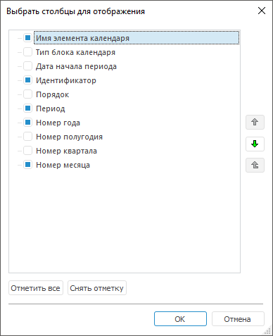

# Настройка отображения справочника

Настройка отображения справочника
-

# Настройка отображения справочника

При работе со справочником доступны операции:

	- [изменение размеров столбцов](#column_size);

	- [выбор столбцов в справочнике НСИ](#column). Доступно
	 только в настольном приложении.

## Изменение размеров столбцов

Для измерения размеров столбцов наведите стрелку мыши на границу между
 столбцами. После появления значка  зажмите и перетаскивайте
 границу для изменения ширины столбцов.

## Выбор столбцов в справочнике НСИ

Примечание.
 Доступно только в настольном приложении.

Для выбора отображаемых столбцов в справочнике НСИ:

	- нажмите кнопку  «Действия»
	 и установите/снимите флажки напротив отображаемых столбцов в раскрывающемся
	 меню или выполните команду «Выбрать
	 столбцы»;

	- выполните команду «Вид >
	 Выбрать столбцы» в главном меню. Доступно, если справочник
	 НСИ открыт на просмотр.

После выполнения одного из действий будет
 открыто окно «Выбрать столбцы для отображения»:

Выбор столбцов для отображения осуществляется
 посредством установки/снятия соответствующих флажков либо с помощью кнопок
 «Отметить все», «Снять
 отметку».

Для задания порядка столбцов используйте кнопки:
 ,
 ,
 .

См. также:

[Работа
 со справочником](Work_Dictionary.htm)

		Справочная
		 система на версию 10.9
		 от 18/08/2025,
		 © ООО «ФОРСАЙТ»,
