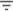

# Сортировка элементов справочника

Сортировка элементов справочника
-

# Сортировка элементов справочника

Сортировка позволяет изменить порядок элементов справочника.

Для элементов справочника доступно:

	- использование сортировки по
	 возрастанию/убыванию. Для этого:

		- в веб-приложении нажмите кнопку  «Сортировка» в заголовке столбца
		 и выберите из раскрывающегося списка требуемый способ сортировки:

			-  «По
			 возрастанию». Устанавливает сортировку по возрастанию.
			 В случае текстовых данных - от А до Я;

			-  «По
			 убыванию». Устанавливает сортировку по убыванию.
			 В случае текстовых данных - от Я до А;

			-  «Сбросить». Отключает
			 сортировку. Команда доступна только при использовании сортировки.

После настройки сортировки по возрастанию
 или убыванию пиктограмма кнопки  «Сортировка»
 изменится на пиктограмму выбранного способа сортировки, а сам выбранный
 способ станет недоступен в раскрывающемся меню кнопки;

		- в настольном приложении выполните команду «Сортировка >
		 По возрастанию/убыванию» в контекстном меню элемента
		 справочника. Будет произведена сортировка элементов по возрастанию/убыванию
		 значения атрибута, выбранного в списке атрибутов;

Примечание.
 Если при сортировке по возрастанию атрибут ранее не был выбран, то при
 выборе данного типа сортировки автоматически будет отмечен атрибут, расположенный
 в списке атрибутов первым.

		- в настольном приложении щёлкните
		 по заголовку столбца. В заголовке столбца отобразится стрелка,
		 показывающая направление сортировки:

	-

			-  «По возрастанию»;

			-  «По убыванию»;

			- Нет стрелки.
			 Сортировка по данному столбцу не производится.

При первом щелчке данные столбца будут отсортированы
 в алфавитном порядке/по возрастанию. При последующих щелчках по заголовку
 меняется вид сортировки;

	- использование сортировки по
	 столбцам. Для этого в настольном приложении нажмите кнопку
	  «Действия» и выберите пункт «Сортировка». Будет открыто одноименное
	 окно. Сортировка элементов справочника по столбцам аналогична [сортировке
	 столбцов таблицы](../../Table/Work/UiDb_relational_table_work_sort.htm). Доступно только при открытии справочника на
	 просмотр;

	- использование сортировки по
	 списку атрибутов измерения. Для этого в настольном приложении
	 выполните команду «Сортировка >
	 По атрибуту» в контекстном меню элемента справочника. Список
	 состоит из атрибутов справочника. Установите флажок напротив атрибута,
	 значение которого будет использовано при сортировке. Если до выбора
	 атрибута не был определен тип сортировки, то автоматически будет отмечен
	 пункт «По возрастанию». Доступно
	 только при открытии справочника на просмотр.

Примечание.
 Если атрибут не должен отображаться в подменю «Сортировка»,
 то его следует сделать скрытым в справочнике. Для этого в окне «[Свойства атрибута справочника](../Master_Table_reference_book/UiMd_reference_book_Master_Table_page1_AttProps.htm)» установите
 флажок «Скрытый».

Для сброса настроек сортировки в настольном приложении выполните команду
 «Сортировка > Сбросить»
 в контекстном меню элемента справочника. Для элементов справочника будет
 использована сортировка, настроенная при [создании
 справочника](../Master_Table_reference_book/UiMd_reference_book_Master_Table_Sorting.htm). Доступно только при открытии справочника на просмотр.

См. также:

[Работа
 со справочником](Work_Dictionary.htm)

		Справочная
		 система на версию 10.9
		 от 18/08/2025,
		 © ООО «ФОРСАЙТ»,
