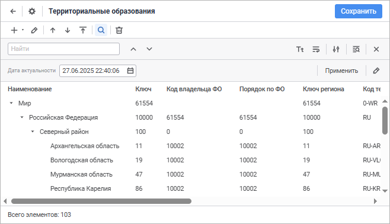
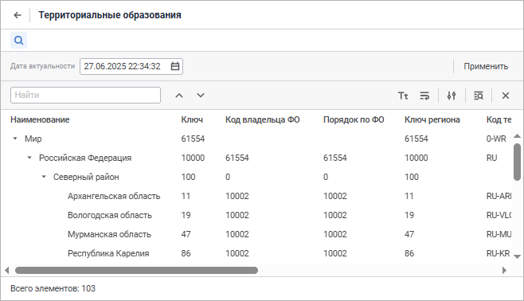
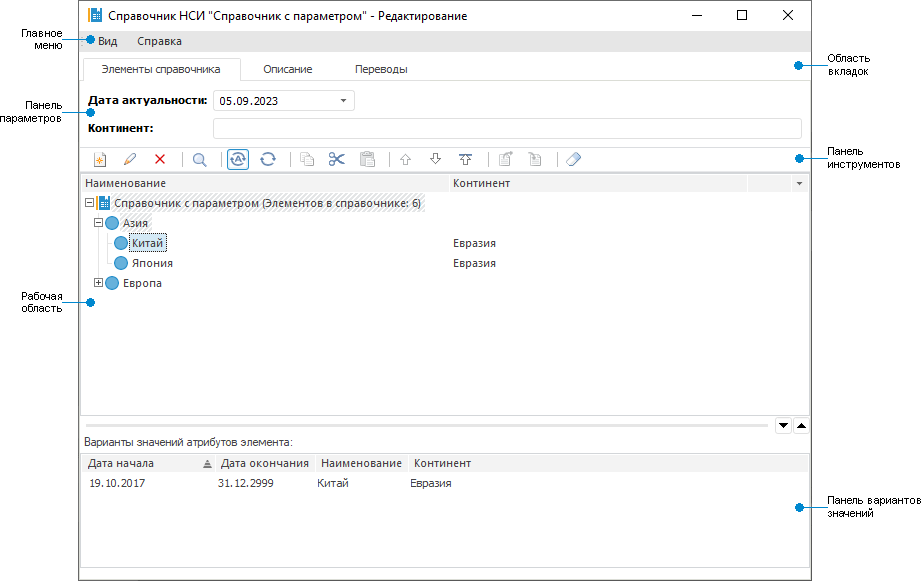
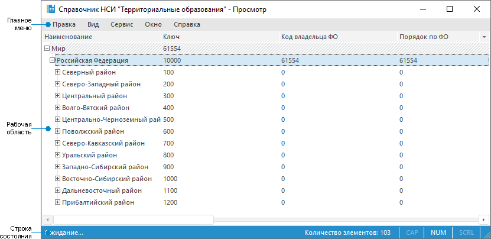
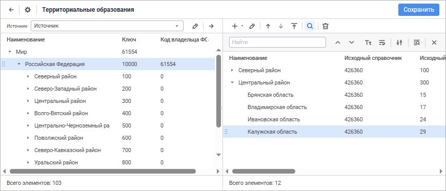
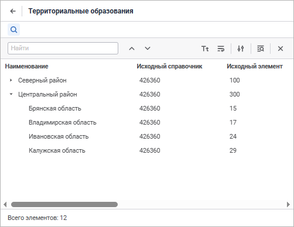
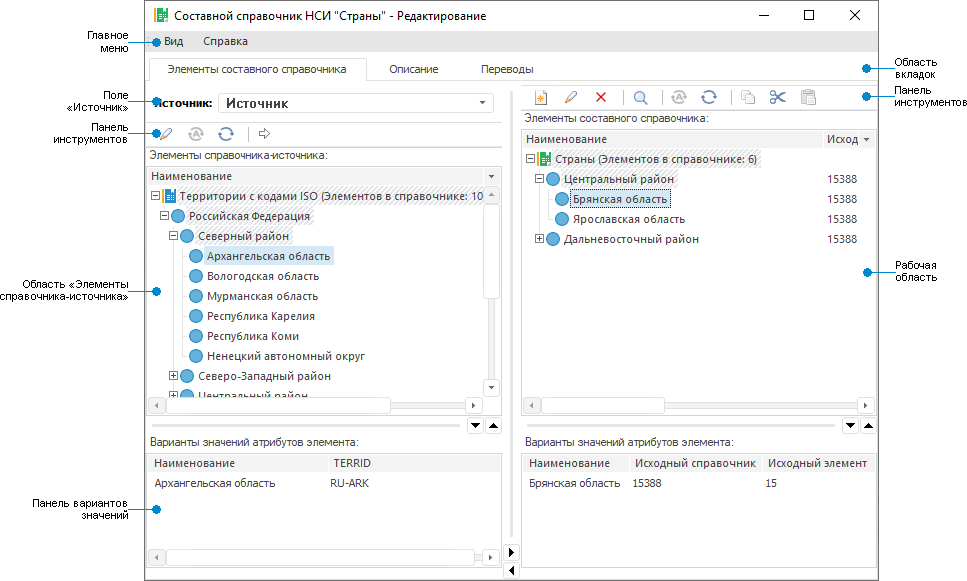
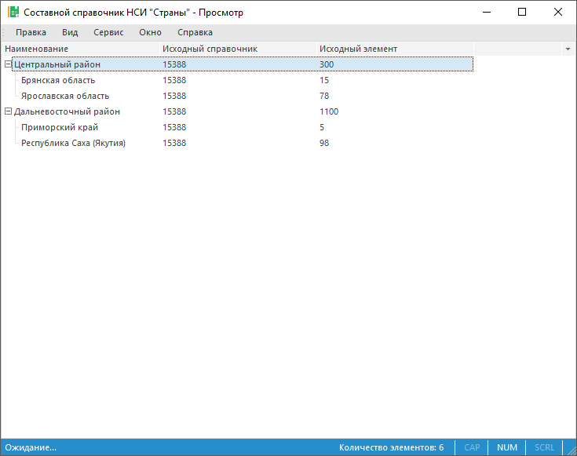

# Работа со справочником

Работа со справочником
-

# Работа со справочником

К справочникам относятся следующие типы объекта:

	- [табличный
	 справочник](../Master_Table_reference_book/Master_Table.htm);

	- [календарный
	 справочник](../Master_Calendar_reference_book/Master_Calendar.htm);

	- [вычисляемый
	 справочник](../Master_Calculation_reference_book/Master_Calculation.htm);

	- [справочник
	 НСИ](../Master_RDS_reference_book/Master_RDS.htm);

	- [составной
	 справочник НСИ](../Master_Composite_Table_reference_book/Master_CompositeTable.htm).

Для работы со справочником откройте его на редактирование или просмотр
 в [навигаторе
 объектов](GetStarted.chm::/Interface/Interface_Navigator.htm).

[Открытие
 справочника на редактирование](javascript:TextPopup(this))

	Для открытия справочника на редактирование:

		- в веб-приложении:

			- выполните команду «Редактировать»
			 в контекстном меню справочника;

			- выполните команду «Редактировать
			 в новой вкладке» в контекстном меню справочника;

			- выполните команду «Редактировать
			 в новом окне» в контекстном меню справочника;

			- нажмите клавишу F4;

		- в настольном приложении:

			- нажмите кнопку  «Редактировать»
			 на вкладке «Главная»
			 ленты инструментов в настольном приложении;

			- выполните команду «Редактировать»
			 в контекстном меню справочника;

			- нажмите клавишу F4.

	Способ редактирования справочника зависит от типа объекта:

		- Табличный справочник.
		 При редактировании справочника будет открыт [мастер
		 табличного справочника](../Master_Table_reference_book/Master_Table.htm);

		- Календарный справочник.
		 При редактировании справочника будет открыт [мастер
		 календарного справочника](../Master_Calendar_reference_book/Master_Calendar.htm);

		- Вычисляемый справочник.
		 При редактировании справочника будет открыт [мастер
		 вычисляемого справочника](../Master_Calculation_reference_book/Master_Calculation.htm);

		- Справочник НСИ.
		 При редактировании справочника будет открыто [окно
		 редактирования справочника](#rds). В веб-приложении доступно открытие
		 мастера с помощью кнопки 
		 «Настройки» через окно
		 редактирования;

		- Составной справочник НСИ.
		 При редактировании справочника будет открыто [окно
		 редактирования справочника](#composite_rds). В веб-приложении доступно
		 открытие мастера с помощью кнопки  «Настройки»
		 через окно редактирования.

[Сохранение
 справочника](javascript:TextPopup(this))

	Для сохранения нового справочника или при открытии справочника на
	 редактирование в веб-приложении:

		- в мастере справочника:

			- нажмите кнопку «Сохранить»;

			- выполните команду «Сохранить
			 и закрыть» в раскрывающемся меню кнопки «Сохранить».
			 После этого будут сохранены заданные настройки, закрыт мастер
			 и выполнен переход:

				- в [навигатор
				 объектов](getstarted.chm::/Interface/Interface_Navigator.htm) для табличного, календарного
				 и вычисляемого справочника;

				- в режим редактирования для справочника НСИ/составного
				 справочника НСИ;

	Примечание.
	 Команда «Сохранить и закрыть»
	 доступна только при редактировании настроек.

		- в [режиме
		 редактирования](Work_Dictionary.htm#edit) для справочника НСИ/составного справочника
		 НСИ:

			- нажмите кнопку «Сохранить»;

			- подтвердите производимое действие в информационном окне
			 при переходе в [навигатор
			 объектов](getstarted.chm::/Interface/Interface_Navigator.htm)/[мастер
			 справочника НСИ](../Master_RDS_reference_book/Master_RDS.htm)/составного справочника НСИ.

	Для сохранения нового справочника или при его редактировании в настольном
	 приложении:

		- в мастере справочника нажмите кнопку «Готово»;

		- в [режиме редактирования](Work_Dictionary.htm#edit)
		 для справочника НСИ/составного справочника НСИ:

			- нажмите кнопку «Сохранить»;

			- подтвердите производимое действие в информационном окне
			 при переходе в [навигатор
			 объектов](getstarted.chm::/Interface/Interface_Navigator.htm).

[Открытие
 справочника на просмотр](javascript:TextPopup(this))

	Для открытия справочника на просмотр:

		- в веб-приложении:

			- выполните команду «Открыть»
			 в контекстном меню справочника;

			- выполните команду «Открыть
			 в новой вкладке» в контекстном меню справочника;

			- выполните команду «Открыть
			 в новом окне» в контекстном меню справочника;

			- дважды щёлкните по справочнику;

			- нажмите клавишу ENTER;

		- в настольном приложении:

			- нажмите кнопку  «Открыть» в группе «Открыть» на вкладке «Главная» ленты инструментов;

			- выполните команду «Открыть»
			 в контекстном меню справочника.

Примечание.
 При открытии справочника отображаются только первые 100 элементов, остальные
 элементы загружаются последовательно в режиме реального времени.

Вид окна редактирования/просмотра справочника зависит от типа объекта.

## Справочники-представления

Окно просмотра табличного, календарного
 и вычисляемого справочников:

	Просмотр в веб-приложении Просмотр в настольном приложении

		

		

## Справочник НСИ

Окно редактирования/просмотра справочника
 НСИ:

	Редактирование в веб-приложении Просмотр в веб-приложении Редактирование в настольном приложении Просмотр в настольном приложении

		

		

		

		

[Элементы окна
 справочника НСИ в настольном приложении](javascript:TextPopup(this))

		- Главное меню. Содержит
		 список команд, предназначенных для выполнения различных операций
		 над объектами репозитория или их настройки;

		- Область вкладок.
		 Содержит вкладки для работы с элементами, настройки структуры
		 и переводов. Содержит вкладки «Элементы
		 справочника», «Описание»
		 и «Переводы». Доступна
		 в настольном приложении при открытии справочника на редактирование;

		- Панель инструментов.
		 Предназначена для выполнения действий над элементами справочника;

		- Панель параметров.
		 Содержит поля для ввода значений [параметров](../Master_RDS_reference_book/Parameters.htm).
		 При использовании параметров элементы со множественными значениями
		 будут отображены, если хотя бы одно значение элемента соответствует
		 выбранному параметру. Множественные значения по элементам должны
		 быть заданы раньше создания параметров. Поле «Дата
		 актуальности» отображается для [версионного
		 справочника](../FAQ/UiRds_Work_RDS_Elements_work_2.htm). Если в справочнике есть связанные атрибуты, то
		 в области «Варианты значений
		 атрибутов элемента» для них будет отображено наименование
		 связанного элемента. Панель доступна только для параметрического
		 справочника НСИ;

		- Рабочая область.
		 Отображает элементы справочника в соответствии с указанными значениями
		 параметров (при их наличии) и имеющимися правами доступа у пользователя.
		 Также отображает все атрибуты, для которых не установлен флажок
		 «Скрытый», и их значения,
		 если они есть;

		- Панель вариантов значений.
		 Отображает значения атрибутов элемента, выбранного в рабочей области;

		- Строка состояния.
		 Отображает количество элементов справочника.

Примечание.
 Работа со справочником НСИ в веб-приложении доступна в новом и старом
 интерфейсах. Старый интерфейс аналогичен интерфейсу справочника НСИ в
 настольном приложении. При необходимости для работы со справочником НСИ
 в старом интерфейсе добавьте поле [modules](setup.chm::/UiWebSetup/03_Setup_Web/PP_config_Java.htm#modules_config)
 в конфигурационном файле [config.json](setup.chm::/UiWebSetup/03_Setup_Web/PP_config_Java.htm#config_json).

## Составной справочник НСИ

Окно редактирования/просмотра составного справочника НСИ:

	Редактирование в веб-приложении Просмотр в веб-приложении Редактирование в настольном приложении Просмотр в настольном приложении

		

		

		

		

[Элементы
 окна составного справочника НСИ в настольном приложении](javascript:TextPopup(this))

		- Главное меню. Содержит
		 список команд, предназначенных для выполнения различных операций
		 над объектами репозитория или их настройки;

		- Область вкладок.
		 Содержит вкладки для работы с элементами, настройки структуры
		 и переводов. Содержит вкладки «Элементы
		 справочника», «Описание»
		 и «Переводы». Доступна
		 в настольном приложении при открытии справочника на редактирование;

		- Панель инструментов.
		 Предназначена для выполнения действий над элементами справочника;

		- Рабочая область.
		 Отображает элементы справочника в соответствии с указанными значениями
		 параметров (при их наличии) и имеющимися правами доступа у пользователя.
		 Также отображает все атрибуты, для которых не установлен флажок
		 «Скрытый», и их значения,
		 если они есть;

		- Панель вариантов значений.
		 Отображает значения атрибутов элемента, выбранного в рабочей области;

		- Область «Элементы
		 справочника-источника». Отображает элементы справочника-источника
		 и значения атрибутов, если они не скрыты и значения заданы;

		- Поле «Источник».
		 Предназначено для выбора исходного справочника НСИ, указанного
		 на вкладке «[Источники](../Master_Composite_Table_reference_book/Sources.htm)».

## Операции со справочником

При работе со справочником доступны следующие операции:

	- [выполнение операций с элементами](Operations_Elements.htm);

	- [поиск элементов справочника](Search_Elements.htm);

	- [сортировка элементов справочника](Sort_Elements.htm);

	- [наполнение справочника данными](Work_Elements.htm);

	- [работа с элементами справочника
	 НСИ через буфер обмена](Copy_Elements.htm);

	- [разграничение прав доступа на
	 элементы справочника](Access_Elements.htm);

	- [настройка отображения справочника](Setting_Directory_View.htm);

	- [управление иерархией
	 справочника](../UiMd_reference_book_Hierarchy.htm).

В веб-приложении для переименования справочника НСИ в [режиме
 редактирования](Work_Dictionary.htm#edit):

	- Щёлкните по наименованию справочника в области «Базовые
	 настройки». Наименование будет переведено в режим редактирования.

	- Внесите требуемые изменения.

	- Щёлкните за пределами наименования справочника.

Дополнительные возможности в настольном приложении:

	- для открытия [среды
	 разработки](UiDevEnv.chm::/01_Development_Environment/01_Purpose_of_the_constructor/Purpose_of_the_constructor.htm) выполните команду «Сервис >
	 Среда разработки» в главном меню;

	- для [смены
	 пароля](UiNav.chm::/02_Navigator/UiNav_ChangePass.htm)
	 выполните команду «Сервис >
	 Сменить пароль» в главном меню;

	- для выбора [интеллектуального
	 анализа](DataMining.chm::/DataMining_Title.htm) выполните команду «Сервис >
	 Интеллектуальный анализ данных» в главном меню;

	- для открытия [менеджера
	 безопасности](Admin.chm::/Admin_Title.htm)
	 выполните команду «Сервис >
	 Менеджер безопасности» в главном меню;

	- для настройки параметров навигатора объектов выполните команду
	 «Сервис > Настройка»
	 в главном меню;

	- для [настройки
	 параметров репозитория](setup.chm::/06_ak_client_config/UiNav_RepoConfig.htm) выполните команду «Сервис > Параметры» в главном
	 меню;

	- для открытия справочной системы выполните команду «Справка >
	 Содержание» в главном меню;

	- для открытия окна «О программе»
	 выполните команду «Справка >
	 О программе» в главном меню.

См. также:

[Создание
 справочников](../Create.htm)

		Справочная
		 система на версию 10.9
		 от 18/08/2025,
		 © ООО «ФОРСАЙТ»,
