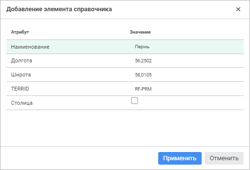

# Наполнение справочника данными

Наполнение справочника данными
-

# Наполнение справочника данными

	Для наполнения справочника НСИ/составного справочника НСИ данными
	 [добавьте элементы](#addelement) или [импортируйте](#import)
	 данные из таблицы с помощью [схемы
	 импорта](../Master_RDS_reference_book/Import.htm#import).

	При необходимости [экспортируйте](#export) данные справочника
	 в таблицу с помощью [схемы
	 экспорта](../Master_RDS_reference_book/Import.htm#export).

	Примечание.
	 Работа с элементами доступна только при открытии справочника НСИ/составного
	 справочника НСИ на [редактирование](Work_Dictionary.htm#rds).

## Добавление элемента

	Для добавления элемента выберите элемент-родитель в дереве элементов,
	 после чего выполните одно из действий:

		- в веб-приложении:

			- нажмите кнопку  «Добавить элемент» на панели
			 инструментов или выполните одноимённую команду в раскрывающемся
			 меню кнопки. Элемент будет добавлен в конец дерева элементов;

			- выполните команду «Добавить
			 подэлемент» в раскрывающемся меню кнопки  «Добавить
			 элемент» на панели инструментов. Элемент будет добавлен
			 в качестве дочернего элемента выбранного родительского элемента;

		- в настольном приложении:

			- нажмите кнопку  «Добавить»
			 на панели инструментов;

			- выполните команду «Добавить»
			 в контекстном меню элемента;

			- нажмите клавишу INSERT;

			- [используйте
			 буфер обмена](Copy_Elements.htm#put_element).

	Примечание.
	 Команда добавления элемента недоступна, если установлен флажок «[Элементы
	 имеют права доступа](../Master_RDS_reference_book/base_settings.htm)» и пользователь не входит ни в одну
	 из [групп
	 в метке](../Master_RDS_reference_book/Access_Subjects.htm), имеющих эффективные права на добавление элементов в данном
	 справочнике.

	После выполнения действий будет открыто окно «Добавление
	 элемента справочника» в веб-приложении или окно «Свойства
	 элемента справочника» в настольном приложении.

		 Веб-приложение Настольное приложение

			

			

	Вид окна зависит от [атрибутов](../Master_RDS_reference_book/Attributes.htm)
	 справочника и от [режима
	 его отображения](../Master_RDS_reference_book/Element_Card.htm).

	Для добавления элемента определите значения [атрибутов](../Master_RDS_reference_book/Attributes.htm),
	 если они не являются [скрытыми](../Master_RDS_reference_book/Attributes/Attribute.htm):

		- Системные атрибуты.
		 Являются обязательными для заполнения, подсвечиваются красным
		 цветом;

		- Пользовательские атрибуты.

	Для получения подробной информации
	 об изменении вида отображения окна «Свойства
	 элемента справочника» обратитесь к разделу «[Замена предустановленного
	 вида диалога](../Master_RDS_reference_book/Element_Card.htm)».

	Для добавления элемента из справочника-источника в составной справочник
	 НСИ:

		- в веб-приложении нажмите кнопку  «Добавить элемент в составной справочник»
		 в строке выбора источника данных;

		- в настольном приложении выберите элемент в области «Элементы справочника-источника»
		 и выполните одно из действий:

			- выполните команду контекстного
			 меню «Добавить элемент в
			 справочник»;

			- нажмите кнопку  «Добавить элемент» на панели
			 инструментов;

			- используйте механизм Drag&Drop.

	После выполнения действия будет добавлен элемент в составной справочник
	 НСИ.

	[Особенности
	 добавления элементов](javascript:TextPopup(this))

			- Для атрибута типа «Дата»
			 будет отражено поле со стандартным редактором дат. Если данный
			 атрибут может иметь пустое значение, то в редактор дат будет
			 добавлен флажок: .

		Если значение данного атрибута отсутствует,
		 то снимите флажок. При снятом флажке редактор дат недоступен для
		 редактирования.

			- Если элемент справочника может иметь [признак
			 скрытости](../Master_RDS_reference_book/base_settings.htm#hidden_attribute), то в окне «Свойства
			 элемента справочника» будет добавлен атрибут «Скрыть». При его установке
			 элемент справочника будет скрыт. Данный атрибут отображается
			 в окне «Свойства элемента
			 справочника», если значение атрибута всегда доступно
			 для редактирования в карточке элемента.

			- Если [атрибут](../Master_RDS_reference_book/Attributes.htm)
			 элемента справочника может иметь множественные значения, то
			 в окне «Свойства элемента
			 справочника» напротив данного атрибута будет отображен
			 раскрывающийся список, в котором можно выбрать несколько значений
			 атрибута. Для таких атрибутов доступен поиск по наименованию
			 элементов справочника, с которым установлена связь. Для поиска
			 нажмите кнопку  «Найти» или начните просто
			 печатать.

			- Если добавляется элемент в [мультиязычный
			 справочник НСИ/составной справочник НСИ](UiNav.chm::/Multilanguage/UiRds_Locale.htm),
			 то в окне «Свойства элемента
			 справочника» будет отображен раскрывающийся список
			 «Задать значения для языка»:

		

		Данный список содержит языки, указанные
		 на вкладке «[Переводы](UiNav.chm::/Multilanguage/UiRds_Locale.htm)»
		 справочника в настольном приложении.

		В настольном приложении атрибуты,
		 значения которых должны быть переведены на различные языки, отмечены
		 пиктограммой с флагом. Для ввода значения атрибута на основном
		 языке и его перевода, поменяйте язык в раскрывающемся списке «Задать значения для языка».

	[Особенности
	 работы со значением строкового/текстового атрибута](javascript:TextPopup(this))

		Ввод и редактирование значения строкового/текстового атрибута
		 в окне «Свойства элемента справочника»
		 могут быть произведены различными способами:

			- непосредственно в поле ввода значения атрибута;

			- в редакторе строк. Для этого:

				- нажмите кнопку  «Задать строку», расположенную
				 в конце поля ввода значения атрибута;

				- нажмите клавишу ENTER в поле ввода значения атрибута.

		После выполнения одного из действий
		 будет открыт редактор строк.

		Примечание.
		 Редактор строк доступен только в настольном приложении.

## Редактирование элемента

	Для редактирования выбранного элемента:

		- в веб-приложении:

			- нажмите кнопку  «Редактировать
			 элемент». Откроется окно «Редактирование
			 элемента справочника»;

			- выполните команду «Редактировать» в контекстном
			 меню элемента;

		- в настольном приложении:

			- нажмите кнопку  «Редактировать» на панели
			 инструментов;

			- выполните команду «Редактировать»
			 в контекстном меню элемента;

			- нажмите клавишу ENTER.

	Откроется окно «Свойства
	 элемента справочника».

	Измените значения атрибутов, заданные при [добавлении
	 элемента](#addelement).

	Если пользователю запрещено редактирование одного или нескольких
	 атрибутов, то в окне «Свойства элемента
	 справочника» пользователь будет видеть эти атрибуты, но редактирование
	 будет недоступно. Если у пользователя нет прав на редактирование элементов,
	 то все атрибуты будут недоступны для редактирования.

	Примечание.
	 При редактировании элемента справочника недоступно изменение значений
	 [заимствованных
	 атрибутов](../Master_RDS_reference_book/Attributes/Imported_Attribute.htm) и [вычисляемых
	 значений по умолчанию](../Master_RDS_reference_book/Attributes/Attribute.htm).

## Импорт данных

	Под импортом данных понимается загрузка данных из таблицы в справочник.
	 Импорт данных доступен только в настольном приложении.

	Для импорта данных нажмите кнопку  «Импорт данных» на панели инструментов.
	 Выберите схему импорта в открывшемся окне «Выбор
	 схемы импорта». Схемы импорта создаются на вкладке «[Импорт](../Master_RDS_reference_book/Import.htm#import)»
	 в окне редактирования справочника.

	Совет. После
	 импорта данных рекомендуется обновить дерево элементов.

	Особенности импорта с учётом прав доступа:

		- если пользователь имеет привилегию на изменение прав, то
		 импортируются все атрибуты, в том числе и атрибуты прав;

		- если пользователь не имеет привилегии на изменение прав
		 и объект импорта содержит атрибуты прав доступа, то будет выдано
		 сообщение об ошибке;

		- если в процессе импорта добавляются новые элементы, то для
		 администратора и группы администраторов будут выданы права на
		 чтение, запись и удаление этих элементов.

## Экспорт данных

	Под экспортом данных понимается выгрузка данных из справочника в
	 таблицу. Экспорт данных доступен только в настольном приложении.

	Для экспорта данных нажмите кнопку  «Экспорт справочника» на панели инструментов.
	 Выберите схему экспорта в открывшемся окне «Выбор
	 схемы экспорта». Схемы экспорта создаются на вкладке «[Экспорт](../Master_RDS_reference_book/Import.htm#export)»
	 в окне редактирования справочника.

	Экспорт справочника выполняется с учетом прав доступа. Экспортируются
	 только те элементы, на чтение которых пользователь имеет права.

## Удаление элемента

	Для удаления выбранного элемента:

		- в веб-приложении:

			- нажмите кнопку  «Удалить»
			 на панели инструментов;

			- выполните команду «Удалить» в контекстном меню
			 элемента;

		- в настольном приложении:

			- нажмите кнопку  «Удалить»
			 на панели инструментов;

			- выполните команду «Удалить»
			 в контекстном меню элемента.

	После выполнения действия будет запрошено подтверждение об удалении
	 выбранного элемента справочника.

	Примечание.
	 Родительские элементы удаляются со всеми дочерними элементами.

## Удаление всех элементов

	Для удаления всех элементов нажмите кнопку  «Очистить справочник» на панели инструментов.
	 Удаление всех элементов доступно только в настольном приложении.

	Будет запрошено подтверждение об удалении всех элементов справочника
	 НСИ/составного справочника НСИ. После завершения очистки справочника
	 отображается сообщение с результатами.

	Если в процессе очистки возникла ошибка, то отобразится диалог с
	 соответствующим сообщением. Для отображения подробного текста ошибки
	 нажмите кнопку «Подробнее».
	 Для пропуска удаления текущего элемента нажмите кнопку «Пропустить».
	 Для пропуска удаления текущего элемента и всех последующих, при удалении
	 которых могут возникнуть подобные ошибки, нажмите кнопку «Пропустить
	 все».

### Особенности очистки справочника

	При очистке справочника отображается окно, содержание которого зависит
	 от [вида справочника](Work_Dictionary.htm) и заданных [параметров](../Master_RDS_reference_book/Parameters.htm).
	 Окно может содержать флажки:

		- Указать значение параметров.
		 При установленном флажке появляется возможность указать значение
		 параметров, по которым будет произведена очистка элементов. Для
		 каждого параметра справочника отображается соответствующий редактор.
		 Флажок отображается при очистке:

			- параметрического справочника;

			- параметрического [версионного](../FAQ/UiRds_Work_RDS_Elements_work_2.htm)
			 справочника;

		- Установить дату закрытия
		 элемента. Флажок присутствует только при очистке [версионного
		 справочника](../FAQ/UiRds_Work_RDS_Elements_work_2.htm) с [ручным
		 управлением периодами](../Master_RDS_reference_book/base_settings.htm#change_in_time). После установки флажка появляется возможность
		 задать дату закрытия элементов, которые должны быть удалены. По
		 умолчанию в редакторе дат указана текущая дата. Установка флажка
		 доступна только в настольном приложении.

	Флажок отображается при очистке:

			- параметрического [версионного](../FAQ/UiRds_Work_RDS_Elements_work_2.htm)
			 справочника;

			- непараметрического [версионного](../FAQ/UiRds_Work_RDS_Elements_work_2.htm)
			 справочника.

	При очистке справочника с настроенным автоматическим формированием
	 [периода
	 действия элементов](KeRds.chm::/Enums/DictionaryTimeDependencyType.htm) будет запрошено подтверждение
	 об очистке справочника.

См. также:

[Работа
 со справочником](Work_Dictionary.htm)

		Справочная
		 система на версию 10.9
		 от 18/08/2025,
		 © ООО «ФОРСАЙТ»,
