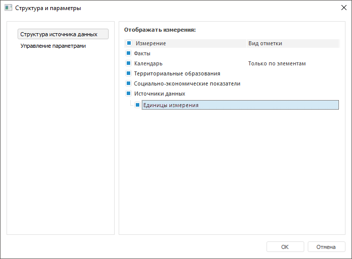
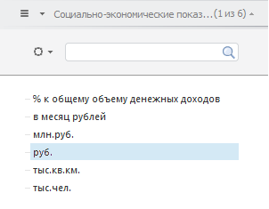
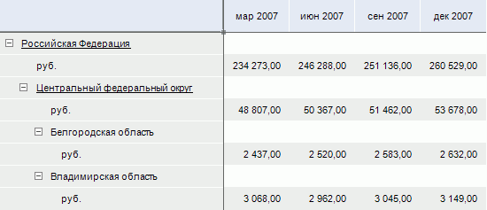

# Альтернативная иерархия на основе атрибутов справочника

Альтернативная иерархия на основе атрибутов справочника
-

# Альтернативная иерархия на основе атрибутов справочника

Атрибут справочника может использоваться в качестве альтернативной иерархии.
 Данная возможность позволяет построить отчет, используя значения атрибутов
 справочника в качестве отдельных измерений, отображаемых в группе вкладок
 «[Отметка](UiSelection.chm::/Selection/Dimension.htm)».

Для настройки атрибута в качестве альтернативной иерархии:

	- Откройте справочник в режиме редактирования.

	- Выполните настройку справочника:

		- [в справочнике
		 НСИ](../Master_RDS_reference_book/Master_RDS.htm)/[составном
		 справочнике НСИ](../Master_Composite_Table_reference_book/Master_CompositeTable.htm) в настольном приложении:

			- Добавьте [уникальный](../Master_RDS_reference_book/Unique_Keys.htm)
			 или [неуникальный](../Master_RDS_reference_book/Non_Unique_Keys.htm)
			 ключ для атрибута, который планируется использовать в качестве
			 альтернативной иерархии.

			- Перейдите на вкладку «Описание».
			 Выделите атрибут и нажмите кнопку «Редактировать»
			 или выполните одноименную команду в контекстном меню атрибута.
			 Будет открыто окно «[Свойства
			 атрибута](../Master_RDS_reference_book/Attributes/Attribute.htm)». Установите флажок «Альтернативная
			 иерархия».

Примечание.
 Одновременная установка флажков «Альтернативная
 иерархия» и «Может иметь множественные
 значения» недоступна.

		- [в табличном
		 справочнике](../Master_Table_reference_book/Master_Table.htm):

			- На странице «[Структура](../Master_Table_reference_book/UiMd_reference_book_Master_Table_page2.htm)»
			 мастера добавьте [индекс](../Master_Table_reference_book/UiMd_reference_book_Master_Table_page2.htm#indexes)
			 по атрибуту, который планируется использовать в качестве альтернативной
			 иерархии.

			- Перейдите на страницу «[Атрибуты](../Master_Table_reference_book/Attributes_Simple.htm)».
			 Выделите атрибут и нажмите кнопку «Редактировать»
			 или выполните одноименную команду в контекстном меню атрибута
			 в настольном приложении или щёлкните по атрибуту основной
			 кнопкой мыши в веб-приложении. Будет открыто окно/панель «[Свойства атрибута](../Master_Table_reference_book/UiMd_reference_book_Master_Table_page1_AttProps.htm)». Установите
			 флажок «Альтернативная иерархия».

		- [в
		 календарном справочнике](../Master_Calendar_reference_book/Master_Calendar.htm) в настольном приложении:

			- На странице «[Атрибуты](../Master_Calendar_reference_book/UiMd_reference_book_Master_Calendar_page3.htm)»
			 добавьте [пользовательский
			 атрибут](../Master_Calendar_reference_book/UiMd_reference_book_Master_Calendar_page3.htm), который будет использоваться в качестве альтернативной
			 иерархии.

			- Выделите добавленный атрибут и нажмите кнопку «Редактировать» или выполните
			 одноименную команду в контекстном меню атрибута. Будет открыто
			 окно «[Свойства
			 атрибута](../Master_Calendar_reference_book/UiMd_reference_book_Master_Calendar_page3Attr.htm#user)». Установите флажок «Альтернативная
			 иерархия».

Совет.
 Убедитесь, что корректно настроены атрибуты справочников для дальнейшего
 использования альтернативной иерархии на их основе.

	- Укажите атрибут, который будет
	 использоваться в качестве альтернативной иерархии. Для разных инструментов
	 продукта «Форсайт. Аналитическая платформа»
	 последовательность действий различается:

		- для инструмента «[Отчёты](UiReport.chm::/UiReport_purpose.htm)»:

			- в веб-приложении:

				- Откройте окно «[Настройка
				 отображения измерений»](../../../uireport/Web/Reports/Visualization.htm#display).

				- Установите флажки напротив атрибутов измерения,
				 значения которых необходимо использовать в качестве альтернативной
				 иерархии;

			- в настольном приложении:

				- Откройте окно «[Параметры](uireport.chm::/desktop/Reports/Parameters_DataSource.htm)».

				- Перейдите на вкладку «Структура
				 источника данных».

				- Установите флажки напротив атрибутов измерения,
				 значения которых необходимо использовать в качестве альтернативной
				 иерархии;

		- для инструментов «[Аналитические
		 запросы (OLAP)](UiExpress.chm::/purpose/UiExpress_Purpose.htm)»
		 и «[Аналитические панели](UiAdhoc.chm::/UiAdhoc_Purpose.htm)»:

			- Откройте окно «[Структура и параметры](UiSelection.chm::/Selection/Dimension.htm#show_dims)».

			- Перейдите на вкладку «Структура
			 источника данных».

			- Установите флажки напротив атрибутов измерения, значения
			 которых необходимо использовать в качестве альтернативной
			 иерархии.

В результате будет настроена альтернативная иерархия на основе атрибутов
 справочника.

## Пример использования альтернативной иерархии на основе атрибутов справочника

Рассмотрим в настольном приложении экспресс-отчёт, источником данных
 которого является куб. Куб содержит измерение «Социально-экономические
 показатели». Атрибут «Единицы
 измерения» данного измерения настроен в качестве альтернативной
 иерархии.

Откройте окно «[Структура и параметры](UIExpress.chm::/purpose/DS_structure.htm)». На вкладке «Структура
 источника данных» установите флажок напротив атрибута «Единицы
 измерения»:

В группе вкладок «[Отметка](UiSelection.chm::/Selection/Dimension.htm)»
 боковой панели будет отображено измерение «Социально-экономические
 показатели.Единицы измерения», построенное по значениям атрибута
 «Единицы измерения»:

В результате получим отчёт, в котором используются значения указанного
 атрибута справочника:

См. также:

[Иерархия
 справочника](../UiMd_reference_book_Hierarchy.htm) | [Альтернативная
 иерархия на основе справочников](Use_AlterHier_ForRefBook.htm)

		Справочная
		 система на версию 10.9
		 от 18/08/2025,
		 © ООО «ФОРСАЙТ»,
