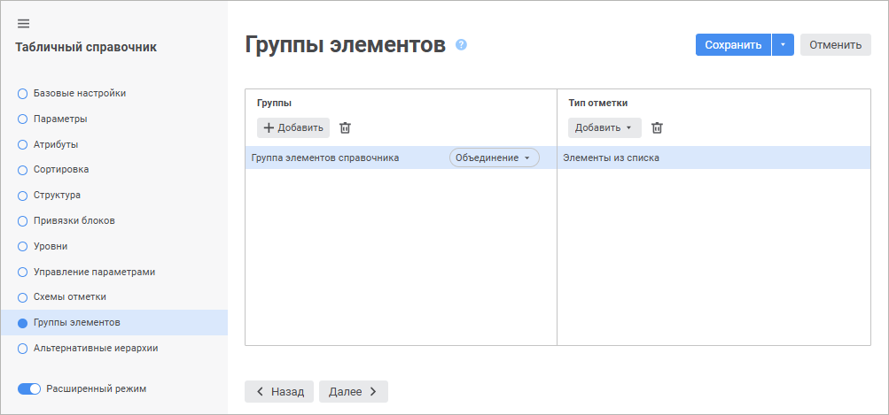
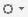
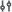
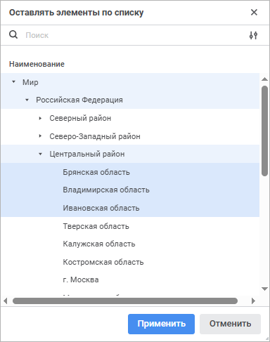
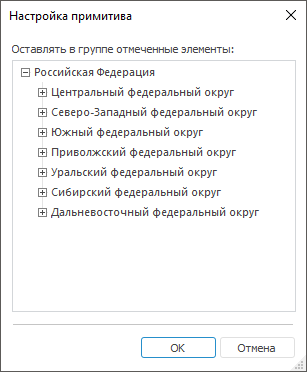
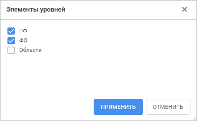
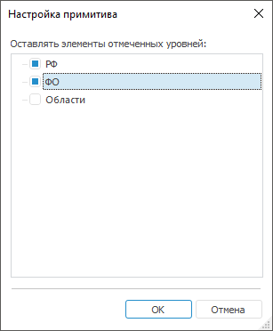
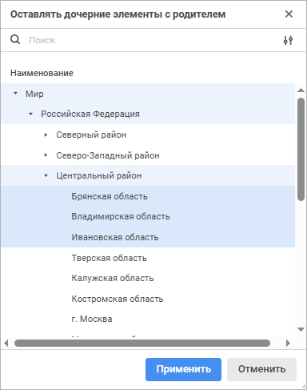
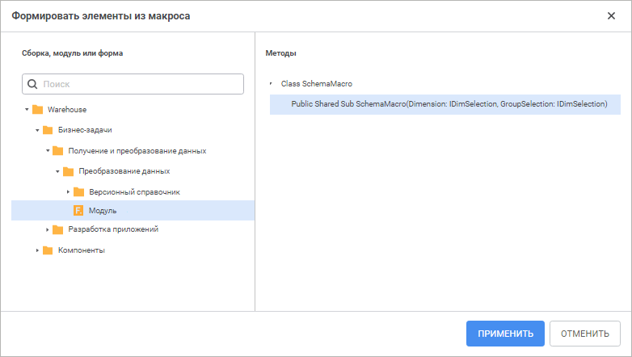

# Группы элементов: Справочники

Группы элементов: Справочники
-

# Группы элементов

Группа элементов - это
 объект репозитория, используемый в справочниках для ограничения списка
 доступных элементов. Группы элементов создаются как дочерние объекты справочника
 и не отображаются в навигаторе объектов.

Группы элементов могут быть использованы в инструментах продукта «Форсайт. Аналитическая платформа»
 для отметки элементов измерения, построенного на данном справочнике.

Группа элементов строится из отдельных типов отметки.

Тип отметки - это набор элементов
 справочника, сформированный по какому-либо общему признаку.

Управление группами элементов осуществляется:

	- в веб-приложении на странице «Группы
	 элементов» [мастера справочника](../Create.htm);

	- в настольном приложении в окне «Группы
	 элементов», которое доступно из навигатора объектов и инструментов
	 продукта «Форсайт. Аналитическая платформа»:
	 «[Аналитические панели](UiAdhoc.chm::/UiAdhoc_Purpose.htm)»,
	 «[Аналитические
	 запросы (OLAP)](UiExpress.chm::/purpose/UiExpress_Purpose.htm)», «[Отчёты](UiReport.chm::/UiReport_purpose.htm)».

Для управления группами элементов выполните шаги:

	- [Добавьте
	 новую группу элементов](UiMd_reference_book_look-and-feel_Group.htm#add_group).

	- [Добавьте
	 тип отметки](UiMd_reference_book_look-and-feel_Group.htm#add_primitive).

	- [Настройте
	 тип отметки](UiMd_reference_book_look-and-feel_Group.htm#configure_primitive) при необходимости.

	- [Выберите
	 способ взаимодействия типов отметки](UiMd_reference_book_look-and-feel_Group.htm#interaction).

	- [Сохраните
	 группу элементов](UiMd_reference_book_look-and-feel_Group.htm#save). Доступно только в настольном приложении.

	- [Удалите
	 тип отметки](UiMd_reference_book_look-and-feel_Group.htm#del_primitive) при необходимости.

	- [Удалите
	 группу элементов](UiMd_reference_book_look-and-feel_Group.htm#del_goup) при необходимости.

Примечание.
 [Добавление](../Work/Work_Elements.htm#addelement) и [удаление](../Work/Work_Elements.htm#del_element)
 элементов в справочниках НСИ и составных справочников НСИ, входящих в
 группы элементов, а также использование групп элементов в различных операциях
 не зависят от того, выбрана ли иерархия по умолчанию. Группы элементов
 справочников НСИ работают только с основными элементами справочника. При
 этом отсутствует возможность создания группы элементов на [альтернативных
 иерархиях](Use_AlterHier_ForRefBook.htm), установленных по умолчанию.

	 Веб-приложение

	 Настольное
	 приложение

		

		[Для
		 открытия окна «Группы элементов»](javascript:TextPopup(this))

			Для открытия окна «Группы
			 элементов» из навигатора объектов выполните команду
			 «Группы элементов»
			 в контекстном меню справочника.

			Для открытия окна «Группы
			 элементов» из инструментов «Форсайт. Аналитическая платформа»:

				- Перейдите на вкладку «Отметка»
				 на боковой панели.

				- Выберите пункт «Редактировать»
				 в раскрывающемся меню:

					- кнопки «Отметить
					 группу», расположенной на вкладке «Отметка»
					 ленты инструментов;

					- «Расширенная
					 отметка > Отметить группу» в контекстном
					 меню элемента измерения в боковой панели;

					- «Расширенная
					 отметка > Отметить группу» меню измерения
					  в боковой панели;

					- кнопки «Группа
					 элементов», расположенной в группе «Вид»
					 вкладки «Иерархия»
					 ленты инструментов;

					- «Группа элементов»
					 в контекстном меню элемента измерения в боковой панели;

					- «Группа элементов»
					 в меню измерения  в боковой панели.

		

[Добавление
 новой группы элементов](javascript:TextPopup(this))

	Для добавления новой группы элементов:

		- в веб-приложении:

			- Нажмите кнопку «Добавить»
			 в области «Группы».
			 Будет открыто окно «Новая
			 группа элементов»:

	

			- Задайте параметры:

				- Наименование.
				 Введите наименование группы. По умолчанию «Группа
				 элементов справочника»;

				- Идентификатор.
				 Введите уникальный идентификатор группы. Идентификатор
				 должен содержать только буквы латинского алфавита, цифры,
				 знак «_», не должен содержать пробелов и не должен начинаться
				 с цифры.

			- Нажмите кнопку «Применить».

		- в настольном приложении выберите элемент «[Новая
		 группа]» в раскрывающемся списке «Группа
		 элементов».

	После выполнения действий в список групп элементов будет добавлена
	 новая группа.

[Редактирование
 существующей группы элементов](javascript:TextPopup(this))

	Для редактирования существующей группы элементов:

		- в веб-приложении выделите группу элементов в области «Группы»;

		- в настольном приложении выберите группу элементов в раскрывающемся
		 списке «Группа элементов».

	После выполнения действий будет отрыт список типов отметки в соответствии
	 с выбранной группой элементов.

[Добавление
 типа отметки](javascript:TextPopup(this))

	Для добавления типа отметки нажмите кнопку «Добавить»
	 в области «Тип отметки» и
	 в раскрывающемся списке выберите способ отметки:

		- Элементы из списка.
		 В группу будут включены отмеченные элементы списка;

		- Элементы уровней.
		 В группу будут включены элементы выбранных уровней справочника;

		- Элементы по общему владельцу.
		 В группу будут включены выбранные элементы, а также все их дочерние
		 элементы;

		- [Использовать
		 прикладной макрос](#macro). Содержимое группы элементов динамически
		 формируется на основе результата выполнения макроса.

	Для одной группы элементов можно добавить несколько типов отметки.

	Примечание.
	 Для корректного формирования табличной области при задании типа отметки
	 иерархия добавляемой [отметки](UiSelection.chm::/Selection/Selection_of_the_dimension_elements.htm#MiniTOCBookMark5)
	 и иерархия используемого [измерения](UiSelection.chm::/Selection/Dimension.htm)
	 должны совпадать.

[Настройка
 типа отметки](javascript:TextPopup(this))

	Описание настройки приведено для всех типов отметки, кроме «Использовать прикладной макрос».
	 Настройка типа отметки «Использовать
	 прикладной макрос» приведена в разделе «[Использование
	 прикладного макроса](#macro)».

	Для настройки типа отметки:

		- Выделите тип отметки.

		- Откройте окно редактирования типа отметки:

			- в веб-приложении нажмите кнопку 
			 «Редактировать», расположенную
			 напротив типа отметки;

			- в настольном приложении выделите тип отметки и нажмите
			 кнопку «Редактировать»
			 или дважды щёлкните по нему.

	После выполнения действий будет открыто
	 окно редактирования. Вид окна зависит от выбранного типа отметки:

			- Элементы из списка.
			 При выборе данного типа отметки окно для редактирования в
			 веб-приложении и настольном приложениях отличаются.

	Окно «Оставлять
	 элементы по списку» в веб-приложении:

	

	Окно «Настройка
	 примитива» в настольном приложении:

	

	В окнах содержатся списки элементов справочника.
	 Отметьте необходимые элементы. Для работы с отметкой доступно стандартное
	 [контекстное меню](../Work/Operations_Elements.htm#select).

	Для настройки отображения элементов справочника
	 в веб-приложении нажмите кнопку 
	 «Отображение атрибутов» и
	 выберите в раскрывающемся меню атрибуты. В меню содержатся атрибуты,
	 добавленные на странице «Атрибуты»
	 мастера справочника;

			- Элементы уровней.
			 При выборе данного типа отметки окно для редактирования в
			 веб-приложении и настольном приложениях отличаются.

	Окно «Элементы
	 уровней» в веб-приложении:

	

	Окно «Настройка
	 примитива» в настольном приложении:

	

	Установите флажки напротив наименований
	 необходимых уровней;

			- Элементы по общему
			 владельцу. При выборе данного типа отметки окно для
			 редактирования в веб-приложении и настольном приложениях отличаются.

	Окно «Оставлять
	 дочерние элементы с родителем» в веб-приложении:

	

	Окно «Настройка
	 примитива» в настольном приложении:

	

	В окнах содержатся списки элементов справочника.
	 Отметьте необходимые элементы. Для работы с отметкой доступно стандартное
	 [контекстное меню](../Work/Operations_Elements.htm#select).

	Для настройки отображения элементов справочника
	 в веб-приложении нажмите кнопку 
	 «Отображение атрибутов» и
	 выберите в раскрывающемся меню атрибуты. В меню содержатся атрибуты,
	 добавленные на странице «Атрибуты»
	 мастера справочника.

		- Нажмите кнопку «Применить»
		 в веб-приложении или «ОК»
		 в настольном приложении.

	После выполнения действий будет настроен тип отметки.

	Если в справочнике содержатся [параметры](../Master_Table_reference_book/parameters.htm),
	 то для типов отметки «Элементы из
	 списка», «Элементы по общему
	 владельцу» перед открытием окна редактирования будет открыто
	 окно «[Установка значений параметров](uinav.chm::/02_Navigator/General_Principles_of_Work.htm#open_param_object)»
	 для формирования списка элементов по заданным значениям параметров.

[Использование
 прикладного макроса](javascript:TextPopup(this))

	Содержимое группы элементов формируется на основе результата выполнения
	 макроса, при этом:

		- макрос должен быть статическим (Shared) методом какого-либо
		 класса;

		- сигнатура макроса должна иметь вид:

	Public Class <наименование класса>: Object

	    Public Shared Function <наименование группы> (Dimension: IDimInstance): IDimSelection;

	    Var

	        GroupSelection: IDimSelection;

	    Begin

	        GroupSelection := Dimension.CreateSelection;

	        //Формирование отметки GroupSelection

	         Return GroupSelection;

	    End Function <наименование группы>;

	End Class <наименование класса>;

	Параметры:

	Dimension. Открытый
	 экземпляр справочника.

	Результат: отметка тех элементов, из
	 которых необходимо сформировать группу.

	Для редактирования типа отметки, использующей для отметки группы
	 элементов справочника прикладной макрос, откройте окно «Формировать
	 элементы из макроса» в веб-приложении или окно «Метод
	 отбора элементов» в настольном приложении.

	Для открытия окна «Формировать
	 элементы из макроса» в веб-приложении нажмите кнопку  «Настройки»,
	 расположенную напротив типа отметки «Использовать
	 прикладной макрос»:

	

	Для открытия окна «Метод отбора
	 элементов» в настольном приложении выделите тип отметки «Формировать элементы из макроса»
	 и нажмите кнопку «Редактировать»
	 или дважды щёлкните по типу отметки:

	

	В области «Сборка, модуль или форма»
	 отображается список доступных сборок, модулей и форм.

	В области «Методы» отображается
	 дерево классов объекта, выбранного в списке репозитория. Для каждого
	 класса выводятся дочерние элементы (методы), если они соответствуют
	 нужной сигнатуре. Если методов нет, то класс не отображается.

	При двойном щелчке по методу происходит его выбор и окно закрывается.

	Для добавления макроса нажмите кнопку «Применить»
	 в веб-приложении или «ОК»
	 в настольном приложении. Кнопка доступна, если:

		- в списке методов выделен метод;

		- в списке методов отображается только один метод.

[Выбор
 способа взаимодействия типов отметки](javascript:TextPopup(this))

	Конечный набор элементов справочника формируется путём объединения
	 или пересечения элементов, входящих в отдельные [типы
	 отметки](#add_primitive).

	После добавления типов отметки выберите способ их взаимодействия
	 в раскрывающемся списке, расположенном в области «Группы»
	 напротив группы элементов в веб-приложении или расположенном выше
	 списка типов отметки в настольном приложении:

		- Объединение. В случае
		 взаимодействия отметок остаются все элементы, которые получаются
		 в результате работы любого из типов отметки (в единственном экземпляре);

		- Пересечение. В случае
		 взаимодействия типов отметки остаются элементы, которые входят
		 в результат каждого из типов отметки.

[Сохранение
 группы элементов](javascript:TextPopup(this))

	Сохранение группы элементов доступно только в настольном приложении.
	 Для сохранения выбранной группы элементов нажмите кнопку «Сохранить
	 как», расположенную на одном уровне с полем «Группа
	 элементов». В открывшемся окне задайте наименование и идентификатор
	 схемы отметки. Идентификатор должен содержать только буквы латинского
	 алфавита, цифры, знак «_», не должен содержать пробелов и не должен
	 начинаться с цифры.

[Удаление
 типа отметки](javascript:TextPopup(this))

	Для удаления выбранного типа отметки из группы элементов:

		- в веб-приложении нажмите кнопку  «Удалить» в области «Тип
		 отметки»;

		- в настольном приложении нажмите кнопку «Удалить»,
		 расположенную под списком типов отметки.

	После выполнения действий тип отметки будет удалён из группы элементов.

[Удаление
 группы элементов](javascript:TextPopup(this))

	Для удаления выбранной группы элементов:

		- в веб-приложении нажмите кнопку  «Удалить» в области «Группы»;

		- в настольном приложении нажмите кнопку «Удалить»,
		 расположенную на одном уровне с раскрывающимся списком «Группа элементов».

	После выполнения действий будет выдан диалог подтверждения. При
	 положительном ответе группа элементов будет удалена.

См. также:

[Создание
 справочников](../Create.htm)

		Справочная
		 система на версию 10.9
		 от 18/08/2025,
		 © ООО «ФОРСАЙТ»,
