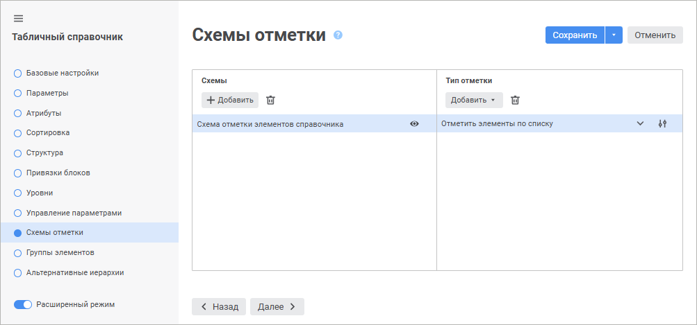
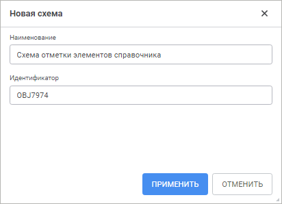
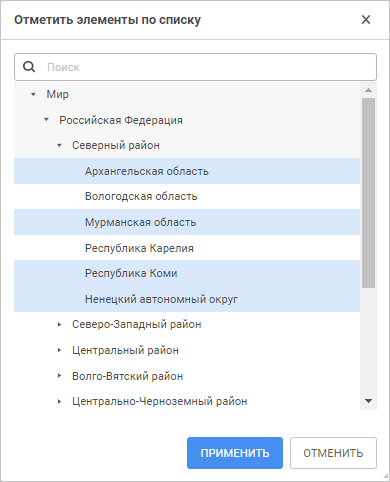
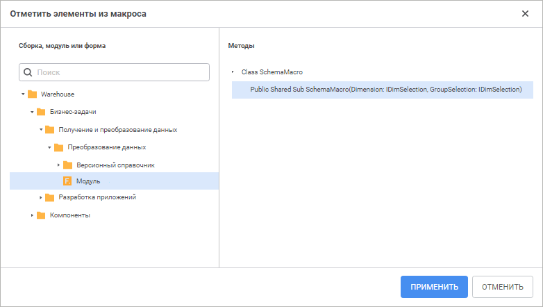
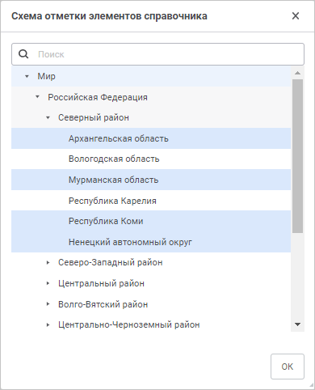

# Схемы отметки: Справочники

Схемы отметки: Справочники
-

# Схемы отметки

Схемы отметки - это объект
 репозитория, используемый в справочниках для автоматизации выделения элементов
 по заданным правилам. Схемы отметки создаются как дочерние объекты справочника
 и не отображаются в навигаторе объектов, однако могут быть использованы
 везде, где используется справочник.

Совет.
 Для получения подробной информации о применении схем отметки обратитесь
 к статье «[Использование
 схемы отметки](UiSelection.chm::/Selection/Selection_of_the_dimension_elements.htm#schemas)».

Схемы отметки строятся из отдельных типов отметки.

Тип отметки - это правило,
 в соответствии с которым осуществляется отметка элементов. Все типы отметки
 будут применяться в том порядке, в каком они были созданы.

Управление схемами отметки осуществляется:

	- в веб-приложении на странице «Схемы
	 отметки» [мастера справочника](../Create.htm);

	- в настольном приложении в окне «Схемы
	 отметки», которое доступно из навигатора объектов и инструментов
	 продукта «Форсайт. Аналитическая платформа»:
	 «[Аналитические панели](UiAdhoc.chm::/UiAdhoc_Purpose.htm)»,
	 «[Аналитические
	 запросы (OLAP)](UiExpress.chm::/purpose/UiExpress_Purpose.htm)», «[Отчёты](UiReport.chm::/UiReport_purpose.htm)».

Для управления схемой отметки выполните шаги:

	- [Добавьте
	 новую схему отметки](UiMd_reference_book_look-and-feel_Scheme.htm#add_schema).

	- [Добавьте
	 тип отметки](UiMd_reference_book_look-and-feel_Scheme.htm#add_primitive).

	- [Настройте
	 тип отметки](UiMd_reference_book_look-and-feel_Scheme.htm#configure_primitive) при необходимости.

	- [Измените
	 порядок расположения типов отметки](UiMd_reference_book_look-and-feel_Scheme.htm#changeorder_primitive) при необходимости. Доступно
	 только в настольном приложении.

	- [Просмотрите
	 результат](UiMd_reference_book_look-and-feel_Scheme.htm#view_results).

	- [Сохраните
	 схему отметки](UiMd_reference_book_look-and-feel_Scheme.htm#save_schema). Доступно только в настольном приложении.

	- [Удалите
	 тип отметки](UiMd_reference_book_look-and-feel_Scheme.htm#del_primitive) при необходимости.

	- [Удалите
	 схему отметки](UiMd_reference_book_look-and-feel_Scheme.htm#del_schema) при необходимости.

Примечание.
 Для справочников НСИ и составных справочников НСИ работа ведется только
 с основными элементами справочника. При этом отсутствует возможность создания
 схем отметки на элементах альтернативных иерархий, установленных по умолчанию.

	Веб-приложение Настольное приложение

		

		[Для
		 открытия окна «Схемы отметки»](javascript:TextPopup(this))

			Для открытия окна «Схемы
			 отметки» из навигатора объектов выполните команду «Схемы отметки» в контекстном
			 меню необходимого справочника.

			Для открытия окна «Схемы
			 отметки» из инструментов «Форсайт. Аналитическая платформа»:

				- Перейдите на вкладку «Отметка»
				 на боковой панели.

				- Выберите пункт «Редактировать»
				 в раскрывающемся меню:

					- кнопки «Схема
					 отметки», расположенной на вкладке «Отметка»
					 ленты инструментов;

					- «Расширенная
					 отметка > Применить схему отметки»
					 в контекстном меню элемента измерения в боковой панели;

					- «Расширенная
					 отметка > Применить схему отметки»
					 меню измерения  в
					 боковой панели.

		

[Добавление
 новой схемы отметки](javascript:TextPopup(this))

	Для добавления новой схемы отметки:

		- в веб-приложении:

			- Нажмите кнопку «Добавить»
			 в области «Схемы».
			 Будет открыто окно «Новая
			 схема»:

	

			- Задайте параметры:

				- Наименование.
				 Введите наименование схемы. По умолчанию «Схема
				 отметки элементов справочника»;

				- Идентификатор.
				 Введите уникальный идентификатор схемы. Идентификатор
				 должен содержать только буквы латинского алфавита, цифры,
				 знак «_», не должен содержать пробелов и не должен начинаться
				 с цифры.

			- Нажмите кнопку «Применить».

		- в настольном приложении выберите элемент «[Новая
		 схема]» в раскрывающемся списке «Схема».

	После выполнения действий в список схем отметки будет добавлена
	 новая схема.

[Редактирование
 существующей схемы отметки](javascript:TextPopup(this))

	Для редактирования существующей схемы отметки:

		- в веб-приложении выделите схему отметки в области «Схемы»;

		- в настольном приложении выберите схему отметки в раскрывающемся
		 списке «Схема».

	После выполнения действий будет открыт список типов отметки в соответствии
	 с выбранной схемой отметки.

[Добавление
 типа отметки](javascript:TextPopup(this))

	Для добавления типа отметки нажмите кнопку «Добавить»
	 в области «Тип отметки» и
	 в раскрывающемся списке выберите способ отметки:

		- в веб-приложении:

			- отметить все элементы;

			- отметить элементы по списку;

			- отметить подчиненные элементы;

			- отметить элементы уровня;

			- отметить весь уровень;

			- отметить родительские элементы;

			- отметить дочерние элементы;

			- [отметить элементы из макроса](#macro).

		- в настольном приложении:

			- отметить все;

			- отметить по списку;

			- отметить подчиненные по уровню;

			- отметить уровень;

			- всегда отмечать уровень;

			- всегда отмечать с предками;

			- всегда отмечать с подчиненными;

			- [использование прикладного макроса](#macro).

	Для одной схемы отметки можно добавить несколько типов отметки.

[Настройка
 типа отметки в веб-приложении](javascript:TextPopup(this))

	Описание настройки приведено для всех типов отметки, кроме «Отметить элементы из макроса». Настройка
	 типа отметки «Отметить элементы из
	 макроса» приведена в разделе «[Использование
	 прикладного макроса](UiMd_reference_book_look-and-feel_Scheme.htm#macro)».

	Для настройки типа отметки в веб-приложении:

		- Выделите тип отметки.

		- Нажмите кнопку  «Действия» и
		 в раскрывающемся списке выберите вариант действия:

			- отметить все элементы;

			- снять отметку у всех элементов.

		- Нажмите кнопку  «Редактировать»,
		 если она доступна. Будет открыто окно редактирования типа отметки:

	

	Примечание.
	 Показано окно для типа отметки «Отметить
	 элементы по списку».

	Название окна зависит от настраиваемого
	 типа отметки.

	В открывшемся окне в дереве элементов
	 или списке уровней справочника укажите, для каких элементов или уровней
	 будет действовать данное правило.

	Для работы с отметкой доступно стандартное
	 контекстное меню.

		- Нажмите кнопку «Применить».

	После выполнения действий будет настроен тип отметки.

	Если в справочнике содержатся [параметры](../Master_Table_reference_book/parameters.htm),
	 то для типов отметки «Отметить элементы
	 по списку», «Отметить подчиненные
	 элементы» перед открытием окна редактирования будет выдан диалог
	 «[Установка значений параметров](uinav.chm::/02_Navigator/General_Principles_of_Work.htm#open_param_object)»
	 для формирования списка элементов по заданным значениям параметров.

[Настройка
 типа отметки в настольном приложении](javascript:TextPopup(this))

	Описание настройки приведено для всех типов отметки, кроме «Использование прикладного макроса».
	 Настройка типа отметки «Использование
	 прикладного макроса» приведена в разделе «[Использование
	 прикладного макроса](UiMd_reference_book_look-and-feel_Scheme.htm#macro)».

	Для настройки типа отметки в настольном приложении:

		- выделите тип отметки и нажмите кнопку «Редактировать»;

		- дважды щёлкните по типу отметки.

	Будет открыто окно «Настройка примитива»:

	

	В открывшемся окне:

		- В раскрывающемся списке выберите вариант действия:

			- устанавливает отметку у выбранных элементов;

			- снимает отметку у выбранных элементов.

		- В дереве элементов справочника укажите, для каких элементов
		 будет действовать данное правило. Для работы с отметкой доступно
		 стандартное контекстное меню.

		- Нажмите кнопку «ОК».

	После выполнения действий будет настроен тип отметки.

	Если в справочнике содержатся [параметры](../Master_Table_reference_book/parameters.htm),
	 то для типов отметки «Отметить по
	 списку», «Отметить подчиненные
	 по уровню» перед открытием окна редактирования будет выдан
	 диалог «[Установка значений параметров](uinav.chm::/02_Navigator/General_Principles_of_Work.htm#open_param_object)»
	 для формирования списка элементов по заданным значениям параметров.

[Использование
 прикладного макроса](javascript:TextPopup(this))

	Содержимое схемы отметки динамически формируется на основе результата
	 выполнения макроса, при этом:

		- макрос должен быть статическим (Shared) методом какого-либо
		 класса;

		- сигнатура макроса должна иметь вид:

	Public Class <наименование класса>: Object

	    Public Shared Sub <наименование схемы>(<SelectionParam>, <GroupParam>: IDimSelection);

	    Begin

	        ...

	    End Sub <наименование схемы>;

	End Class <наименование класса>;

	Параметры:

	SelectionParam. Отметка
	 измерения, в которой нужно изменить элементы (установить или сбросить
	 отметки);

	GroupParam.
	 Группа элементов, в рамках которых будет применяться схема отметки.
	 Если этот параметр равен Null, то обрабатываются все элементы отметки.

	Для редактирования типа отметки, использующей для отметки элементов
	 справочника прикладной макрос, откройте окно «Отметить
	 элементы из макроса» в веб-приложении или окно «Метод
	 отбора элементов» в настольном приложении.

	Для открытия окна «Отметить элементы
	 из макроса» в веб-приложении нажмите кнопку  «Настройки», расположенную напротив
	 типа отметки «Использовать прикладной
	 макрос»:

	

	Для открытия окна «Метод отбора
	 элементов» в настольном приложении выделите тип отметки «Формировать элементы из макроса»
	 и нажмите кнопку «Редактировать»
	 или дважды щёлкните по типу отметки:

	

	В области «Сборка, модуль или форма»
	 отображается список доступных сборок, модулей и форм. В области «Методы» отображается дерево классов
	 объекта, выбранного в списке репозитория.

	В области «Методы» для каждого
	 класса выводятся дочерние элементы (методы), если они соответствуют
	 нужной сигнатуре. Если методов нет, то класс не отображается.

	Для добавления макроса нажмите кнопку «Применить»
	 в веб-приложении или «ОК»
	 в настольном приложении. Кнопка доступна, если:

		- в списке методов выделен метод;

		- в списке методов отображается только один метод.

[Смена
 порядка расположения типов отметки](javascript:TextPopup(this))

	Смена порядка расположения типов отметки доступна только в настольном
	 приложении. Для смены порядка в списке используйте кнопки «Вниз»
	 и «Вверх».

[Просмотр
 результата применения всех типов отметки](javascript:TextPopup(this))

	Для просмотра результата применения всех типов отметки:

		- в веб-приложении нажмите кнопку  «Просмотр». Будет открыто окно
		 «<наименование
		 схемы отметки>»:

	

		- в настольном приложении нажмите кнопку «Просмотреть
		 результат». Будет открыто окно «Схема
		 отметки» аналогичное окну в веб-приложении.

[Сохранение
 схемы отметки](javascript:TextPopup(this))

	Сохранение схемы отметки доступно только в настольном приложении.
	 Для сохранения выбранной схемы отметки нажмите кнопку «Сохранить
	 как», расположенную на одном уровне с полем «Схема».
	 В открывшемся окне задайте наименование и идентификатор схемы отметки.

[Удаление
 типа отметки](javascript:TextPopup(this))

	Для удаления выбранного типа отметки из схемы:

		- в веб-приложении нажмите кнопку  «Удалить» в области «Тип
		 отметки»;

		- в настольном приложении нажмите кнопку «Удалить»,
		 расположенную под списком типов отметки.

	После выполнения действий тип отметки будет удалён из схемы.

[Удаление
 схемы отметки](javascript:TextPopup(this))

	Для удаления выбранной схемы отметки:

		- в веб-приложении нажмите кнопку  «Удалить» в области «Схемы»;

		- в настольном приложении нажмите кнопку «Удалить»,
		 расположенную на одном уровне с раскрывающимся списком «Схема».

	После выполнения действий будет выдан диалог подтверждения. При
	 положительном ответе схема отметки будет удалена.

См. также:

[Создание
 справочников](../Create.htm)

		Справочная
		 система на версию 10.9
		 от 18/08/2025,
		 © ООО «ФОРСАЙТ»,
