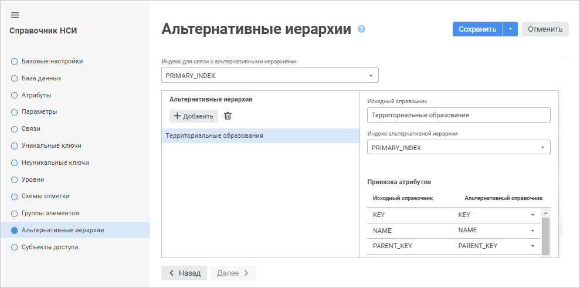
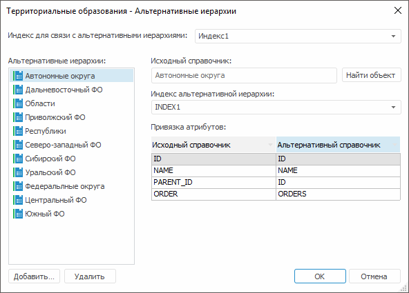
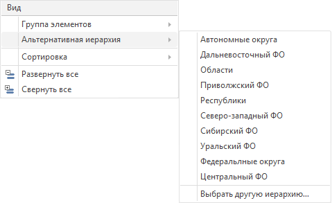
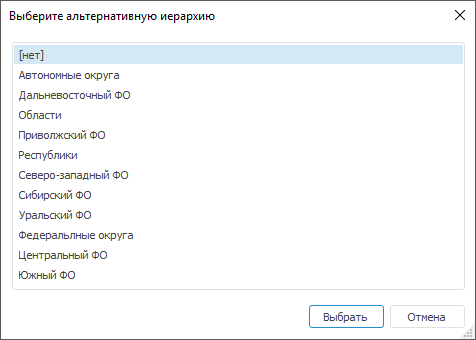
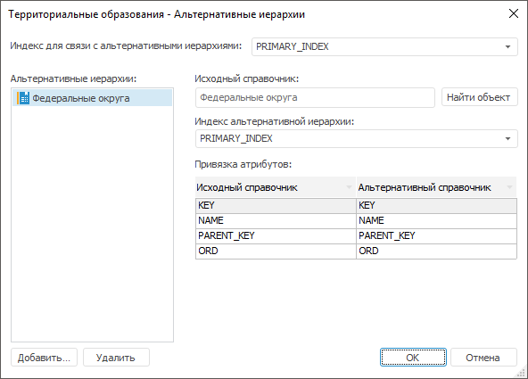
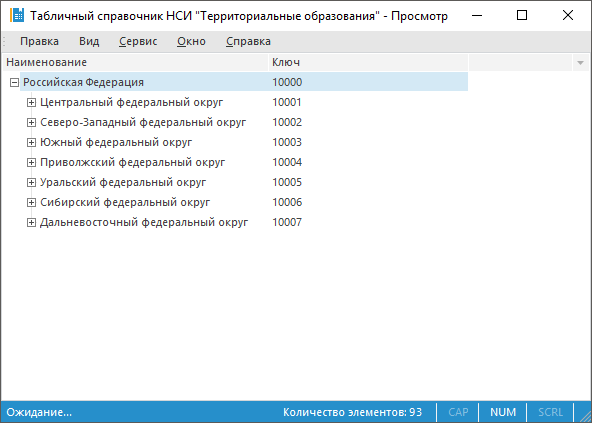

# Альтернативная иерархия на основе справочников

Альтернативная иерархия на основе справочников
-

# Альтернативная иерархия на основе справочников

Альтернативной иерархией может быть любой другой справочник, при этом
 между справочниками устанавливается связь для сопоставления их элементов.
 По умолчанию сопоставление производится по идентификатору и по типу атрибутов
 исходного и альтернативного справочников.

В результате использования альтернативной иерархии вместо элементов
 исходного справочника будут отображены элементы альтернативного справочника,
 сопоставленные по индексу.

Примечание.
 [Добавление](../Work/Work_Elements.htm#addelement) и [удаление](../Work/Work_Elements.htm#del_element)
 элементов в справочниках НСИ или составных справочниках НСИ, входящих
 в [группы элементов](UiMd_reference_book_look-and-feel_Group.htm),
 а также использование групп элементов в различных операциях не зависят
 от того, выбрана ли иерархия по умолчанию. Группы элементов справочников
 НСИ или составных справочников НСИ работают только с основными элементами
 справочника. При этом отсутствует возможность создания группы элементов
 на альтернативных иерархиях, установленных по умолчанию.

Для настройки альтернативных иерархий на основе справочника используйте
 страницу «Альтернативные иерархии»
 [мастера справочника](../Create.htm) в веб-приложении или окно
 «Альтернативные иерархии» в настольном
 приложении.

	Веб-приложение Настольное приложение

		

		На странице «Альтернативные
		 иерархии» доступны операции:

		[Создание
		 и общая настройка альтернативной иерархии](javascript:TextPopup(this))

			Для создания альтернативной иерархии:

				- В раскрывающемся списке «Индекс
				 для связи с альтернативными иерархиями» выберите
				 индекс справочника, по которому будет настраиваться связь
				 с другим справочником. Раскрывающийся список содержит
				 все доступные индексы справочника, для которого настраиваются
				 альтернативные иерархии.

				- В области «Альтернативные
				 иерархии» нажмите кнопку «Добавить».
				 После выполнения действия выберите необходимые справочники
				 в стандартном окне «Выбрать
				 объект».

Для быстрого выбора объекта в поле для поиска введите его название/идентификатор/ключ,
 в зависимости от настроек отображения. Поиск будет выполняться автоматически
 по мере ввода текста. Список будет содержать объекты, наименования/идентификаторы/ключи
 которых содержат вводимый текст.

Для настройки отображения объектов репозитория в списке нажмите кнопку
  «Отображение
 объекта» и выберите в раскрывающемся меню вариант отображения:

	- Наименование. Объекты
	 отображаются под своими наименованиями. Вариант по умолчанию;

	- Идентификатор. Объекты
	 отображаются под своими идентификаторами;

	- Ключ. Объекты отображаются
	 под своими ключами.

Выбрать можно несколько вариантов. Идентификатор и ключ будут указаны
 в скобках.

Для сброса отметки выбранных объектов нажмите кнопку 
 «Очистить».

				- В поле «Исходный
				 справочник» отображается наименование справочника,
				 к которому привязана выбранная иерархия. Заполняется автоматически
				 после выделения справочника в области «Альтернативные
				 иерархии».

				- В раскрывающемся списке «Индекс
				 альтернативной иерархии» выберите индекс связанного
				 справочника, по которому будет настраиваться связь с исходным
				 справочником.

				- В поле «Привязка
				 атрибутов» выполните привязку атрибутов исходного
				 и альтернативного справочников. Таблица содержит список
				 привязок атрибутов исходного и альтернативного справочников.
				 При добавлении альтернативной иерархии привязка атрибутов
				 происходит в автоматическом режиме: привязываются атрибуты
				 с одинаковыми идентификаторами. Атрибуты в столбце «Альтернативный справочник»
				 редактируются при помощи раскрывающихся списков, встроенных
				 в ячейки. Списки содержат те атрибуты альтернативного
				 справочника, которые совпадают по типу с соответствующим
				 атрибутом исходного справочника.

			В результате будет создана и настроена альтернативная иерархия
			 на основе справочников.

		[Удаление
		 альтернативной иерархии](javascript:TextPopup(this))

			Для удаления выбранной альтернативной иерархии нажмите кнопку
			  «Удалить»
			 в области «Альтернативные
			 иерархии».

		[Для
		 открытия окна «Альтернативные иерархии»](javascript:TextPopup(this))

			Выполните команду «Альтернативные
			 иерархии» в контекстном меню справочника в навигаторе
			 объектов.

		

		В окне «Альтернативные иерархии»
		 доступны операции:

		[Создание
		 и общая настройка альтернативной иерархии](javascript:TextPopup(this))

			Для создания альтернативной иерархии:

				- В области «Альтернативные
				 иерархии»:

					- нажмите кнопку «Добавить»;

					- выполните команду «Добавить»
					 в контекстном меню поля или иерархии;

					- нажмите клавишу INSERT.

			После выполнения одного из действий
			 выберите необходимые справочники в стандартном окне «Выбор объекта».

				- В раскрывающемся списке «Индекс
				 для связи с альтернативными иерархиями» выберите
				 индекс справочника, по которому будет настраиваться связь
				 с другим справочником. Раскрывающийся список содержит
				 все доступные индексы справочника, для которого настраиваются
				 альтернативные иерархии.

				- В поле «Исходный
				 справочник» отображается наименование справочника,
				 к которому привязана выбранная иерархия. При нажатии кнопки
				 «Найти объект»
				 фокус в окне навигатора объектов будет перемещен к указанному
				 справочнику.

				- В раскрывающемся списке «Индекс
				 альтернативной иерархии» выберите индекс связанного
				 справочника, по которому будет настраиваться связь с исходным
				 справочником.

				- В поле «Привязка
				 атрибутов» выполните привязку атрибутов исходного
				 и альтернативного справочников. Таблица содержит список
				 привязок атрибутов исходного и альтернативного справочников.
				 При добавлении альтернативной иерархии привязка атрибутов
				 происходит в автоматическом режиме: привязываются атрибуты
				 с одинаковыми идентификаторами. Атрибуты в столбце «Альтернативный справочник»
				 редактируются при помощи раскрывающихся списков, встроенных
				 в ячейки. Списки содержат те атрибуты альтернативного
				 справочника, которые совпадают по типу с соответствующим
				 атрибутом исходного справочника.

			В результате будет создана и настроена альтернативная иерархия
			 на основе справочников.

		[Переименование
		 альтернативной иерархии](javascript:TextPopup(this))

			Для переименования альтернативной иерархии, выбранной в
			 области «Альтернативные иерархии»:

				- выполните команду «Переименовать»
				 в контекстном меню иерархии;

				- дважды щелкните кнопкой мыши на иерархии.

			Наименование иерархии станет доступным для изменения.

		[Удаление
		 альтернативной иерархии](javascript:TextPopup(this))

			Для удаления альтернативной иерархии, выбранной в области
			 «Альтернативные иерархии»:

				- выполните команду «Удалить»
				 в контекстном меню иерархии;

				- нажмите кнопку «Удалить»;

				- нажмите сочетание клавиш CTRL+DELETE.

		[Удаление
		 всех альтернативных иерархий справочника](javascript:TextPopup(this))

			Для удаления всех альтернативных иерархий из списка без
			 предварительного подтверждения выполните команду «Очистить»
			 в контекстном меню области «Альтернативные
			 иерархии».

## Работа с альтернативной иерархией на основе справочников

После настройки альтернативной иерархии для справочника откройте его
 на просмотр. Для его элементов и для элементов измерения, основанного
 на данном справочнике с альтернативной иерархией, в контекстном меню в
 настольном приложении будет отображаться дополнительное подменю «Альтернативная иерархия»:

Операции с альтернативной иерархией справочника:

[Выбор альтернативной
 иерархии](javascript:TextPopup(this))

	Для выбора альтернативной иерархии в подменю «Альтернативная
	 иерархия» выберите пункт, который совпадает с наименованием
	 иерархии.

	Если для справочника определено более десяти альтернативных иерархий
	 в подменю «Альтернативная иерархия»
	 будет отображена команда «Выбрать
	 другую иерархию». При выполнении данной команды будет открыто
	 окно «Выберите альтернативную иерархию»,
	 содержащее список всех альтернативных иерархий справочника:

	

	В списке будет выделена текущая альтернативная иерархия справочника.
	 Для установки другой альтернативной иерархии выберите ее из списка
	 и:

		- нажмите кнопку «Выбрать»;

		- дважды щелкните по ней мышью.

[Отмена использования
 альтернативной иерархии](javascript:TextPopup(this))

	Для установки основной иерархии справочника в подменю «Альтернативная
	 иерархия» выполните команду «Сбросить».
	 Данная команда присутствует, если для справочника установлена альтернативная
	 иерархия.

	Если для справочника определено более
	 десяти альтернативных иерархий установить основную иерархию справочника
	 можно с помощью окна «Выберите альтернативную
	 иерархию», выбрав элемент «Нет».

## Пример использования альтернативной иерархии на основе справочников

Рассмотрим справочник НСИ «Территориальные образования», который классифицирован
 по экономическим районам:

В качестве альтернативной иерархии воспользуемся справочником, который
 классифицирован по федеральным округам.

Для этого выполните следующие шаги:

	- Выполните команду «Альтернативные
	 иерархии» в контекстном меню справочника НСИ «Территориальные
	 образования» в навигаторе объектов.

	- В области «Альтернативные иерархии»
	 добавьте справочник НСИ «Федеральные округа». Для этого:

		- нажмите кнопку «Добавить»;

		- выполните команду «Добавить»
		 в контекстном меню поля или иерархии;

		- нажмите клавишу INSERT.

После выполнения одного из действий выберите
 справочник НСИ «Федеральные округа» в стандартном окне «Выбор
 объекта».

	- Настройте связь справочников и выполните привязку атрибутов:

	- Для сохранения настроек нажмите кнопку «ОК».

	- В навигаторе объектов откройте на просмотр справочник НСИ «Территориальные
	 образования» и выполните команду «Альтернативная
	 иерархия > Федеральные округа» в контекстном меню справочника.
	 В результате использования альтернативной иерархии, вместо элементов
	 справочника «Территориальные образования», будут отображены элементы
	 справочника «Федеральные округа», сопоставленные по индексу:

См. также:

[Управление
 иерархией справочника](../UiMd_reference_book_Hierarchy.htm) | [Альтернативная
 иерархия на основе атрибутов справочника](Attributes_as_alt_hier.htm) | [Составной
 справочник НСИ](../Master_Composite_Table_reference_book/Master_CompositeTable.htm) | [Справочник
 НСИ](../Master_RDS_reference_book/Master_RDS.htm)

		Справочная
		 система на версию 10.9
		 от 18/08/2025,
		 © ООО «ФОРСАЙТ»,
